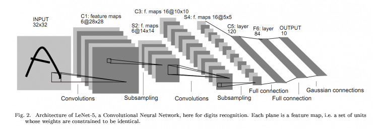
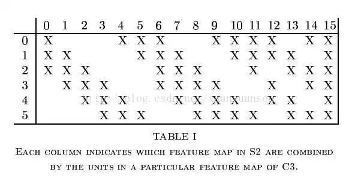
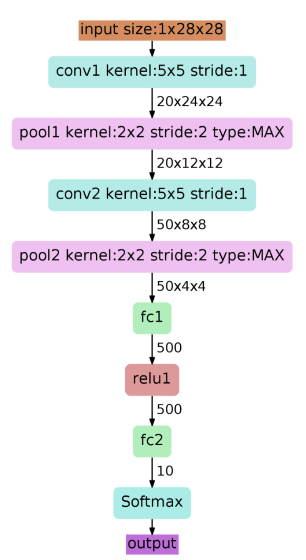
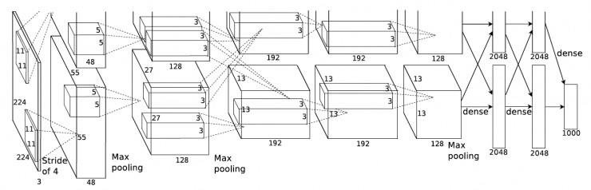
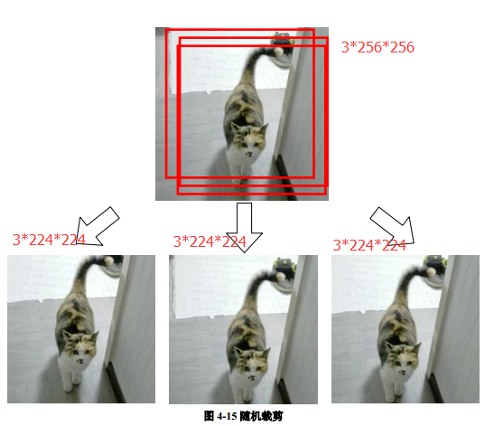
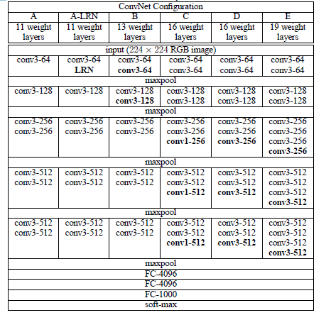

在上一节[《深入理解卷积神经网络(CNN)》](https://mp.weixin.qq.com/s/gCPhqj0rtH_FKXQ6AZRPRg)中，介绍了卷积神经网络(CNN)的基本原理、基本组成部分、网络结构的基本模式。本节将回顾各经典CNN的网络架构及其特点，从而理解CNN网络架构设计演进思路。

从 1998 年经典的 LeNet，到 2012 年历史性的 AlexNet，之后深度学习进入了蓬勃发展阶段，出现了各式各样的不同网络，网络越来越深，架构越来越复杂，解决反向传播时梯度消失的方法也越来越巧妙。不同网络各有特点，也互相借鉴，在很多任务上不断取得突破。本文从最基本的分类任务的角度，回顾了卷积神经网络的发展历史。

## **LeNet：**1998

paper: Gradient based learning applied to document recognition

LeNet是卷积神经网络的祖师爷LeCun在1998年提出，用于解决手写数字识别的视觉任务。卷积神经网络的开山之作，麻雀虽小五脏俱全，卷积层、池化层、全链接层一直沿用至今。这个网络结构非常简单，如图所示。

层数很浅，并且kernel大小单一，C1、C3、C5三个卷积层使用的kernel大小全部都是5×5，不过在我个人看来，这个kernel的大小是经过了无数次实验得来的最优结果，并且有一定的特征提取能力，才能如此经得起时间的考验。C5的feature map大小为1×1是因为，S4的feature map大小为5×5而kernel大小与其相同，所以卷积的结果大小是 1×1 。

S2和S4两个池化层使用的window大小均为2×2，这里的池化有两种，一个是平均池化（在window内对所有数值求平均值），一个是最大池化（取window内的最大值）。

F6是一个有84个神经元的全连接层，猜测这个神经元数量也是实验所得较优的情况得来。 LeNet有一个很有趣的地方，就是S2层与C3层的连接方式。在原文里，这个方式称为“Locally Connect”，学习了CNN很久之后的一天，在回顾CNN原理的时候发现了这种神奇的连接方式：

规定左上角为(0,0)，右下角为(15,5)，那么在(n,m)位置的“X”表示S2层的第m个feature map与C3层的第n个kernel进行卷积操作。例如说，C3层的第0个kernel只与S2层的前三个feature map有连接，与其余三个feature map是没有连接的；C3层的第15个kernel与S2层的所有feature map都有连接。这难道不就是*ShuffleNet*？

如今各大深度学习框架中所使用的LeNet都是简化改进过的LeNet-5（-5表示具有5个层），和原始的LeNet有些许不同，比如把激活函数改为了现在很常用的ReLu。

以上图为例，对经典的LeNet-5做深入分析：

1. 首先输入图像是单通道的28*28大小的图像，用矩阵表示就是[1,28,28]
2. 第一个卷积层conv1所用的卷积核尺寸为5*5，滑动步长为1，卷积核数目为20，那么经过该层后图像尺寸变为24，28-5+1=24，输出矩阵为[20,24,24]。
3. 第一个池化层pool核尺寸为2*2，步长2，这是没有重叠的max pooling，池化操作后，图像尺寸减半，变为12×12，输出矩阵为[20,12,12]。
4. 第二个卷积层conv2的卷积核尺寸为5*5，步长1，卷积核数目为50，卷积后图像尺寸变为8,这是因为12-5+1=8，输出矩阵为[50,8,8].
5. 第二个池化层pool2核尺寸为2*2，步长2，这是没有重叠的max pooling，池化操作后，图像尺寸减半，变为4×4，输出矩阵为[50,4,4]。
6. pool2后面接全连接层fc1，神经元数目为500，再接relu激活函数。
7. 再接fc2，神经元个数为10，得到10维的特征向量，用于10个数字的分类训练，送入softmaxt分类，得到分类结果的概率output。

一个很好的LeNet可视化项目：LeNet-5可视化（http://t.cn/RbmYJ5b）

但是，在 1998 年以后，深度学习并没有太多的突破。有一些基于非深度学习的方法，最好错误率是28.2%。

## **AlexNet：**2012

paper: ImageNet Classification with Deep Convolutional Neural Networks

一直沉寂到 2012 年，大规模训练数据（ImageNet）的出现和GPU硬件的发展，将深度学习重新带入大家视线。

AlexNet在2012年ImageNet竞赛中Top5 错误率：16.4%，以超过第二名10.9个百分点的绝对优势一举夺冠，从此深度学习和卷积神经网络名声鹊起，深度学习的研究如雨后春笋般出现，AlexNet的出现可谓是卷积神经网络的王者归来。

AlexNet 总体结构和 LeNet 相似，但是有极大改进：

- 由五层卷积和三层全连接组成，输入图像为3\*224\*224 大小，网络规模远大于 LeNet
- 使用了 ReLU 激活函数
- 使用了 Dropout，可以作为正则项防止过拟合，提升模型鲁棒性
- 一些很好的训练技巧，包括数据增广、学习率策略、weight decay 等

以上图AlexNet架构为例，这个网络前面5层是卷积层，后面三层是全连接层，最终softmax输出是1000类，取其前两层进行详细说明。

1. AlexNet共包含5层卷积层和三层全连接层，层数比LeNet多了不少，但卷积神经网络总的流程并没有变化，只是在深度上加了不少。
2. AlexNet针对的是1000类的分类问题，输入图片规定是256×256的三通道彩色图片，为了增强模型的泛化能力，避免过拟合，作者使用了随机裁剪的思路对原来256×256的图像进行随机裁剪，得到尺寸为3×224×224的图像，输入到网络训练。

1. 因为使用多GPU训练，所以可以看到第一层卷积层后有两个完全一样的分支,将模型分为两部分放到了两块显卡上并行运算，以加速训练。虽然这仅仅是单块显卡资源有限时的做法，但是后面的许多网络都进一步发扬了这种对卷积进行分组的思想（虽然动机不同）。
2. 针对一个分支分析：第一层卷积层conv1的卷积核尺寸为11×11，滑动步长为4，卷积核数目为48。卷积后得到的输出矩阵为[48,55,55]。这里的55是个难以理解的数字，作者也没有对此说明，如果按照正常计算的话(224-11)/4+1 != 55的，所以这里是做了padding再做卷积的，即先padiing图像至227×227，再做卷积(227-11)/4+1 = 55。这些像素层经过relu1单元的处理，生成激活像素层，尺寸仍为2组48×55×55的像素层数据
   。然后经过归一化处理，归一化运算的尺度为5*5。第一卷积层运算结束后形成的像素层的规模为48×27×27。
3. 输入矩阵是[48,55,55].接着是池化层，做max pooling操作，池化运算的尺度为3*3，运算的步长为2，则池化后图像的尺寸为(55-3)/2+1=27。所以得到的输出矩阵是[48,27,27]。后面层不再重复叙述。

AlexNet用到训练技巧：

- 数据增广技巧来增加模型泛化能力。
- 用ReLU代替Sigmoid来加快SGD的收敛速度
- Dropout:Dropout原理类似于浅层学习算法的中集成算法，该方法通过让全连接层的神经元（该模型在前两个全连接层引入Dropout）以一定的概率失去活性（比如0.5）失活的神经元不再参与前向和反向传播，相当于约有一半的神经元不再起作用。在测试的时候，让所有神经元的输出乘0.5。Dropout的引用，有效缓解了模型的过拟合。
- Local Responce Normalization：局部响应归一层的基本思路是，假如这是网络的一块，比如是 13×13×256， LRN 要做的就是选取一个位置，比如说这样一个位置，从这个位置穿过整个通道，能得到 256 个数字，并进行归一化。进行局部响应归一化的动机是，对于这张 13×13 的图像中的每个位置来说，我们可能并不需要太多的高激活神经元。但是后来，很多研究者发现 LRN 起不到太大作用，因为并不重要，而且我们现在并不用 LRN 来训练网络。

## ZF-Net：2013

ZFNet是2013ImageNet分类任务的冠军，其网络结构没什么改进，只是调了调参，性能较Alex提升了不少。ZF-Net只是将AlexNet第一层卷积核由11变成7，步长由4变为2，第3，4，5卷积层转变为384，384，256。这一年的ImageNet还是比较平静的一届，其冠军ZF-Net的名堂也没其他届的经典网络架构响亮。

## VGG-Nets: 2014

VGG-Nets是由牛津大学VGG（Visual Geometry Group）提出，是2014年ImageNet竞赛定位任务的第一名和分类任务的第二名的中的基础网络。VGG可以看成是加深版本的AlexNet. 都是conv layer + FC layer，在当时看来这是一个非常深的网络了，因为层数高达十多层，我们从其论文名字就知道了（《Very Deep Convolutional Networks for Large-Scale Visual Recognition》），当然以现在的目光看来VGG真的称不上是一个very deep的网络。

上面一个表格是描述的是VGG-Net的网络结构以及诞生过程。为了解决初始化（权重初始化）等问题，**VGG采用的是一种Pre-training的方式，这种方式在经典的神经网络中经常见得到，就是先训练一部分小网络，然后再确保这部分网络稳定之后，再在这基础上逐渐加深。**表1从左到右体现的就是这个过程，并且当网络处于D阶段的时候，效果是最优的，因此D阶段的网络也就是VGG-16了！E阶段得到的网络就是VGG-19了！VGG-16的16指的是conv+fc的总层数是16，是不包括max pool的层数！

下面这个图就是VGG-16的网络结构。

由上图看出，VGG-16的结构非常整洁，深度较AlexNet深得多，里面包含多个conv->conv->max_pool这类的结构,VGG的卷积层都是same的卷积，即卷积过后的输出图像的尺寸与输入是一致的，它的下采样完全是由max pooling来实现。

VGG网络后接3个全连接层，filter的个数（卷积后的输出通道数）从64开始，然后没接一个pooling后其成倍的增加，128、512，VGG的注意贡献是使用小尺寸的filter，及有规则的卷积-池化操作。

闪光点：

- 卷积层使用更小的filter尺寸和间隔

与AlexNet相比，可以看出VGG-Nets的卷积核尺寸还是很小的，比如AlexNet第一层的卷积层用到的卷积核尺寸就是11*11，这是一个很大卷积核了。而反观VGG-Nets，用到的卷积核的尺寸无非都是1×1和3×3的小卷积核，可以替代大的filter尺寸。

3×3卷积核的优点：

- 多个3×3的卷基层比一个大尺寸filter卷基层有更多的非线性，使得判决函数更加具有判决性
- 多个3×3的卷积层比一个大尺寸的filter有更少的参数，假设卷基层的输入和输出的特征图大小相同为C，那么三个3×3的卷积层参数个数3×（3×3×C×C）=27CC；一个7×7的卷积层参数为49CC；所以可以把三个3×3的filter看成是一个7×7filter的分解（中间层有非线性的分解）

1*1卷积核的优点：

- 作用是在不影响输入输出维数的情况下，对输入进行线性形变，然后通过Relu进行非线性处理，增加网络的非线性表达能力。

下一节[CNN网络架构演进(二)]()中，将继续介绍其它CNN网络的架构设计及其特点。

## 参考

1. [CNN网络架构演进：从LeNet到DenseNet](https://www.cnblogs.com/skyfsm/p/8451834.html)
2. [从LeNet到SENet——卷积神经网络回顾](https://www.leiphone.com/news/201802/31oWxcSnayBIUJhE.html)
3. [LeNet-5可视化](http://t.cn/RbmYJ5b)
