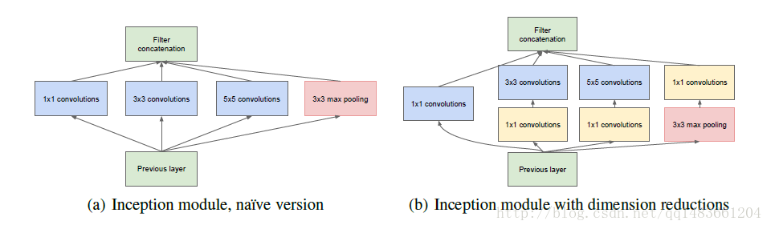
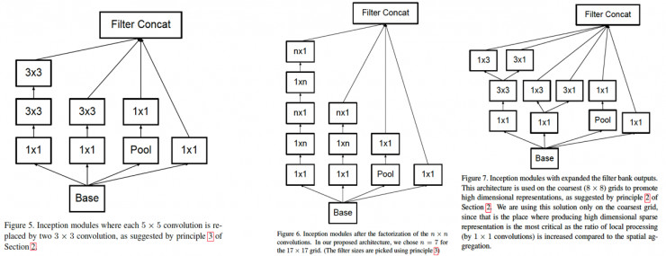
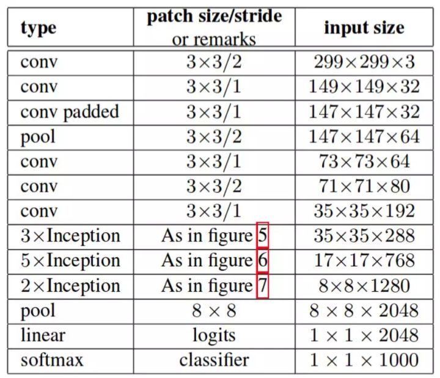
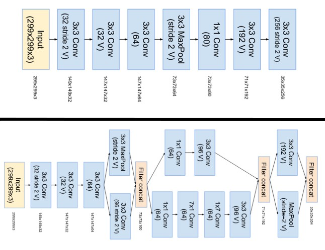
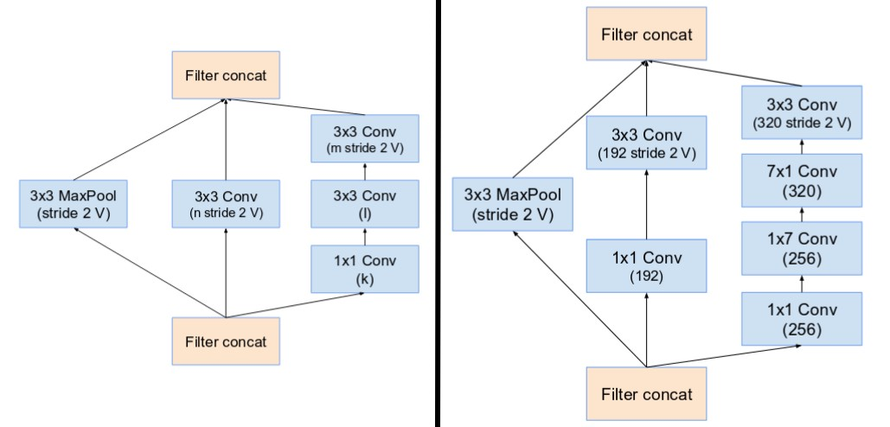
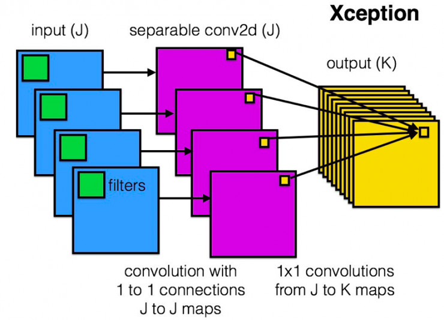
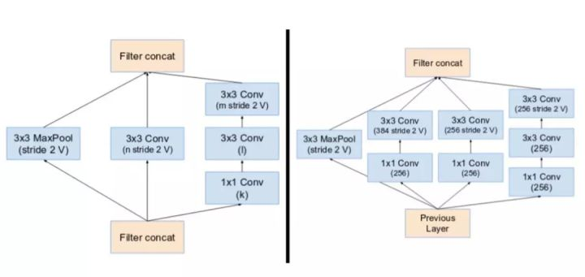
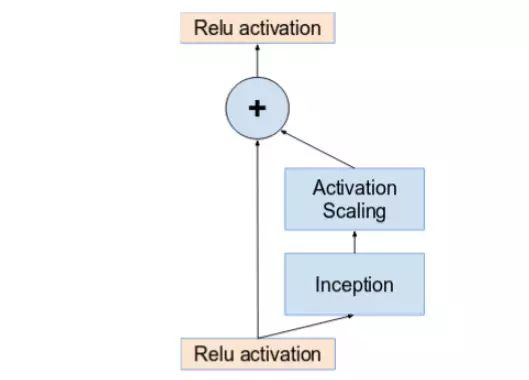
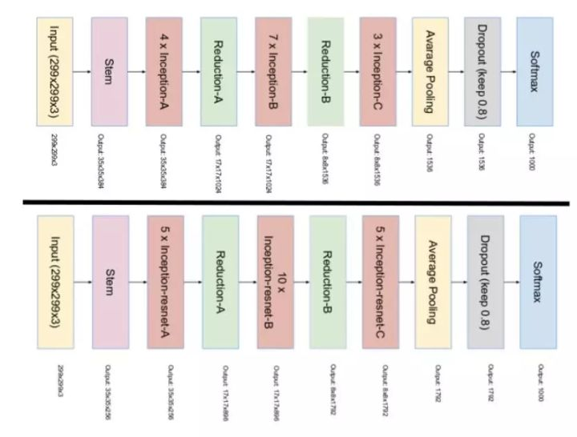

[TOC]

在上一节[《CNN网络架构演进(一)》](https://mp.weixin.qq.com/s/N1v_VqfWFS8mKjPGo5gtaw)中，回顾了LeNet、AlexNet、ZF-Net、VGG-Net网络的架构及其特点。这一节将介绍Inception家族的主要成员，包括 Inception v1、Inception v2 、 Inception v3、Inception v4 、Inception-ResNet和Xception。

Inception 网络是 CNN 分类器发展史上一个重要的里程碑。在 Inception 出现之前，大部分流行 CNN 仅仅是把卷积层堆叠得越来越多，使网络越来越深，以此希望能够得到更好的性能。但继续简单增加网络层数会遇到问题：参数量不断增长，网络更难训练。

Inception 模块的目的是设计一种具有优良局部拓扑结构的网络，即对输入图像并行地执行多个卷积运算或池化操作，并将所有输出结果拼接为一个非常深的特征图。因为 1\*1、3\*3 或 5\*5 等不同的卷积运算与池化操作可以获得输入图像的不同信息，并行处理这些运算并结合所有结果将获得更好的图像表征。

另一方面，Inception 网络是复杂的（需要大量工程工作）。它使用大量 trick 来提升性能，包括速度和准确率两方面。它的不断进化带来了多种 Inception 网络版本的出现。每个版本都是前一个版本的迭代进化。了解 Inception 网络的升级可以帮助我们构建自定义分类器，优化速度和准确率。常见的版本如下：

## **Inception v1（GoogLeNet）：**2015

ImageNet Top5 错误率 6.7%

GoogLeNet 就是一个精心设计的性能良好的 Inception 网络（Inception v1）的实例，即GoogLeNet 是Inception v1 网络的一种。

GoogLeNet跟AlexNet,VGG-Nets这种单纯依靠加深网络结构进而改进网络性能的思路不一样，它另辟幽径，在加深网络的同时（22层），也在网络结构上做了创新，引入Inception结构代替了单纯的卷积+激活的传统操作（这思路最早由Network in Network提出），从另一个维度来增加网络能力。为了优化质量，架构决策基于赫布原则和多尺度处理。

**问题：**

- 图像中突出部分的大小差别很大。例如，狗的图像可以是以下任意情况。每张图像中狗所占区域都是不同的。

从左到右：狗占据图像的区域依次减小（图源：https://unsplash.com/）

- 由于信息位置的巨大差异，为卷积操作选择合适的卷积核大小就比较困难。信息分布更全局性的图像偏好较大的卷积核，信息分布比较局部的图像偏好较小的卷积核。
- 非常深的网络更容易过拟合。将梯度更新传输到整个网络是很困难的。
- 简单地堆叠较大的卷积层非常消耗计算资源。

**解决方案：**

为什么不在同一层级上运行具备多个尺寸的滤波器呢？网络本质上会变得稍微「宽一些」，而不是「更深」。作者因此设计了 Inception 模块。

这个左边的是一般的版本，右边的是改进的版本，首先解释一下这种Inception module的好处，从Alexnet到VGG，网络层次不断增加，深度不断增加，但是却忽视了广度上的增加，而Inception就是在广度上增加，同时使用不同的卷积核大小，3\*3，5\*5，1\*1，此外它还会执行最大池化，所有子层的输出最后会被级联起来，并传送至下一个 Inception 模块。这些不同卷积核的提取不同的特征，增加了特征的多样性，但是这样带来一个问题就是参数量增加太大。

为了降低算力成本，作者在 3x3 和 5x5 卷积层之前添加额外的 1x1 卷积层，来限制输入信道的数量。尽管添加额外的卷积操作似乎是反直觉的，但是 1x1 卷积比 5x5 卷积要廉价很多，而且输入信道数量减少也有利于降低算力成本。不过一定要注意，1x1 卷积是在最大池化层之后，而不是之前。这就是右边对左边的改进。

利用实现降维的 Inception 模块可以构建 GoogLeNet（Inception v1），其架构如下图所示：

GoogLeNet。橙色框是 stem，包含一些初始卷积。紫色框是辅助分类器。较宽的部分是 inception 模块。（图源：https://arxiv.org/pdf/1409.4842v1.pdf）

GoogLeNet 有 9 个线性堆叠的 Inception 模块。它有 22 层（包括池化层的话是 27 层）。不用多说，这是一个深层分类器。和所有深层网络一样，它也会遇到**梯度消失**问题。

为了阻止该网络中间部分梯度的「消失」过程，作者引入了两个**辅助分类器**（上图紫色框），共3个LOSS单元，这样的网络设计是为了帮助网络的收敛。它们对其中两个 Inception 模块的输出执行 softmax 操作，然后在同样的标签上计算辅助损失在中间层加入辅助计算的LOSS单元，目的是计算损失时让低层的特征也有很好的区分能力，从而让网络更好地被训练。在论文中，这两个辅助LOSS单元的计算被乘以0.3，然后和最后的LOSS相加作为最终的损失函数来训练网络。**辅助损失只是用于训练，在推断过程中并不使用。**

该模型在最后一个 inception 模块处将后面的全连接层全部替换为简单的全局平均pooling，在最后参数会变的更少。而在AlexNet中最后3层的全连接层参数差不多占总参数的90%，使用大网络在宽度和深度允许GoogleNet移除全连接层，但并不会影响到结果的精度，在ImageNet中实现93.3%的精度，而且要比VGG还要快。

## **Inception v2（BN-Inception）：**2015

ImageNet Top5 错误率：4.8%

Inception v2 和 Inception v3 来自同一篇论文《Rethinking the Inception Architecture for Computer Vision》，作者提出了一系列能增加准确度和减少计算复杂度的修正方法。

主要是增加了 Batch Normalization，之前神经网络很依赖于良好的初始化，并且网络太深会梯度弥散，这两个问题都是因为网络中间的激活的分布不理想，那既然我们想要一个理想的分布，就手动把它转换为理想的分布好了。所以在每一层输出后面加上了归一化变换，减去每个训练 batch 的每个特征的均值再除以标准差，得到 0 均值 1 标准差的输出分布，这样，就可以很好地训练了，梯度也不容易弥散。

**问题：**

- 减少特征的表征性瓶颈。直观上来说，当卷积不会大幅度改变输入维度时，神经网络可能会执行地更好。过多地减少维度可能会造成信息的损失，这也称为「表征性瓶颈」。
- 使用更优秀的因子分解方法，卷积才能在计算复杂度上更加高效。

**解决方案：**

- 将 5×5 的卷积分解为两个 3×3 的卷积运算以提升计算速度。尽管这有点违反直觉，但一个 5×5 的卷积在计算成本上是一个 3×3 卷积的 2.78 倍。所以叠加两个 3×3 卷积实际上在性能上会有所提升，如上图(左)所示。
- 将 n*n 的卷积核尺寸分解为 1×n 和 n×1 两个卷积。例如，一个 3×3 的卷积等价于首先执行一个 1×3 的卷积再执行一个 3×1 的卷积。他们还发现这种方法在成本上要比单个 3×3 的卷积降低 33%，如上图(中)所示。
- 模块中的滤波器组被扩展（即变得更宽而不是更深），以解决表征性瓶颈。如果该模块没有被拓展宽度，而是变得更深，那么维度会过多减少，造成信息损失，如上图(右)所示。

前面三个原则用来构建三种不同类型的 Inception 模块（这里我们按引入顺序称之为模块 A、B、C，这里使用「A、B、C」作为名称只是为了清晰期间，并不是它们的正式名称）。架构如下所示：

这里，「figure 5」是模块 A，「figure 6」是模块 B，「figure 7」是模块 C。（图源：https://arxiv.org/pdf/1512.00567v3.pdf）

## **Inception v3：**2015

**问题：**

- 作者注意到辅助分类器直到训练过程快结束时才有较多贡献，那时准确率接近饱和。作者认为辅助分类器的功能是正则化，尤其是它们具备 BatchNorm 或 Dropout 操作时。
- 是否能够改进 Inception v2 而无需大幅更改模块仍需要调查。

**解决方案：**

Inception Net v3 整合了前面 Inception v2 中提到的所有升级，还使用了：

- RMSProp 优化器；
- Factorized 7x7 卷积；
- 辅助分类器使用了 BatchNorm；
- 标签平滑（添加到损失公式的一种正则化项，旨在阻止网络对某一类别过分自信，即阻止过拟合）。

## **Inception v4**：2016

Inception v1 到 v3，可以看到很明显的人工设计的痕迹，不同卷积核的和网络结构的安排，很特殊，并不知道为什么要这样安排，实验确定的。作者称由于以前受硬件软件的限制，有太多的历史包袱，而现在有了 TensorFlow（论文里怒打一波广告），网络可以按照理想的设计来实现了，于是很规范地设计了一个 Inception v4 网络，类似于 Inception v3，但是没有很多特殊的不一致的设计。

**问题：**

- 使模块更加一致。作者还注意到某些模块有不必要的复杂性。这允许我们通过添加更多一致的模块来提高性能。

**解决方案：**

Inception v4 的 stem 被修改了。这里的 stem 参考了在引入 Inception 块之前执行的初始运算集。

图上部是 Inception-ResNet v1 的 stem。图下部是 Inception v4 和 Inception-ResNet v2 的 stem。（图源：https://arxiv.org/pdf/1602.07261.pdf）

- 它们有三个主要的 Inception 模块，称为 A、B 和 C（和 Inception v2 不同，这些模块确实被命名为 A、B 和 C）。它们看起来和 Inception v2（或 v3）变体非常相似。

（左起）在 Inception v4 中使用的 Inception 模块 A、B、C。注意它们和 Inception v2（或 v3）模块的相似性。（图源：https://arxiv.org/pdf/1602.07261.pdf）

- Inception v4 引入了专用的「缩减块」（reduction block），它被用于改变网格的宽度和高度。早期的版本并没有明确使用缩减块，但也实现了其功能。

缩减块 A（从 35x35 到 17x17 的尺寸缩减）和缩减块 B（从 17x17 到 8x8 的尺寸缩减）。这里参考了论文中的相同超参数设置（V,I,k）。（图源：https://arxiv.org/pdf/1602.07261.pdf）

## Xception：2016

Xception: Deep Learning with Depthwise Separable Convolutions

Xception 则把分组卷积的思想发挥到了极致，每一个通道单独分为一组。利用了 depthwise separable convolution，如下图所示，J 个输入通道，每个通道用一个单独的空间卷积核卷积（比如 3x3），J 个卷积核得到 J 个输出通道，然后再用 K 个卷积核对上一步得到的 J 个输出通道进行 1x1 的普通卷积，得到 K 个最终的输出：

Xception 基于一个假设，水平和竖直方向的空间卷积（比如第一步的 3x3 卷积）和深度方向的通道卷积（比如第二步的 1x1 卷积）可以完全独立进行，这样减少了不同操作间的耦合，可以有效利用计算力。实验证明，相同的计算量，精度有明显的提升。（不过现在对于分组卷积的底层支持还不够好，实际速度并没有理论计算的那么好，需要底层库进行更好的支持）

## **Inception-ResNet v1 和 v2**: 2016

在《Inception-v4, Inception-ResNet and the Impact of Residual Connections on Learning》论文中，研究者介绍道，Inception 架构可以用很低的计算成本达到很高的性能。而在传统的网络架构中引入残差连接曾在 2015ILSVRC 挑战赛中获得当前最佳结果，其结果和 Inception-v3 网络当时的最新版本相近。这使得人们好奇，如果将 Inception 架构和残差连接结合起来会是什么效果。

受 ResNet 的优越性能启发，研究者提出了一种混合 inception 模块。Inception ResNet 有两个子版本：v1 和 v2。在我们分析其显著特征之前，先看看这两个子版本之间的微小差异。

- Inception-ResNet v1 的计算成本和 Inception v3 的接近。
- Inception-ResNetv2 的计算成本和 Inception v4 的接近。
- 它们有不同的 stem，正如 Inception v4 部分所展示的。
- 两个子版本都有相同的模块 A、B、C 和缩减块结构。唯一的不同在于超参数设置。在这一部分，我们将聚焦于结构，并参考论文中的相同超参数设置（图像是关于 Inception-ResNet v1 的）。

**问题：**

- 引入残差连接，它将 inception 模块的卷积运算输出添加到输入上。

**解决方案：**

- 为了使残差加运算可行，卷积之后的输入和输出必须有相同的维度。因此，我们在初始卷积之后使用 1x1 卷积来匹配深度（深度在卷积之后会增加）。

（左起）Inception ResNet 中的 Inception 模块 A、B、C。注意池化层被残差连接所替代，并在残差加运算之前有额外的 1x1 卷积。（图源：https://arxiv.org/pdf/1602.07261.pdf）

- 主要 inception 模块的池化运算由残差连接替代。然而，你仍然可以在缩减块中找到这些运算。缩减块 A 和 Inception v4 中的缩减块相同。

（左起）缩减块 A（从 35x35 到 17x17 的尺寸缩减）和缩减块 B（从 17x17 到 8x8 的尺寸缩减）。这里参考了论文中的相同超参数设置（V,I,K）。（图源：[https://arxiv.org/pdf/1602.07261.pdf](https://link.zhihu.com/?target=https%3A//arxiv.org/pdf/1602.07261.pdf)）

- 如果卷积核的数量超过 1000，则网络架构更深层的残差单元将导致网络崩溃。因此，为了增加稳定性，作者通过 0.1 到 0.3 的比例缩放残差激活值。

激活值通过一个常数进行比例缩放，以防止网络崩溃。（图源：[https://arxiv.org/pdf/1602.07261.pdf](https://link.zhihu.com/?target=https%3A//arxiv.org/pdf/1602.07261.pdf)）

- 原始论文并没有在求和之后使用批归一化，以在单个 GPU 上训练模型（在单个 GPU 上拟合整个模型）。
- 研究发现 Inception-ResNet 模型可以在更少的 epoch 内达到更高的准确率。
- Inception v4 和 Inception-ResNet 的网络完整架构如下图所示：

图上部是 Inception v4 的架构。图下部是 Inception-ResNet 的架构。（图源：[https://arxiv.org/pdf/1602.07261.pdf](https://link.zhihu.com/?target=https%3A//arxiv.org/pdf/1602.07261.pdf)）

研究者通过实验明确地证实了，结合残差连接可以显著加速 Inception 的训练。也有一些证据表明残差 Inception 网络在相近的成本下略微超过没有残差连接的 Inception 网络。研究者还展示了多种新型残差和非残差 Inception 网络的简化架构。这些变体显著提高了在 ILSVRC2012 分类任务挑战赛上的单帧识别性能。作者进一步展示了适当的激活值缩放如何稳定非常宽的残差 Inception 网络的训练过程。通过三个残差和一个 Inception v4 的模型集成，作者在 ImageNet 分类挑战赛的测试集上取得了 3.08% 的 top-5 误差率。

## 参考

1. [CNN网络架构演进：从LeNet到DenseNet](https://www.cnblogs.com/skyfsm/p/8451834.html)
2. [从LeNet到SENet——卷积神经网络回顾](https://www.leiphone.com/news/201802/31oWxcSnayBIUJhE.html)
3. [从Inception v1到Inception-ResNet，一文概览Inception家族的奋斗史](https://zhuanlan.zhihu.com/p/37505777)
4. [A Simple Guide to the Versions of the Inception Network](https://towardsdatascience.com/a-simple-guide-to-the-versions-of-the-inception-network-7fc52b863202)