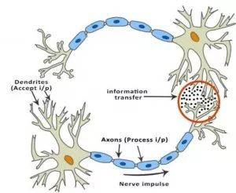
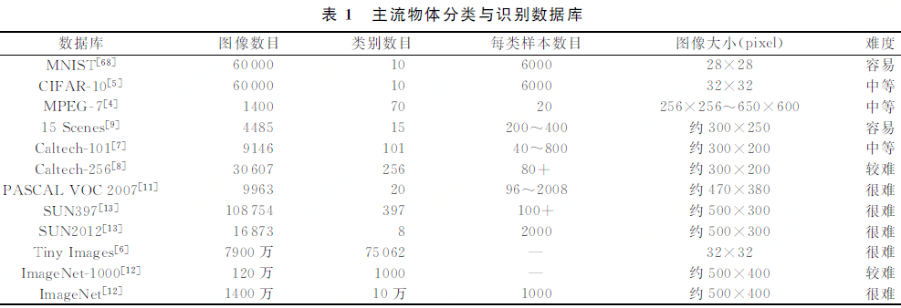

目标检测

selective search原理

SPP Net原理

图像分类是指根据一定的分类规则将图像自动分到一组预定义类别中的过程。

图像分类

图像检测

语义分割

http://pg9j4f5e6.bkt.clouddn.com/36331640-9.jpeg

### 分类的种类

1. 通用图像分类

2. 细粒度图像分类

（1）对象分类 object categorization

（2）场景分类 scene classification

（3）事件分类 event classification

（4）情感分类 emotion classification

### 分类的难点

对于人来说，识别出一个像“猫”一样视觉概念是简单至极的，然而从计算机视觉算法的角度来看就值得深思了。我们在下面列举了计算机视觉算法在图像识别方面遇到的一些难点，要记住图像是以3维数组来表示的，数组中的元素是亮度值。

- 视角变化（Viewpoint variation）：同一个物体，摄像机可以从多个角度来展现。
- 大小变化（Scale variation）：物体可视的大小通常是会变化的（不仅是在图片中，在真实世界中大小也是变化的）。
- 形变（Deformation）：很多东西的形状并非一成不变，会有很大变化。
- 遮挡（Occlusion）：目标物体可能被挡住。有时候只有物体的一小部分（可以小到几个像素）是可见的。
- 光照条件（Illumination conditions）：在像素层面上，光照的影响非常大。
- 背景干扰（Background clutter）：物体可能混入背景之中，使之难以被辨认。
- 类内差异（Intra-class variation）：一类物体的个体之间的外形差异很大，比如椅子。这一类物体有许多不同的对象，每个都有自己的外形。

### 图像分类的应用

网络图像检索

视频分析与检索

医学图像分类

医学图像数据挖掘

图像检测

遥感图像分类