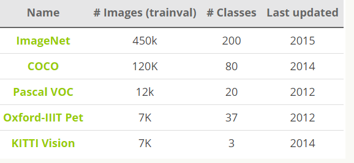
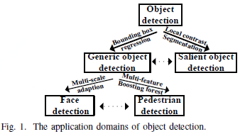
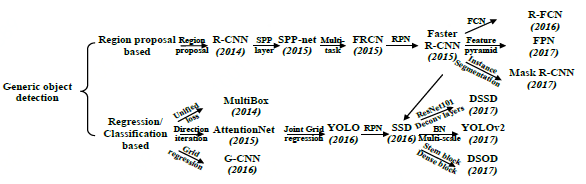

目标检测可以分为两种类型：

特定实例检测：检测一个特定目标的实例（比如唐纳德·特朗普的脸、五角大楼建筑或我的狗 Penny）

特定类别检测：检测预定义目标类别的不同实例（比如人、车、自行车和狗）

目标检测是解决分割、场景理解、目标追踪、图像描述、事件检测和活动识别等更复杂更高层次的视觉任务的基础。	

图像分类：指将一张图像归为某种类别。

图像定位：找到图像中单一物体的位置。

目标检测：将定位以及分类问题结合起来，同时检测和分类多个目标。

语义分割：找到每一个被检测目标的像素级掩膜。

示例分割

#### 目标检测的**数据集和性能指标**

目标检测常用的数据集包括PASCAL VOC，ImageNet，MS COCO等数据集，这些数据集用于研究者测试算法性能或者用于竞赛。目标检测的性能指标要考虑检测物体的位置以及预测类别的准确性，下面我们会说到一些常用的性能评估指标。

（1）**数据集**

PASCAL VOC（[The PASCAL Visual Object Classification](http://host.robots.ox.ac.uk/pascal/VOC/)）是目标检测，分类，分割等领域一个有名的数据集。从2005到2012年，共举办了8个不同的挑战赛。PASCAL VOC包含约10,000张带有边界框的图片用于训练和验证。但是，PASCAL VOC数据集仅包含20个类别，因此其被看成目标检测问题的一个基准数据集。

[ImageNet](http://www.image-net.org/)在2013年放出了包含边界框的目标检测数据集。训练数据集包含500,000张图片，属于200类物体。由于数据集太大，训练所需计算量很大，因而很少使用。同时，由于类别数也比较多，目标检测的难度也相当大。2014 ImageNet数据集和2012 PASCAL VOC数据集的对比在[这里](http://image-net.org/challenges/LSVRC/2014/)。

另外一个有名的数据集是Microsoft公司（见[T.-Y.Lin and al. 2015](https://arxiv.org/pdf/1405.0312.pdf))建立的MS COCO（[Common Objects in COntext](http://cocodataset.org/#home)）数据集。这个数据集用于多种竞赛：图像标题生成，目标检测，关键点检测和物体分割。对于目标检测任务，COCO共包含80个类别，每年大赛的训练和验证数据集包含超过120,000个图片，超过40,000个测试图片。测试集最近被划分为两类，一类是test-dev数据集用于研究者，一类是test-challenge数据集用于竞赛者。测试集的标签数据没有公开，以避免在测试集上过拟合。在[COCO 2017 Detection Challenge](http://cocodataset.org/#detections-challenge2017)中，旷视科技团队凭借提出的[Light-Head R-CNN](https://arxiv.org/pdf/1711.07264.pdf)模型夺得冠军（AP为0.526），看来还是two-stage算法准确度更胜一筹。

（2）**性能指标**

目标检测问题同时是一个回归和分类问题。首先，为了评估定位精度，需要计算IoU（Intersection over Union，介于0到1之间），其表示预测框与真实框（ground-truth box）之间的重叠程度。IoU越高，预测框的位置越准确。因而，在评估预测框时，通常会设置一个IoU阈值（如0.5），只有当预测框与真实框的IoU值大于这个阈值时，该预测框才被认定为真阳性（True Positive, TP），反之就是假阳性（False Positive，FP）。

对于二分类，AP（Average Precision）是一个重要的指标，这是信息检索中的一个概念，基于precision-recall曲线计算出来，详情见(https://en.wikipedia.org/w/index.php?title=Information_retrieval&oldid=793358396#Average_precision)。对于目标检测，首先要单独计算各个类别的AP值，这是评估检测效果的重要指标。取各个类别的AP的平均值，就得到一个综合指标mAP（Mean Average Precision），mAP指标可以避免某些类别比较极端化而弱化其它类别的性能这个问题。

对于目标检测，mAP一般在某个固定的IoU上计算，但是不同的IoU值会改变TP和FP的比例，从而造成mAP的差异。COCO数据集提供了[官方的评估指标](https://github.com/cocodataset/cocoapi)，它的AP是计算一系列IoU下（0.5:0.05:0.9，见(http://cocodataset.org/#detection-eval)）AP的平均值，这样可以消除IoU导致的AP波动。其实对于PASCAL VOC数据集也是这样，Facebook的Detectron上的有比较清晰的实现(https://github.com/facebookresearch/Detectron/blob/05d04d3a024f0991339de45872d02f2f50669b3d/lib/datasets/voc_eval.py#L54)。

除了检测准确度，目标检测算法的另外一个重要性能指标是速度，只有速度快，才能实现实时检测，这对一些应用场景极其重要。评估速度的常用指标是每秒帧率（Frame Per Second，FPS），即每秒内可以处理的图片数量。当然要对比FPS，你需要在同一硬件上进行。另外也可以使用处理一张图片所需时间来评估检测速度，时间越短，速度越快。

#### 目标检测的应用

1. 人脸检测

   相机中自带的人脸检测功能，能够进行更有效地自动对焦。

2. 计数

   统计图像中人、汽车、花卉甚至微生物的数量。例如，使用来自[Planet](https://www.planet.com/)和[Descartes Labs](https://www.descarteslabs.com/)公司的卫星图像，应用目标检测技术进行车辆、树木和船只的数量统计。

3. 图像检索

   例如，[Pinterest视觉搜索引擎](https://labs.pinterest.com/assets/paper/visual_search_at_pinterest.pdf)

#### 目标检测面临的挑战

1. 目标的可变数量问题
2. 目标的大小不一致问题
3. 目标种类多样
4. 如何将定位和分类这两种不同类型的问题最理想地结合进一个单一模型？

#### 目标检测的方法

近几年来，目标检测算法取得了很大的突破。比较流行的算法可以分为两类，一类是基于Region Proposal的R-CNN系算法（R-CNN，Fast R-CNN, Faster R-CNN），它们是two-stage的，需要先使用启发式方法（selective search）或者CNN网络（RPN）产生Region Proposal，然后再在Region Proposal上做分类与回归。而另一类是Yolo，SSD这类one-stage算法，其仅仅使用一个CNN网络直接预测不同目标的类别与位置。第一类方法是准确度高一些，但是速度慢，但是第二类算法是速度快，但是准确性要低一些。

##### 经典方法

1. [Viola Jones框架](https://en.wikipedia.org/wiki/Viola%E2%80%93Jones_object_detection_framework)

   由Paul Viola和Michael Jones 2001年在论文[《鲁棒实时目标检测》](http://www.hpl.hp.com/techreports/Compaq-DEC/CRL-2001-1.pdf)中提出。工作原理是使用[Haar特征](https://en.wikipedia.org/wiki/Haar-like_feature)产生多种（可能有数千个）简单的二进制分类器。这些分类器由级联的多尺度滑动窗口进行评估，并且在出现消极分类情况的早期及时丢弃错误分类。

   该方法快速并且相对简单，因此傻瓜相机的人脸检测就是使用这个算法，它能做到实时检测，并且运算量很小。

2. HOG+SVM

   采用[梯度方向直方图](https://en.wikipedia.org/wiki/Histogram_of_oriented_gradients)（Histogram of Oriented Gradients，HOG）作为特征，以及支持向量机（SVM）作为分类器。它仍然依赖多尺度滑动窗口，尽管它的效果比Viola Jones要好很多，但是速度也慢很多。

##### 基于深度学习的目标检测

**OverFeat**

第一个使用深度学习进行目标检测并取得很大进展的方法是纽约大学在2013年提出的[Overfeat](https://arxiv.org/abs/1312.6229)。他们提出了一个使用卷积神经网络（CNN）的多尺度滑动窗口算法。

**R-CNN**

来自加州大学伯克利分校的[Ross Girshick](http://www.rossgirshick.info/)等人发表了[基于卷积神经网络特征的区域方法](https://arxiv.org/abs/1311.2524)（Regions with CNN features，R-CNN），它在目标检测比赛上相比其他方法取得了50%的性能提升。他们提出了一个三阶段的方法：

- 使用区域候选算法提取包含可能目标的区域（最流行的[选择性搜索算法](http://www.huppelen.nl/publications/selectiveSearchDraft.pdf)）
- 使用CNN在每个区域上提取特征。
- 使用[支持向量机](https://en.wikipedia.org/wiki/Support_vector_machine)对区域进行分类。

存在问题：

- 模型需多阶段训练

- 对于[Pascal 2012](http://host.robots.ox.ac.uk/pascal/VOC/voc2012/)训练数据集来说，通常需要生成大于200GB的中间文件

**Fast R-CNN**

一个纯深度学习的方法。与R-CNN相似，它也使用选择性搜索来生成候选区域，但与R-CNN不同的是，Fast R-CNN在整张图上使用CNN来提取特征，然后在特征图上使用区域兴趣池化（Region of Interest，ROI），并且最后用前馈神经网络来进行分类和回归。

存在问题：

该模型仍旧依赖选择性搜索（或者其他的区域候选算法），这也成为了模型推理阶段的一个瓶颈。

#### 参考

1. [深度学习的目标检测技术演进：R-CNN、Fast R-CNN、Faster R-CNN](https://cloud.tencent.com/developer/article/1099771)
2. [深度学习检测方法梳理](https://www.cnblogs.com/venus024/p/5590044.html)

