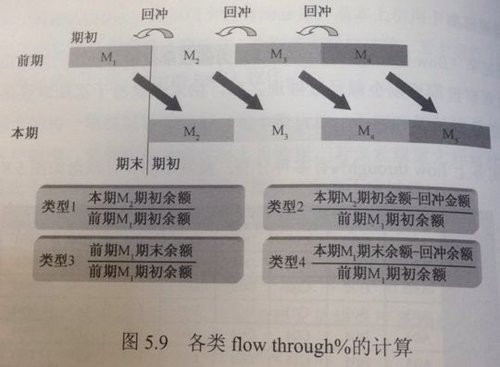
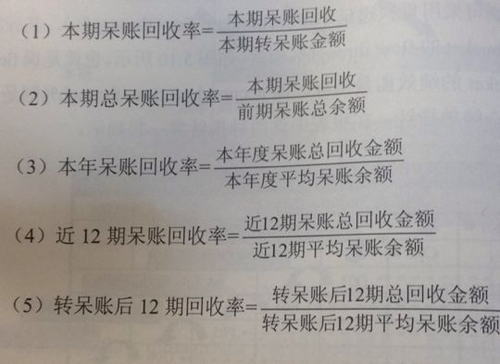

**逾期天数DPD（days past due）：**已逾契约书约定缴款日的延滞天数，贷放型产品自缴款截止日（通常为次一关帐日）后第一天开始算。

**逾期期数bucket：**也叫逾期月数，逾期一期为M1，2期M2。缴款截止日与次一关帐日之间称为M0。

**逾期阶段stage：**分为前期、中期、后期和转呆账。一般将M1（1-29）列为前期，M2~M3（30~89）列为中期、M4（90+）以上列为后期，若已转呆账者则列入转呆账。

**即期指标（coincidental）：**计算延滞率时常用的两种方法之一，以当期各bucket延滞金额÷应收账款（accounts receivable，AR）。

**递延指标（lagged）：**计算延滞率时常用的两种方法之一，延滞金额÷上月应收账款。若单纯想了解各月资产质量结构，可使用coindental，但若想精准溯及逾放源头的话，建议采用lagged。

**月底结算（month end）：**month end报表主要在表达各月月底结算数据，适用于消费金融所有产品。

**期末结算结算（cycle end）：****cycle end**为信用卡特有的结算方式。账务及催收单位皆以cycle为作业周期。

**2、重要风险指标**

****

**延滞率（delinquent%）：**计算可分为coincidental和lagged两种方式，除了各bucket，尚会观察特定bucket以上的延滞率。如M2+lagged%及M4+lagged等指标。如M2+lagged，坟墓为两个月前应收账款，分子为本月M2（含以上）伤胃转呆账的逾期金额。M1落入M2以上可确认为物理交款或蓄意拖欠。

**不良率（bad%）：**bad定义除了逾期户外，可能还饱含各式债务协议及高风险控管户等。**转呆账率（WO%）：**为write-off%的简写，当月转呆账金额÷逾期开始月的应收账款。经过年化之后，月转呆账率转换为年损失率。

**转呆账率（WO%）：**为write-off%的简写，当月转呆账金额÷逾期开始月的应收账款。经过年化之后，月转呆账率转换为年损失率。

**净损失率（NCL）：**为net credit loss的简写，当期转呆账金额减当期呆账回收，亦即为净损概念。

通常NCL%与WO%一并列示。NCL的计算方式为：净损金额÷逾期开始月的应收账款，通常也以年化形态为主。

**累计WO%：**主要目的为观察期满客户的累积损失率，计算样本为已届满总期数后的N期客户，计算公式为：分母案件第1~（K+N）期的转呆账总金额/已满（K+N）期案件的初贷总金额。K表示为总期数，N表示转呆账所需期数。最后1期应缴金额若延滞，经过N个月后才会转为呆账。转换为年化后才较易解读。可精确计算该产品整个生命周期结束后的实际损失率。但在中长期贷放产品中较少使用。

**审核金额/件数：**检视征审人员的作业绩效及工作压力。

**核准金额/件数：**检视征审尺度的重要观测值之一，常配合核准率、拨贷率和延滞率等指标一起进行综合判断。

**拨贷金额/件数：**多寡直接影响应收帐水平。

**金额核准率/件数核准率：**常见的核准率计算方式有两种，第一种的分母为当月进件量、分子为当月核准量。另一种方式为：当月核准件加拒绝件/当月核准量。

**违例核准率（deviation%）：**计算方式为：（违例核准案件数）÷（核准+拒绝案件数），特例核准一般限定在总审核量的10%~20%。

**拨贷率：**核准率×拨贷率。

**各类占率：**泛指各种维度下的户数、进件、拨款、余额等占有率。常常与核准率及延滞率搭配使用。

**负债比（debit burden ratio，DBR）：**泛测试客户还款压力的常用指标，总无担保债务归户后的总余额（包括信用卡、现金卡及信用贷款）÷月收入，不宜超过22倍。

**月负比：**另一种衡量还款压力的指标：（推估每月各项贷款月付额+最低生活费）÷月收入

**贷后N月的delinquent%：**将其中几个重要观测点的数字取出（如贷后6个月及12个月的delinquent%）置于综合分析报表中。在delinquent%的选择上，一般建议采用“M2+lagged%”，若遇延滞反映较慢的产品，则定为“M1+lagged%”

**平均额度：**主要在观察不同产品及群组间额度的差异

**风险等级（risk grade）**：早期多位rule base，今年由于评分模型普及，越来越多银行采用信用评分来划分客户风险等级score base。

**恶意延滞率（non-starter%）**：原始定义为“贷后从未缴款客户”，主要目的为找出恶性欺诈的案件。

**授权核准率（authorization）**：原信用卡特有的业务，信用卡交易皆须通过授权系统或授权人员的检核才能成立。为维护交易顺畅，授权和准率不宜过低。

**命中率（hit%）：**用于信用卡的中途授信及早期预警报表，所谓命中率意指控管后一定期间内客户发生延滞的几率。命中率过低可能表示浮滥或风险判断方向有误。

**可用余额（open to buy，OTB）：**常与命中率指标一同出现，计算方式为先找出证实控管命中的客户，再会整这些客户遭控管时的信用卡可用余额，此数字可视为银行因控管而减少的损失。

**诈欺损失率：**计算方式为：诈欺损失金额除以签账金额，功能为观察信用卡签账金额中，发生伪冒诈骗状况并造成损失的比率。

**递延率（flow through%）：**计催收单位最常使用的绩效指标，观察前期逾期金额经过催收之后，仍未缴款而于次期继续落入下一bucket的几率。有四种计算方式：

**累计递延率：**计算方式为特定区间各bucket的flow through%相乘。

**实收金额：**催收人员实际收回的金额

**呆账回收率：**根据计算的时间范围，呆账回收率可分为以下几个类别：

## 1、风控系统篇

1.1 A card

释义：Application scorecard 进件评分卡，对授信阶段提交的资料赋值的规则。

举例： “进件”是传统银行的说法，指申请单。评分卡是对一系列用户信息的综合判断。随着可以收集到的用户信息变多，授信决策者不再满足于简单的if、else逻辑，而是希望对各个资料赋予权重和分值，根据用户最后综合得分判断风险，通过划定分数线调整风险容忍度，评分卡应运而生。

1.2 B card

释义：Behavior scorecard 行为评分卡，对贷后可以收集到的用户信息进行评分的规则。

举例：与 A 卡类似，B卡也是一套评分规则，在贷款发放后，通过收集用户拿到钱后的行为数据，推测用户是否会逾期，是否可以继续给该用户借款。例如用户在某银行贷款后，又去其他多家银行申请了贷款，那可以认为此人资金短缺，可能还不上钱，如果再申请银行贷款，就要慎重放款。

1.3 C card

释义：Collection Scorecard 催收评分卡，对已逾期用户未来出催能力做判断的评分规则。

举例：催收评分卡是行为评分卡的衍生应用，其作用是预判对逾期用户的催收力度。对于信誉较好的用户，不催收或轻量催收即可回款。对于有长时间逾期倾向的用户，需要从逾期开始就重点催收。进件评分卡、行为评分卡和催收评分卡常合并称为“ABC卡”，应用在贷前、贷中和贷后管理。

1.4 MIS

释义：Management Information System 管理信息系统。

举例：MIS_weekly是MIS 系统出的周报，是从风控角度出发，涵盖当期重要数据和历史用户的风险表现，是授信模块需重点关注的报表。

**1.5 Ser**
释义：service的简写。“.ser” 是决策引擎工具SMG3的工程文件格式，故用 ser代指决策引擎规则版本。
举例：SMG3（Strategy Management Generation 3）是Experian提供的决策引擎工具，类 似的工具还有FICO的Blaze。决策引擎是一系列规则的集合，可处理大量的入参，最终输出结论。决策引擎规则是授信的核心构成之一，通常每个细分人群都会单独配置一个Ser，同一个授信流程也可执行多个Ser。
**1.6 RBP**
释义：Risk-based Pricing，风险定价。
举例：量化风险管理的一个核心就是风险定价，可以根据用户人群、模型决策风险、外部征信数据等条件，给用户授予额度和费率。

## 2、风控指标篇

**2.1 Aging Analysis**
释义：账龄分析。显示各期至观察点为止的延滞率，其特点为结算终点一致，把分散于各个月的放贷合并到一个观察时间点合并计算逾期比率。
**2.2 Vintage Analysis**
释义：同样也是账龄分析。与aging analysis不同，vintage以贷款的账龄为基础，观察贷后N个月的逾期比率。也可用于分析各时期的放贷后续质量，观察进件规则调整对债权质量的影响。
举例：Deliquency Vintage 30+:表现月逾期30+剩余本金/对应账单生成月发放贷款金额。

2.3 C 、M

释义：C和M是描述逾期期数bucket的专有名词。M0为正常资产，Mx为逾期 x 期，Mx+为逾x期（含）以上。无逾期正常还款的bucket为M0，即C，M1即逾1期（1-29天） 。 M2+即逾2期及以上（30+） 。M2和M4是两个重要的观察节点，一般认为M1为前期，M2-M3为中期，M4以上为后期，大于M6的转呆账。

**2.4 Delinquency**
释义：逾期率/延滞率。评价资产质量的指标，可分为Coincident和Lagged两种观察方式。
**2.5 Coincident**
释义： 即期指标。用于分析当期所有应收账款的质量，计算延滞率。计算方式是以当期各bucket延滞金额除以本期应收账款（AR）总额。Coincident是在当前观察点总览整体，所以容易受到当期应收账款的高低导致波动，这适合业务总量波动不大的情况下观察资产质量。
举例：常看的一个指标Coincident DPD 30+
**2.6 Lagged**
释义： 递延指标。与coincident相同也是计算延滞率的一个指标，区别是lagged的分母为产生逾期金额的那一期的应收账款。Lagged观察的是放贷当期所产生的逾期比率，所以不受本期应收账款的起伏所影响。
举例：Lagged DPD 30+$(%)= Lagged M2+Lagged M3+Lagged M4+Lagged M5+Lagged M6
月末资产余额M1(1-29天): 统计月份月末资产中满足 1≤当前逾期天数≤29 的订单剩余本金总和，当前逾期天数为订单当前最大逾期天数，不包含坏账订单。
Lagged M1 =月末M1的贷款余额/上个月底的贷款余额(M0~M6)
**2.7 DPD**
释义：Days Past Due 逾期天数，自还款日次日起到实还日期间的天数。
举例：DPD7+/30+，大于7天和30天的历史逾期。业内比较严格的逾期率计算公式为：在给定时间点，当前已经逾期90天以上的借款账户的未还剩余本金总额除以可能产生90+逾期的累计合同总额。其分子的概念是，只要已经产生90天以上逾期，那么未还合同剩余本金总额都视为有逾期可能，而分母则将一些借款账龄时间很短的，绝对不可能产生90+逾期的合同金额剔除在外（比如只在2天前借款，无论如何都不可能产生90天以上逾期）。

2.8 FPD

释义：First Payment Deliquency，首次还款逾期。用户授信通过后，首笔需要还款的账单，在最后还款日后7天内未还款且未办理延期的客户比例即为FPD 7，分子为观察周期里下单且已发生7日以上逾期的用户数，分母为当期所有首笔下单且满足还款日后7天，在观察周期里的用户数。常用的FPD指标还有FPD 30。

举例：假设用户在10.1日授信通过，在10.5日通过分期借款产生了首笔分3期的借款，且设置每月8日为还款日。则11.08是第一笔账单的还款日，出账日后，还款日结束前还款则不算逾期。如11.16仍未还款，则算入10.1-10.30周期的FPD7的分子内。通常逾期几天的用户可能是忘了还款或一时手头紧张，但FPD 7 指标可以用户来评价授信人群的信用风险，对未来资产的健康度进行预估。

与FPD 7 类似，FPD 30也是对用户首笔待还账单逾期情况进行观察的指标。对于逾期30天内的用户，可以通过加大催收力度挽回一些损失，对于逾期30天以上的用户，催收回款的几率就大幅下降了，可能进行委外催收。如果一段时间内的用户FPD 7较高，且较少催收回款大多落入了FPD 30 内，则证明这批用户群的non-starter比例高，借款时压根就没想还，反之则说明用户群的信用风险更严重。

2.9 Flow Rate

释义：迁徙率。观察前期逾期金额经过催收后，仍未缴款而继续落入下一期的几率。

举例：M0-M1=M月月末资产余额M1 / 上月末M0的在贷余额

8月M0-M1 ：8月进入M1的贷款余额 / 8月月初即7月月末M0的在贷余额 

## 3、风控模型篇

3.1 Benchmark

释义：基准。每个版本的新模型都要与一个线上的基准模型或规则集做效果比对。

**3.2 IV**
释义：information value 信息值，也称VOI，value of information，取值区间(0,1)。该值用来表示某个变量的预测能力，越大越好。通常IV值0.3以上的，预测能力较高。

**3.3 K-S value**
释义：K-S指klmogrov-smirnov，这是一个区隔力指标。所谓区隔力，是指模型对于好坏客户的辨识能力，区隔力越强，模型准确度越高，误判的几率越低。K-S值越大越好，一般0.6以上用户解释能力很高。
**3.4 PSI**
释义：population stability index，稳定度指标，越低越稳定。用于比较当前客群与模型开发样本客群差异程度，评价模型的效果是否符合预期。
**3.5 Training Sample**
释义：建模样本，用来训练模型的一组有表现的用户数据。配合该样本还有off-time sample（验证样本），两个样本都取同样的用户维度，通常要使用建模样本训练出的模型在验证样本上进行验证。
**3.6 WOE**
释义：weight of ecidence，迹象权数，取值区间(-1,1)。违约件占比高于正常件，WOE为负数。绝对值越高，表明该组因子区分好坏客户的能力越强。

3.7 Bad Capture Rate

释义：坏用户捕获率。这是评价模型效果的一个指标，比率越高越好。

举例：Top 10% Bad Capture Rate是指模型评估出的最坏用户中的前10%用户，在样本中为坏用户的比率。

**3.8 Population**
释义：All Population，全体样本用户，包含建模样本与验证样本。

**3.9 Variable**
释义：变量名。每个模型都依赖许多的基础变量和衍生变量作为入参。变量的命名需要符合规范，易于理解和扩充。

**3.10 CORR**
释义：相关系数。Corr的绝对值越接近1，则线性相关程度越高，越接近0，则相关程度越低。

## 4、风控基础词汇篇

**4.1 APR**
释义：Annual percentage rate，年度百分率，一年一次复利计息的利率。nominal APR名义利率，effective APR实际利率。
**4.2 AR**
释义：accounts receivable，当期应收账款。
**4.3 Application fraud **
释义：伪冒申请
**4.4 Transaction fraud **
释义：欺诈交易
**4.5 Balance Transfer**
释义：余额代偿，即信用卡还款业务。
**4.6 Collection **
释义： 催收。根据用户入催时间由短到长，分为Early collection（早期催收）、Front end（前段催收）、Middle range（中段催收）、Hot core（后段催收）Recovery（呆账后催收/坏账收入）这几个阶段，对应不同的催收手段和频率。
**4.7 DBR**
释义：debit burden ratio，负债比。通常债务人的在各渠道的总体无担保负债不宜超过其月均收入的22倍。
**4.8 Installment**
释义：分期付款
**4.9 IIP**
释义: 计提的坏账准备
**4.10 PIP**
释义：资产减值损失

**4.11 NCL**
释义：net credit loss，净损失率。当期转呆账金额减去当期呆账回收即为净损失金额。
**4.12 Loan Amount**
释义：在贷总额
**4.13 MOB**
释义：month on book 账龄
举例：MOB0,放款日至当月月底。MOB1,放款后第二个完整月份
**4.14 Non-starter **
释义：恶意逾期客户
**4.15 Payday Loan**
释义：发薪日贷款。无抵押的信用贷款，放款速度快，额度低，期限短但利率高。额度低和高利率是该模式的必要条件。

**4.16 Revolving**
释义：循环信用。提钱乐信用钱包给用户的就是循环额度，相对应的还有医美、教育类的专项额度。

**4.17 WO**
释义：Write-off ，转呆账，通常逾期6期以上转呆账。