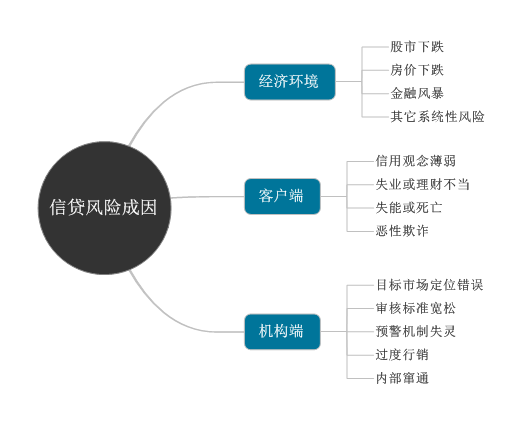

## 信贷风险

### 信贷风险成因

要讨论信贷风控策略，首先需思考风险从何而来，出现的原因是什么？如此才能进一步研究风险发生的前兆、影响范围、冲击程度及应对方式。

信贷风控业务涉及面广，风险成因复杂，不能单纯规则于客户信用败落，一般可以从以下几个方面进行探讨。

[信贷风险成因](信贷风险成因.mmap)

#### 经济环境

总体经济环境直接或间接影响每个人的财力及偿债能力。

比如股市下跌、房市下跌、金融风暴、其它系统性风险。拿股市举例：当股市市场较好时，投资人纷纷将手中的资金投入股市，甚至利用信贷及现金卡等消费金融产品获取更多的资金购买股票。在股市获利后，其消费能力及欲望大增，从而使得信用卡业务受惠；由于客户偿债记录良好，使其信用持续扩充。若股市下跌，客户被套牢蒙受损失，为求解套，往往向银行或其它渠道寻求更多资金，当股票下跌到一定程度，客户严重亏损无力支撑负债，就会出现逾期情况。所以在股市飙升时，风险管理人员要注意客户资金用途，并对消费行为异于以往或或无担负债快速增加的客户予以特别的注意观察。

与股市效应类似的还有房市，因此，须对投资型客户及风险较高的地区案件小心。

同时全球性的金融风暴和其它一些无法预测的系统性风险或天灾，也会带来意料之外的伤害。

#### 客户端

客户端的风险主要包括：

- 信用观念薄弱：信用价值为消费金融业务最重要的基础。对于消费金融最为热衷的年轻人群，在纵情享受的冲动下，容易过度的消费自己的信用，所以量力而为及信用无价的观念仍有待加强。
- 失业或理财不当：客户失业也是重要风险之一。尤其是中年人群，如果失业在面对房贷、车贷或其它贷款时易出现逾期现象。
- 失能或死亡：客户若遭遇如车祸或其它意外导致失能而无法工作甚至死亡，可能给机构造成损失，债款回收的机率相对较低。
- 恶性欺诈：欺诈风险为机构必须面对的挑战。

#### 机构端

- 机构在推出产品前，要针对目标客户群进行深入研究，配合客户群风险给予不同定价（risk-based pricing），并以产品利润模型（PPM，product profit model）评估各项损益。锁定正确的目标客户群，搭配适当的营销策略，才能真正获利。

- 贷中：征审及授信政策人员需要保持一个公正客观的立场，如果为了配合业务发展需求而放宽审核标准，将形成风险管理漏洞。
- 贷后管理，每位客户于往来期间，机构须密切关心其信用状况变化，若未能落实KYC（know your customers），预警机制无法有效发挥功能，措施风险防范的先机。
- 过度营销：金融机构为了抢占市场或者业务人员为了提升个人业绩，可能会将产品入门门槛降低，开放对于风险较高的次级客户代放，而使授信质量受到影响。
- 内部窜通欺诈：内部人员串通外部人员进行欺诈，如故意泄露风控流程中的一些薄弱环节协助欺诈分子作案。

### 信贷风险类型

信贷风险依据发生场合、对象、时机或衡量目的不同，有不同的分类方式。

#### 市场风险/作业风险/信用风险

- **市场风险**

市场风险是指因各种市场因素改变而引起的净利或组合价值损失。就消费金融而言，此类风险主要来自客户群体结构、国民所得、失业率、政府法令与风俗民情等方面。

- **作业风险**

作业风险是指由于银行人员或系统作业处理不当，给客户及公司造成直接或间接损失的风险，主要包括信息安全、防呆帐机制、标准作业流程、经验及训练、人员操守及防弊机制几个方面。

- **信用风险**

信用风险是指借款人或交易对手无法履行契约义务，因而承受经济损失的风险。消费金融信用风险来源主要有逾期及欺诈两大类。其中欺诈又可分为伪冒申请及欺诈交易。

#### 名义风险/实质风险

- **名义风险**

名义风险是指客户风险表现于财务报表的数字上，即反映违约客户对于产品损益的影响。其重点在于评估帐面发生损失的几率。

客户自发生延滞开始，即出现转销呆帐的可能风险，就财务观点而言，须就逾期但未转呆帐的客户进行提存动作，提存计算范围至转呆帐前为止，若客户实际转列呆帐，表示往后已不会对帐面产生其它损失，因此就名义风险的角度来看，此客户的风险在转呆帐之后随之归零。

- **实质风险**

实质风险是指客户风险表现于实际逾期状态的数字上，反映违约客户对于产品质量的影响。其重点在于评估往来之后发生损失的机率。

#### 事前风险/事后风险

- **事前风险**

事前风险是指客户于早贷之时各项个人条件及其与其它金融机构往来记录所透露的风险。简单地说，事前风险就是客户申请贷款时既有且可被机构掌握的风险。

- **事后风险**

事后风险是指贷款放贷成功之后，客户于往来期间发生风险，此类风险在征审阶段辨识困难，通常须依赖贷后管理机制及早发现风险征兆。

### Reference

- 互联网金融时代消费信贷评分建模与应用. 单良, 茆小林著.