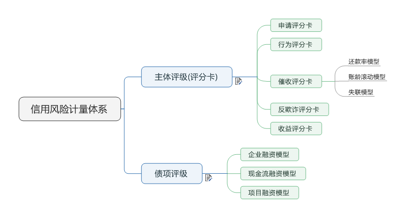
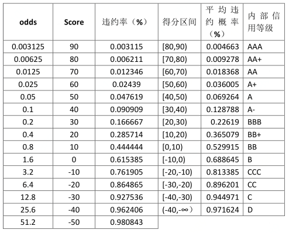
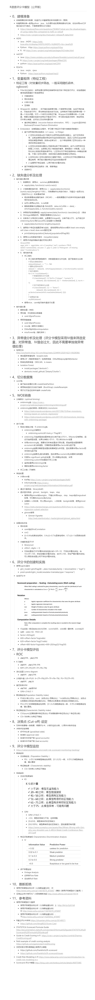

## 评分卡模型

## 信用风险评级模型的类型

## 信用风险评级模型开发流程

### （1） 数据获取

包括获取存量客户及潜在客户的数据。存量客户是指已经在证券公司开展相关融资类业务的客户，包括个人客户和机构客户；潜在客户是指未来拟在证券公司开展相关融资类业务的客户，主要包括机构客户，这也是解决证券业样本较少的常用方法，这些潜在机构客户包括上市公司、公开发行债券的发债主体、新三板上市公司、区域股权交易中心挂牌公司、非标融资机构等。 

### （2） EDA（探索性数据分析）与数据描述

该步骤主要是获取样本总体的大概情况，以便制定样本总体的数据预处理方法。描述样本总体情况的指标主要有缺失值情况、异常值情况、平均值、中位数、最大值、最小值、分布情况等。 

### （3） 数据预处理

主要工作包括数据清洗、缺失值处理、异常值处理，主要是为了将获取的原始数据转化为可用作模型开发的格式化数据。 

#### 缺失值处理

- 直接删除含有缺失值的样本

  含有缺失值样本占总样本的比例、样本缺失列占总列数的比例

- 根据样本之间的相似性填补缺失值（列）

  使用能代表变量中心趋势的值进行填补。

  - 定量指标 -- 平均值、中位数

    最佳选择是由变量的分布来确定，例如，对于接近正态分布的变量来说，由于所有观测值都较好地聚集在平均值周围，因此平均值就就是填补该类变量缺失值的最佳选择。然而，对于偏态分布或者离群值来说，大部分值都聚集在变量分布的一侧，平均值不能作为最常见值的代表，中位数是更好地代表数据中心趋势的指标。

  - 定性指标 -- 众数

- 根据变量之间的相关关系填补缺失值（行）

  基于KNN找k个最邻近的样本的（考虑距离加权的）统计值进行填补。

  在计算欧式距离时，为了消除变量间不同尺度的影响，通常要先对数值变量进行标准化。

#### 异常值处理

检测出异常值后，其处理方法与缺失值的处理方法是相同。

1. 基于已知的数据范围

2. 基于离群值检测

   - 单变量离群值检测

     求解单变量数值四分位数值，将数值小于第1个四分位数和大于第3个四分位数的值定义为离群值。

     该方法扩展到在二维数据框中检测离群值。先分别在两列数据上进行离群值检测，再从检测出的离群值中抽取重叠的部分作为二位数据框的离群值点。

   - 局部离群值因子检测

     将一个点的局部密度与其相邻区域进行比较，如果前者远远小于后者，则该点相对于其相邻区域位于一个更稀疏的区域，我们认为该点为离群值。

   - 基于聚类方法的离群值检测

     据样本的分布将样本聚为若干个群簇，那些远离群簇中心点的值被定义为离群值。 

### （4） 变量选择

并非收集的每个指标都会用作模型开发，而是需要通过统计学的方法从所有指标中筛选出对违约状态影响最大的指标，作为入模指标来开发模型。

#### 定量指标的筛选

1. 随机森林法

2. 计算变量间的相对重要性，并通过相对重要性的排序

3. 通过自变量间的广义交叉验证法

4. 通过自变量的逐步回归法

5. 采用“Boruta”法

6. 连续变量分段，以便于计算定量指标的WOE

   - **等距分段**：将连续变量分为等距离的若干区间，然后在分别计算每个区间的WOE值。

   - **最优分段**：根据变量的分布属性，并结合该变量对违约状态变量预测能力的变化，按照一定的规则将属性接近的数值聚在一起，形成距离不相等的若干区间，最终得到对违约状态变量预测能力最强的最优分段。

     基于条件推理树（conditional inference trees, Ctree）的递归分割算法，其基本原理是根据自变量的连续分布与因变量的二元分布之间的关系，采用递归的回归分析方法，逐层递归满足给定的显著性水平，此时获取的分段结果（位于Ctree的叶节点上）即为连续变量的最优分段。其核心算法用函数ctree()表示。

   ​

   http://sklearn.apachecn.org/cn/0.19.0/modules/feature_selection.html#feature-selection

   https://blog.csdn.net/lll1528238733/article/details/76600019

#### 定性指标的筛选

计算各指标的IV值，即可得到各定性指标间的重要性度量。

 

### （5） 模型开发

该步骤主要包括变量分段、变量的WOE（证据权重）变换和逻辑回归估算三部分。 

### 拒绝推断

#### 目的：

1. 防止建模样本有偏

   A卡模型是建立在历史数据之上的，而很多被婉拒的用户没有被纳入到评分卡建模的数据集中，这就造成了建模数据的偏差，因此有必要利用拒绝推断来预测这些被婉拒的客户的0-1标签，并纳入到建模数据集中，这样就是根据100%的通过率数据进行建模了。

2. 1.公司内部策略的变动，导致当前的申请者已不能代表建模时点的申请者，同样，过去的被拒者也不能够代表当前的被拒者。因此，此时使用审批通过的数据进行建模可能会造成误判；

   2.增加样本数量，类似于防止样本有偏。

   3.利用拒绝推断可以找出被拒绝的好客户，挖掘这些客户，进而改善风控流程，增加公司效益。

#### 拒绝推断可适用的范围：

1、高通过率时推断假设不适用，因为无论是高坏账率或者低坏账率，高通过率说明坏账率已经接近原申请样本了；

2、中低通过率适用，配合适当的风控策略，可以找到更多的好人。

 

 

#### 拒绝推断方法：

1.          接受所有的申请者：

此方法是找出被拒绝客户真正表现的方法，不会有太过保守或高估的坏账率。

2.          分配法：

此方法是依据每一个分数区间的好坏重新分配好坏客户，并将拒绝件分配到每一个分数区间中，以下是具体步骤：

1）       已知好坏样本，建立初步模型；

2）       使用初步模型对所有被拒绝件进行评分，并预测他们的预期违约率；

3）      将已知的好坏样本依评分分数高低进行分组，计算各分组内实际违约率；

4）      将被拒件依照3）步的分数进行分组，以各分组的实际违约率做为抽样比例，随机抽取该分组下的被拒件，并指定其为坏，其余为好；

5）      将这些推论的有标签的数据新增加到原有的数据集中，重新建模。

 

3.          硬性截断法：

将所有婉拒件依次打分，并分配到好坏件中，步骤如下：

1）       已知好坏样本，建立初始模型；

2）       使用初始模型对所有被拒件进行打分，并建立预期坏账率P；

3）       设定一个坏账水准区分好坏件，在此坏账率水准之上视为坏件，以下视为好；

4）       将这些推论的有标签的数据新增加到原有的数据集中，重新建模。

### （6） 主标尺

主标尺：违约概率和信用等级之间的映射关系。违约概率 --> 得分 --> 信用等级标签

该步骤主要是开发某类主体的主标尺并进行模型的验证与校准。 

### （7） 模型评估

该步骤主要是根据模型验证和主标尺设计的结果，评估模型的区分能力、预测能力、稳定性，并形成模型评估报告，得出模型是否可以使用的结论。 

阈值选择 cut-off

- 评分卡分类划分的准确程度，如错误率、准确率、召回率、F1
- 评分卡的判别能力，评估评分卡将好人和坏人分离开的程度，如KS统计量、ROC曲线、GINI系数
- 评分卡概率预测的校准精度

### （8） 模型实施

即模型的部署和应用。 

### （9） 监测与报告

评分卡上线后，如何对评分卡的效果进行有效监测，监测哪些指标，监测的指标阈值达到多少我们需要对现有评分卡进行调整更新？

该步骤主要工作是定期检测模型的使用情况，并关注和定期检验模型的区分能力与预测能力的变化及模型稳定性的变化，在出现模型可能不能满足业务需求的情况时，反馈至模型开发团队，及时进行模型更新或重新开发。

1. **变量稳定性：**监测模型的输入变量的分布是否有变化

   假设我们要比较样本A与样本B中某一变量Y的分布，首先按照同一标准将Y分为几个区间（通常分为10段），计算样本A和样本B中每个区间的占比。在每个区间段上，将两个样本的各自占比相除再取对数，然后乘以各自占比之差，最后将各个区间段的计算值相加，得到最终PSI. 

2. **模型分数分布稳定性：**监测模型的打分结果的分布是否有变化

