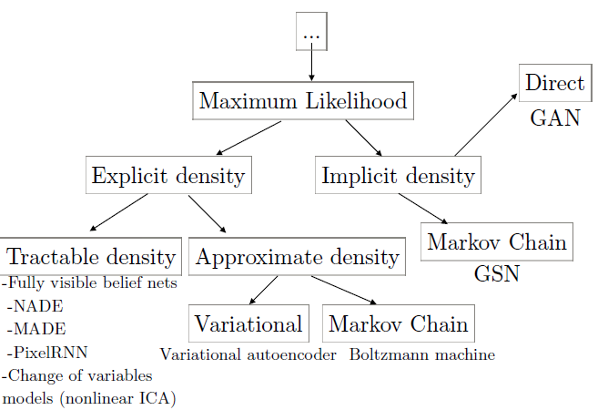

​生成式模型指的是用某种方式去学习并表达针对一个训练数据集分布的估计，也就是$p_{model}$ 因为对于一个训练数据集来说，它所包含的样本会满足一定的分布 $p_{data}$。

通常情况下， 我们不可能知道真实的数据分布 $p_{data(x)}$， 只能通过一些特殊的样本 $x$ 来得到一个对真实数据密度的一个估计， 也就是 $p_{model}$。

### 为什么要学习生成式模型

学习生成式模型有很多的原因，其中包括：

- 生成式模型的训练和采样是一个对我们关于**表达和操作高维概率分布**问题的能力的非常好的测试。 高维的概率分布问题是一个很重要的问题，其在数学和工程领域有很广泛的应用。

- 生成式模型可以以多种方式被应用到增强学习中（reinforcement learning）。

- 生成式模型可以使用有缺失的数据（missing data）来训练，并且可以对缺失的数据进行预测。减少对标注数据的依赖，GAN可以让半监督学习表现的相当好。

- 生成式模型，以及GAN， 使机器学习可以用于多模（multi-modal）输出问题。 有很多任务，一个输入可能对应多个正确的输出， 每一个输出都是可接受的。 传统的基于平均值的机器学习模型， 比如， 对期望输出和预测输出的均方差（MSE）进行最小化的方法，无法训练此种有多个正确输出的模型。

- 很多任务本身需要根据分布来产生真实数据。

  - 使用一个低分辨率图片产生高分辨率图片。

  - 艺术创作任务。通过给出想像的粗略的场景来辅助用户创建真实的图像。

    

  - Image-to-image 转换应用可以将航空图像转换为地图， 或者将素描转换为图像。

    Isola et al. (2016) 演示了很多种图到图转换的应用： 将卫星图像转为地图； 将素描转为真实的照片等等。 因为这个转换过程中每一个输入都对应多个输出， 有必要使用生成式建模来正确的训练模型。 其中Isola et al. (2016) 使用了GAN。 图到图的转换工作给出了很多例子， 这些例子让我们看到一个创新的设计可以帮助我们发现很多意想不到的生成式网络的应用。

    

### 生成式模型是如何工作的? GAN与其他模型有什么区别？

#### 最大似然估计(Maximum Likelihood Estimation)

最大似然方法的基本思路是定义一个模型来对概率分布进行估计。 给定一个数据集包含$m$个训练样本$x^{(i)}$， 然后使用似然（likelihood）表示模型在训练数据集上的概率， 也就是: $\prod_{i=1}^mp_{model}(x^{(i)};\theta)$。简单的说， 最大似然的原理是通过优化模型参数来最大化在训练数据上的预测概率。

我们也可以认为最大似然估计是最小化数据生成分布（data generating distriution）与模型分布的**KL散度**：
$$
\theta^* =  arg\ \underset{\theta}min\ D_{KL}(p_{data}(x)||p_{model}(x;\theta))
$$
理想情况下，如果$p_{data}$是$p_{model}(x;\theta)$分布的一种分布， 那么模型就可以很好的覆盖$p_{data}$。 在实际应用中， 我们无法获取$p_{data}$本身， 只能使用包含有m个样本的训练数据集。 使用这m个样本可以定义一个经验性分布$\hat{p}_{data}$来近似$p_{model}$。 最小化$\hat{p}_{data}$与$p_{data}$的KL散度等价于在训练数据集上最大化对数似然(log-likelihood)。

#### 深度生成模型的分类

图9： 深度生成模型可以使用最大似然的原理进行训练，不同方法的差异在于如何表达或者近似似然。 在此分类树的左边的分支， 模型构建了一个显式的密度函数，$p_{model}(x;\theta)$， 因此我们可以最大化一个显式的似然。 在这些使用显式密度的模型中， 密度函数的计算有的很容易，有的不容易， 这意味着，有时需要使用变分近似（variational approximations），或者Monte Carlo近似（或者两者）来最大化似然。 右边的分支，模型没有显式的表达一个数据空间的概率分布。 取而代之的是，模型提供一些方法来尽量少的直接的与概率分布打交道。 通常， 这种与概率分布交互的非直接方法提供了产生样本的能力。 有一些这种隐式的模型使用Markov chain来提供从数据分布中采样的能力，此类模型定义了一种通过随机转换一个已知的样本来得到属于同一个分布的另一个样本的方式。 有些方法可以在不需要任何输入情况下，通过一个简单的步骤产生一个样本。 尽管GAN使用的模型有时能被用来定义显式的密度， 但是GAN的训练算法仅仅使用模型的能力来产生样本。 因此， GAN是使用最右边叶子的策略来训练的， 也就是使用一个隐式的模型通过此模型直接产生符合分布的样本。

##### 显式密度模型

1. 易处理的显式模型

   - **完全可见置信网络 Fully visible belief networks (FVBN)**

     主要缺点：一个样本的生成复杂度为 O(n)，不能并行计算。

   - **非线性独立成分分析**

     主要缺点：对函数g的选择有很多的限制。 特别是因为有可逆的需求，所以隐变量z必须和x有相同的维数。

2. 需要近似的显式模型

   为了克服显式密度函数由于模型设计的需要带来的缺陷， 出现了另外一些模型， 这类模型仍然使用显式的密度函数，但是却不易计算， 需要使用近似的方式来优化最大似然。

   -  决定式近似， 通常指变分方法（Variational methods）
   - 随机近似， 通常指Markov Chain Monte Carlo 方法。
   - 有些模型同时使用变分和马尔可夫链近似。 比如深度玻尔兹曼机使用这两种近似（Salakhutdinov and Hinton, 2009）。

##### 隐式密度模型

1. 生成随机网络（Bengio et al., 2014）

   隐式密度模型，要运行很多次来获得一个样本。

2. GAN

3. 其他的基于Kernelized momentmatching方法（Li et al., 2015; Dziugaite et al., 2015）

#### GAN与其他生成模型的比较

总而言之， GAN被设计为可以避免很多的其他生成模型的缺点：

- 它可以并行产生样本， 而不是使用运行时间与x的维数成比例的方法。 这一点比FVBN有优势。
- 生成函数设计有很少的限制。 这一点是针对玻尔兹曼机的优势， 只有少数的概率分布能够被马尔可夫链来处理， 并且相比非线性ICA， 生成器必须是可逆的，并且隐变量编码z必须与样本x同维。
- 不需要马尔可夫链。 这一点比玻尔兹曼机和生成随机网络有优势。
- 不需要变分边界， 并且那些被用于GAN的模型是全局优化器， 所以GAN是渐近一致的（asymptotically consistent）。 一些VAE也可能是渐近一致，但是还没有被证明。
- GAN通常被认为比其他方法可以产生更好的样本。

同时， GAN也有一些缺点： 训练需要找到纳什均衡， 这是一个比优化一个目标函数更难的问题。

**疑问**

- 当前三个最流行的生成式网络

  - FVBNs【查原理】
  - GAN
  - autoencoder

- 生成随机网络（Bengio et al., 2014）

  隐式密度模型，要运行很多次来获得一个样本。

### GAN是如何工作的?

#### Reference

1. https://sinpycn.github.io/2017/04/29/GAN-Tutorial-How-do-generative-models-work.html
2. https://sinpycn.github.io/2017/05/03/GAN-Tutorial-How-do-GANs-work.html