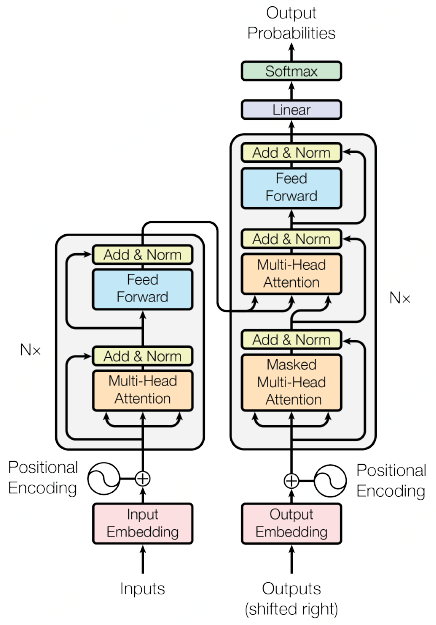
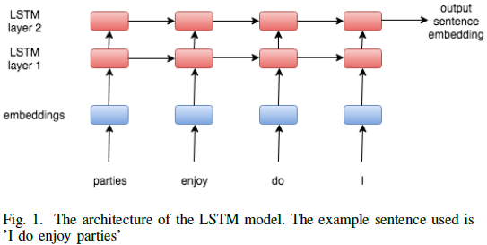
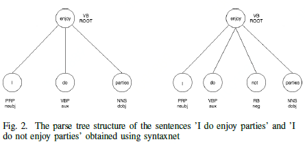
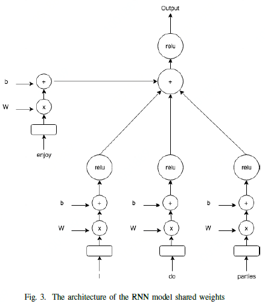
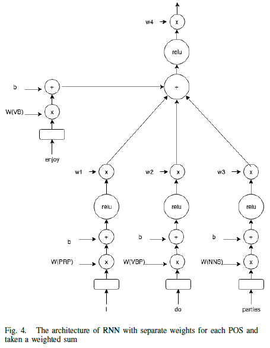
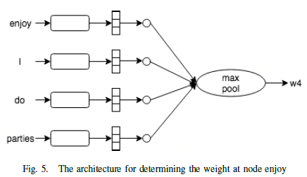

# FastText

将句子编码成嵌入向量

支持skipgram、cbow两种模式学习词嵌入。

- skipgram

  given the sentence *'Poets have been mysteriously silent on the subject of cheese'* and the target word '*silent*', a skipgram model tries to predict the target using a random close-by word, like '*subject' or '*mysteriously*'.*

- cbow

  The cbow model takes all the words in a surrounding window, like {been, mysteriously, on, the}, and uses the sum of their vectors to predict the target. 

FastText使用

直接运行fasttext，查看使用说明。

语料准备

Training word vectors

Training sentence vectors

==print-sentence-vectors 原理是什么？如何评估向量的优劣==

==对于中文，n-gram是如何起作用的==

参数：

维度

窗口大小

学习率

迭代次数

线程数

### **《Universal Sentence Encoder》**

论文提出了将句子编码成嵌入向量的模型，这些嵌入向量将迁移学习到其他NLP任务。这些模型非常高效，可以在不同的迁移任务中获得精确的性能。编码模型的两种变体允许在精度和计算资源之间进行权衡。

本文主要提出了两个句子encode的框架，一个是之前《Attention is all you need》里面transform的一个encode框架，另一个是DAN（deep average network）的encode方式。两个的训练方式较为类似，都是通过多任务学习，将encode用在不同的任务上，包括分类，生成等等，以不同的任务来训练一个编码器，从而实现泛化的目的。

文中还提出了比较两个句子向量之间的相似度时候不用原生的cos距离，而是转化为弧度之后计算，效果要好于原生的：
$$
sim(u, v) = (1 - arccos(\frac{u·v}{||u||\ ||v||}) / \pi)
$$

### **《Attention is all you need》**

https://github.com/tensorflow/tensor2tensor

论文提出了一种新的简单网络结构，**Transformer**，仅基于注意力机制，无需循环和卷积。

通过attention来获得一个句子中词语的context表示，同时考虑所有的词并将其转化为一个fixed length向量。

### **ACL-15 DAN**

http://github.com/miyyer/dan

使用了较为简单的一个**DAN**模型，通过对embedding求平均后输入到feed-forward network，然后不加softmax即可得到隐层表示，然后把这个向量用多任务来进行训练模型。

### **《Learning Sentence Embeddings Using Recursive Networks》**

https://github.com/ansonb/reverse_dictionary

论文比较了学习phrase embeddings的三种方法：1）使用LSTMs，2）使用循环网络，3）使用短语的POS信息的循环网络的变体。作者在词定义的字典上训练他们的模型，以获得与Felix等人相似的逆向字典应用程序。为了查看作者提出的embeddings方式是否可以转移到新的任务中，他们还对烂番茄数据集进行了训练和测试。

这篇论文的贡献是：（1）使用word embeddings在逆向字典应用上；（2）在一个放大的无监督数据集上训练模型，并随机化了句子中的单词。

论文中比较了三个模型，LSTM、Recursive neural network (RNN) with shared weights和RNN with unique weights。

**LSTM**

句子中的词是反向输入到LSTM网络中，使用网络最后一层最后一个时间步的状态作为句子的向量表示。

**Recursive neural network (RNN) with shared weights**

使用syntaxnet解析器来形成分析树。

==何谓syntaxnet解析器？==

共享参数W

**RNN with unique weights**

通过乘以一个矩阵$w_i$考虑位置信息。==？==

**《Learning Semantic Textual Similarity from Conversations》**

论文的目的是度量会话对的相似度，如给定问答场景，区分语义相似的问题或给定问题从答案候选集中找到与问题最相关的答案。最终目标是学习一个可以返回表示各种自然语言关系（包括相似度和相关性）编码的模型。

作者提出了一种新的方法，使用对话数据来学习句子级语义相似性的表示。

通过训练无监督模型来预测对话的输入—回答对。得到的句子嵌入在语义文本相似度（STS）基准和SemEval 2017的社区问答（CQA）问题相似性子任务上表现良好。

通过引入多任务训练，结合对话式输入—回答预测任务和自然语言推理任务，性能得到进一步改善。

大量的实验表明，作者所提出的模型在STS基准测试的所有神经模型中都达到了最佳性能，并且在两项任务中都与最先进的feature engineered和mixed systems有着可相竞争的能力。

这篇论文的贡献是：首先评估从无监督的对话输入—回答对中学到的表征。 然后探索用多任务训练增强其模型，结合无监督的对话—回答预测和有监督的训练自然语言推理（NLI）数据，这被证明能够产生有用的通用目的表示。

在对话数据上的无监督训练可以在STS和CQA问题相似度上表现良好。监督式SNLI数据的添加带来了进一步的改进，并且达到了神经STS模型的最高性能，超越了单独对NLI数据训练的性能。

参考

https://www.tutorialkart.com/fasttext/make-a-model-learn-word-representations-in-fasttext/