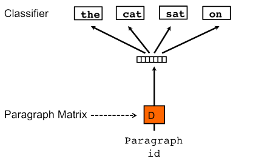

## doc2vec原理

Doc2Vec 或者叫做 paragraph2vec, sentence embeddings，是一种**非监督式算法**，可以获得sentences/paragraphs/documents 的向量表达，是 word2vec 的拓展。学出来的向量可以通过计算距离来找 sentences/paragraphs/documents 之间的相似性， 或者进一步可以给文档打标签。

与Word2vec一样，Doc2Vec也有两种模型，分别为：Distributed Memory（DM）和Distributed Bag of Words（DBOW）。DM模型在给定上下文和文档向量的情况下预测单词的概率，DBOW模型在给定文档向量的情况下预测文档中一组随机单词的概率。其中，在一个文档的训练过程中，文档向量共享（意味着在预测单词的概率时，都利用了真个文档的语义）。

Doc2vec的DM模型跟Word2vec的CBOW很像，DBOW模型跟Word2vec的Skip-gram很像。

## PV-DM模型

每一个段落表示为一个向量，对应矩阵DD中的一个列向量，每一个词表示为一个向量，对应矩阵WW中的一个列向量。段落向量和词向量通过取平均值或者相连接来对上下文(context)中的下一个词进行预测。 
  **该模型对词向量模型的唯一一个改变是在词向量模型中的(1)式中，函数hh通过WW和DD共同构造。** 
  我们可以将段落向量当做一个词向量(段落向量和词向量的维度可能不同)，训练方法和预测都与词向量模型大同小异。但是需要注意一点是：**不同的段落具有不同段落向量，但是不同段落中的相同词具有相同的词向量**。 
  该模型的一个主要的优点是：**段落向量的获得过程中，可以对没有标记的数据进集行训练**，换句话说，在段落向量的获取过程中，无论数据集有没有标记，都可以拿来训练。

## PV-DBOW模型

