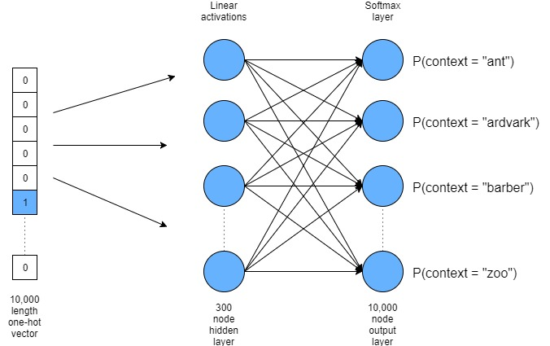

词向量

word2vec的核心是神经网络，采用 CBOW（Continuous Bag-Of-Words，即连续的词袋模型）和 Skip-Gram 两种模型，将词语映像到同一坐标系，输出为数值型向量的方法。
$$
\begin{equation} 
\begin{pmatrix} 
the \\ 
cat \\ 
sat \\ 
on \\ 
the \\ 
mat \\ 
\end{pmatrix} 
= 
\begin{pmatrix} 
1 & 0 & 0 & 0 & 0 \\ 
0 & 1 & 0 & 0 & 0 \\ 
0 & 0 & 1 & 0 & 0 \\ 
0 & 0 & 0 & 1 & 0 \\ 
1 & 0 & 0 & 0 & 0 \\ 
0 & 0 & 0 & 0 & 1 
\end{pmatrix} 
\end{equation}
$$

word2vec，出现了phrase2vec, sentence2vec和doc2vec

one-hot[^one-hot]存在的问题

- ​
- ​

skip-gram[^word2vec]

参考

[^word2vec]: Efficient Estimation of Word Representation in Vector Space
[^one-hot]: one-hot

http://adventuresinmachinelearning.com/word2vec-tutorial-tensorflow/

**Efficient Estimation of Word Representation in Vector Space**

[Tomas Mikolov论文简评：从Word2Vec到FastText](https://blog.csdn.net/m0epNwstYk4/article/details/79124801)