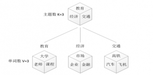
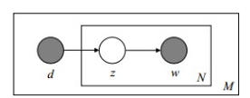

# 概率潜在语义索引

## PLSI概述

pLSI: probabilistic Latent Semantic Index

一种用于分析双模式和共现数据的统计技术。 实际上，就像从PLSA进化而来的潜在语义分析一样，可以根据它们对某些隐藏变量的亲和性来导出观察变量的低维表示。

LSI缺少令人满意的统计学基础，运算量过大，且无法解决一词多义的问题，因此，在LSI的基础上，Thomas Hofmann于1999年提出了PLSI模型。

## PLSI的文档生成模型

  要理解PLSI主题模型，我们首先要理解PLSI假定的文档生成模型是什么。假设你要写M篇文档，由于一篇文档由各个不同的词组成，所以你需要确定每篇文档里每个位置上的词。再假定你一共有K个可选的主题，有V个可选的词，咱们来玩一个扔骰子的游戏。

  1、假设你每写一篇文档会制作一颗K面的“文档-主题”骰子（扔此骰子能得到K个主题中的任意一个），和K个V面的“主题-词项” 骰子（每个骰子对应一个主题，K个骰子对应之前的K个主题，且骰子的每一面对应要选择的词项，V个面对应着V个可选的词）。 
  比如可令K=3，即制作1个含有3个主题的“文档-主题”骰子，这3个主题可以是：教育、经济、交通。然后令V = 3，制作3个有着3面的“主题-词项”骰子，其中，教育主题骰子的3个面上的词可以是：大学、老师、课程，经济主题骰子的3个面上的词可以是：市场、企业、金融，交通主题骰子的3个面上的词可以是：高铁、汽车、飞机。如下图所示： 

​                                                                

  2、每写一个词，先扔该“文档-主题”骰子选择主题，得到主题的结果后，使用和主题结果对应的那颗“主题-词项”骰子，扔该骰子选择要写的词。要注意，每篇文档有其自己的“文档-主题”骰子。 
  上面这个投骰子产生词的过程简化下便是：“先以一定的概率选取主题，再以一定的概率选取词”。事实上，一开始可供选择的主题有3个：教育、经济、交通，那为何偏偏选取教育这个主题呢？其实是随机选取的，只是这个随机遵循一定的概率分布。比如3个主题的概率分布是{教育：0.5，经济：0.3，交通：0.2}，我们把各个主题z在文档d中出现的概率分布称之为主题分布，且是一个多项分布。 
  同样的，从主题分布中随机抽取出教育主题后，依然面对着3个词：大学、老师、课程，这3个词都可能被选中，但它们被选中的概率也是不一样的。比如3个词的概率分布是{大学：0.5，老师：0.3，课程：0.2}，我们把各个词语w在主题z下出现的概率分布称之为词分布，这个词分布也是一个多项分布。 
  所以，选主题和选词都是两个随机的过程，先从主题分布{教育：0.5，经济：0.3，交通：0.2}中抽取出主题：教育，然后从该主题对应的词分布{大学：0.5，老师：0.3，课程：0.2}中抽取出词：大学。

  3、最后，不停的重复扔“文档-主题”骰子和”主题-词项“骰子，重复N次（产生N个词），完成一篇文档，重复这产生一篇文档的方法M次，则完成M篇文档。

  在这个过程中，我们并未关注词和词之间出现的顺序，所以pLSA是一种词袋方法。具体说来，该模型假设一组共现(co-occurrence)词项关联着一个隐含的主题类别。 
接下来，我们对生成模型中出现的一些变量、概率做一下定义：

  $P(d_i)$表示海量文档中某篇文档被选中的概率。 
  $P(w_j|d_i)$表示词$w_j$在给定文档$d_i$中出现的概率。怎么计算得到呢？针对海量文档，对所有文档进行分词后，得到一个词汇列表，这样每篇文档就是一个词语的集合。对于每个词语，用它在文档中出现的次数除以文档中词语总的数目便是它在文档中出现的概率$P(w_j|d_i)$。 
  $P(z_k|d_i)$表示具体某个主题$z_k$在给定文档$d_i$下出现的概率。 
  $P(w_j|z_k)$表示具体某个词$w_j$在给定主题$z_k$下出现的概率，与主题关系越密切的词，其条件概率$P(w_j|z_k)$越大。 
  利用上述的第1、3、4个概率，我们便可以按照如下的步骤得到“文档-词项”的生成模型： 
  1、按照概率$P(d_i)$选择一篇文档$d_i$。 
  2、选定文档$d_i$后，从主题分布中按照概率$P(z_k|d_i)$选择一个隐含的主题类别。 
  所以PLSA中生成文档的整个过程便是选定文档生成主题，确定主题生成词。

## PLSI模型

  我们已经知道了PLSI的生成模型，那如何根据已经产生好的文档反推其主题呢？这个利用看到的文档推断其隐藏的主题（分布）的过程（其实也就是产生文档的逆过程），便是主题建模的目的：自动地发现文档集中的主题（分布）。

  文档d和单词w自然是可被观察到的，但主题z却是隐藏的。如下图所示： 

​                                                                       

  上图中，文档d和词w是我们得到的样本，可观测得到，所以对于任意一篇文档，其$P(w_j|d_i)$是已知的。从而可以根据大量已知的文档-词项信息，训练出文档-主题和主题-词项 ，如下公式所示：
$$
P(w_j|d_i) = \sum _{k=1}^{K}P(w_j|z_k)P(z_k|d_i)
$$
  故得到文档中每个词的生成概率为：
$$
P(d_i,w_j) = P(d_i)P(w_j|d_i) = P(d_i)\sum _{k=1}^{K}P(w_j|z_k)P(z_k|d_i)
$$
  由于$P(d_i)$可事先计算求出，而$P(w_j|z_k)$和$P(z_k|d_i)$未知，所以$θ=(P(w_j|z_k),P(z_k|d_i))$就是我们要估计的参数（值），通俗点说，就是要最大化这个$θ$。

常用的参数估计方法有极大似然估计MLE、最大后验证估计MAP、贝叶斯估计等等。因为该待估计的参数中含有隐变量z，所以我们可以考虑EM算法。

## EM求解PLSI模型

参考资料1

## 应用场景

## 参考

[PLSI主题模型](https://blog.csdn.net/m0_37788308/article/details/78115378)

[通俗理解LDA主题模型](https://blog.csdn.net/v_july_v/article/details/41209515)

