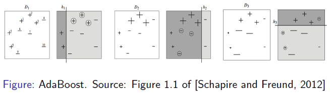
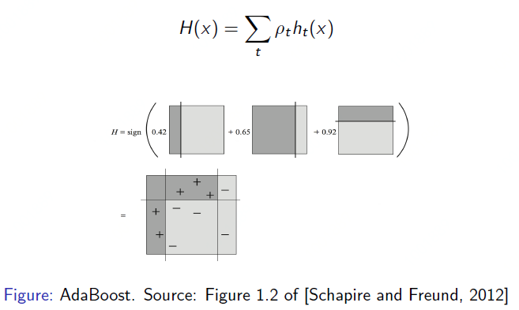
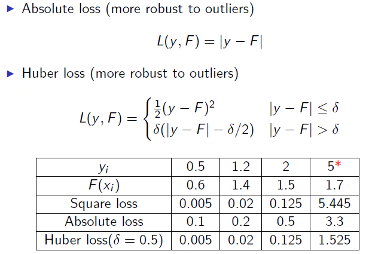

adboost原理

ensemble时各模型的权重是如何得到的？

gradient boosting 

基于梯度的好处在于可以使用除了MSE之外的损失函数。因为MSE损失函数对于异常值过于敏感。

回归问题的损失函数

- Square loss

- Absolute loss（more robust to outliers）

- Huber loss（more robust to outliers）

  