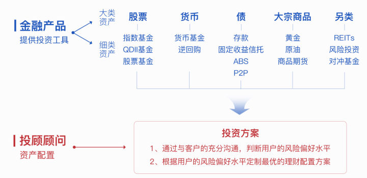
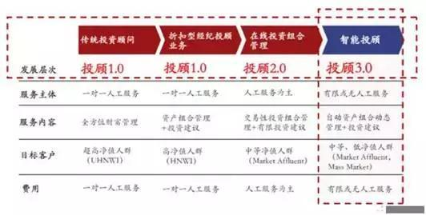

智能投顾，作为一种新兴投资模式，近年来在美国市场快速崛起，世界知名咨询公司A.T. Kearney预测，美国智能投顾行业的资产管理规模将从2016年的3000亿美元增长至2020年的2.2万亿美元，年均复合增长率将达到68%。 

普华永道2015年发布的研究报告预期全球资产管理规模在2020年将高达102万亿美元，麦肯锡估计通过虚拟咨询服务的潜在个人金融资产价值将达到13.5万亿美元，智能投顾作为虚拟咨询的重要组成部分，全球资产管理规模和虚拟咨询服务规模的发展，也表明智能投顾正在成为新的风口。 

“做投资决策，最重要的是要着眼于市场，确定好投资类别。从长远看，大约90%的投资收益都是来自于成功的资产配置。”

——“全球资产配置之父” 加里·布林森

什么是智能投顾？

人工智能＋投资顾问的结合体 。

发达的金融产业依靠的是专业化分工和规模效应，投资理财领域如下图存在“金融产品”和“投资顾问”两个层面的分工： 

1)金融产品： 

金融产品本质上是为大众或专业投资者提供基础的投资工具。 

2)投资顾问 

投资顾问是连接用户端和金融产品端的重要桥梁。

- 投资顾问连接用户端——通过一系列细致深入的访谈了解用户的风险偏好 
- 投资顾问连接产品端——根据不同用户的风险偏好定制的配置资产组合 

智能投顾是指利用大数据分析、量化金融模型以及智能化算法，根据投资者的风险承受水平、预期收益目标以及投资风格偏好等要求，运用一系列智能算法，投资组合优化等理论模型，为用户提供投资参考，并监测市场动态，对资产配置进行自动再平衡，提高资产回报率，从让投资者实现“零基础、零成本、专家级”动态资产投资配置。 

与传统投资顾问一样智能投顾依然承担者用户和金融产品之前的桥梁作用，那么人工智能又是如何发挥这个桥梁作用的呢？ 

**通过算法和模型定制风险资产组合** 

**通过大数据识别用户风险偏好** 

总之因为客户收入、年龄、性别、心理特征的差异会产生不同的风险偏好和风险偏 好变化轨迹，根据这样的特性智能理财就要做到千人千时千面。

 识别智能投顾就有以下四个标准 :

1. **通过大数据获得用户个性化的风险偏好及其变化规律** 
2. **根据用户个性化的风险偏好结合算法模型定制个性化的资产配置方案** 
3. **利用互联网对用户个性化的资产配置方案进行实时跟踪调整** 
4. **不追求不顾风险的高收益，在用户可以承受的风险范围内实现收益最大化** 

招商证券的报告指出，典型的智能投顾服务过程主要包含以下步骤：

1）客户画像：系统通过问卷调查评价客户的风险承受能力和投资目标；

2）投资组合配置：系统根据用户风险偏好从备选资产池中推荐个性化的投资组合；

3）客户资金托管：客户资金被转入第三方托管；

4）交易执行：系统代理客户发出交易指令，买卖资产；

5）投资组合再平衡：用户定期检测资产组合，平台根据市场情况和用户需求变化实时监测及调仓；

6）平台收取相应管理费。 

为什么需要智能投顾？

传统财富管理存在的缺陷：一是覆盖的用户有限，管理收费较高，主要面对小部分的机构投资者或高净值客户；二是资源配置效率低，获客成本较高；三是理财顾问能力参差不齐，知识结构单一；四是传统投顾服务有较高的道德风险，大部分理财经理不希望客户长线持有单一的理财产品，以免佣金收入下降。 

**智能投顾的优点**： 

**1.客观性**。机器人会根据后台数据进行分析，不会为了业绩去误导客户操作。相对人工来说，更客观。 

**2.非常注重风险**。智能投顾的原理是现代组合理论，它的一个基本原则就是高收益、高风险。 国外智能投顾第一步就是鉴别投资者的风险承受能力，绝不会推荐老年人买P2P理财。 

**3.执行力**。机器人根据固定的设置，达到止盈或者止损，一定会叫你卖出或买入。 这样有效克服了人性的弱点，我们知道，往往亏损都是因为太贪婪。 

**4.服务面广，成本低**。网络可以低成本服务最广大的人群，这就是互联网的特点。 

**智能投顾的缺点：** 

**1.恶意代码**。软件也是人编的，很可能会为了公司利益，向你推荐不那么好的理财产品。 比如某只基金给智能投顾公司一定费用，或智能投顾公司自己也开发理财产品。 

**2.人才稀缺**。现在人工智能的人才全球的稀缺，而人工智能力量的核心就是人才储备。 

**3.法律风险**。现在这块又是监管空白，如果智能投顾公司出现道德问题，谁来保障我们投资者的权益？ 

**4.夸大宣传**。你看到那些宣传的业绩，往往都是一些排名靠前的。可能指导了一千个客户， 但只是把业绩靠前的给你看，来误导更多人跟进。历史业绩模拟，也可以截取一段表现最好的来展示。 

智能投顾平台类型有哪些？

智能投顾平台用户进行投资的流程大致相同，可以分为风险测评、获得投资方案、连接账户、进行投资、更新方案、完成投资六大步骤。

1、招商证券将智能投顾进一步细分为**全智能投顾、半智能投顾**，目前行业以半智能投顾模式为主。

全智能投顾是指资产配置建议完全由机器人投顾的人工智能算法给出，人工只做必要的有限干预甚至完全不予干预，主要应用于投资组合构建与交易执行。此类公司大多以新兴互联网平台投顾公司起家，如 Betterment、Wealthfront、SIGFIG等。

而半智能投顾资产配置计划也由机器人投顾给出，但只是作为一种参考，最终投资建议必须经过人工检视、处理后才能提供用户使用，用户与传统投资顾问有更多的互动，其中可以涉及用户税收筹划、房地产投资、子女教育投资等更广泛的财富管理增值服务。此类公司主要是由传统金融机构自主研发或是吸收兼并全智能投顾公司产生，如先锋基金  PAS、嘉信理财SIP等。

从行业发展情况来看，半智能投顾模式由于依托传统金融机构的平台资源和客户渠道，目前处于领先地位。但随着技术进步，更能体现智能投顾优势的全智能投顾模式将成为未来市场主流。

2、按照平台业务模式，东吴证券将目前国内智能投顾平台分为三类，分别是**独立建议型、混合推荐型和一键跟单型。**

独立建议型：

提供诸如A股仓位、买卖点等建议或资产配置建议。

混合推荐型：

推荐与用户风险相适应的基金或其他理财产品。

一键跟单型：

帮助用户管理资金并进行投资，通过第三方平台存放资金以保证用户资金安全。

产品层面

 1. 电子化交易模块：包含程序交易 program trading，算法交易 algorithm trading，量化交易 quantitative trading 与 统计套利交易 statistics trading 模块

a) 程序交易模块为交易应用层，或者是交易决策输出层，强调的是在公开化的市场行情中寻找有效的交易机会，并做出相应的交易决策

b) 算法交易着重于交易订单的执行层面，负责快速、低成本、高效率执行相关的交易订单，并利用相关衍生工具进一步控制交易的成本。这里与股票交易不同的是，股票交易强调的是减少市场冲击成本（即大订单进入市场造成对流动性的影响，进而影响到总成本）

c) 量化交易着重在以概率论与微积分为基础的统计数学工具上，研究市场中资产内在价值与价格形成的结构性原因，若市场中出现价值与价格偏离的情况，系统自动计算偏离度的形成因子，并计算在未来不同时间段内该因子本身与因子对偏离影响的增大或缩减的幅度与相关概率

d) 统计套利着重于利用历史样本数据，寻找成因并预测相关套利机会，系统着重于搜寻可套利资产标的、确定套利区间与套利比率，并纳入对非周期性影响因素的效果考量

\2. 人工智能与机器学习模块：包含六个不同维度的功能模块

a) 资产组合构建：全球海量标的计算，多维资产空间交互匹配：基于概率图论，实时获取并计算评估超过全球超过42万个资产项目的超过200个维度的底层数据，构建出含有20万个节点和超过200亿条有效联接的双向贝叶斯概率图，最终输出与资产管理方或投资者偏好相匹配的候选组合

b) 细分资产筛选与识别：利用数据挖掘与神经网络认知学习系统，学习与资产相关的众多非结构化数据与市场资讯，构建事件检索词典，并使用无监督学习技术甄别出合理交易周期内可选择的资产标的，实现适合热点主题投资的定制化最优交易策略

c) 智能分析配置优化系统：在严格遵循投资偏好要求，保证最佳流动性状态的前提下，对组合与平台资产进行持续性的动态优化，以达到最优化风险调整后预期收益的目标

d) 智能化的量化择时监控与调仓执行：独有的智能回测模块，自动识别底层标的和组合整体特性，利用实时更新的市场与产品数据，动态计算、监测当前市场状况下变动的调仓方案，并进行可行性分析、多参数历史无偏差回测，并结合交易成本寻求最优调仓执行路径

e) 机构化大数据平台：多维度的海量全球数据，包含商用数据、政府披露数据、三方独立机构采集数据、独立定向舆情数据等全球数千项公开/半公开数据源，以及平台自身积累的用户交易偏好数据经过多层处理后构建为独有的自动化大数据平台，并支持数万种不同策略的实时回测演算研究

f) 脉冲交易执行系统：全自动执行输出的投资决策，并结合量化交易模块控制交易频次、风险系数与其它实际影响交易效率的结构性因素。同时，利用机器学习预测组合在可预期时间周期内的用户交易模式，通过集成化的交易订单近一步降低交易成本、资金门槛，同时保持最佳的流动性体验

**结论：**

1. 美国智能投顾行业主要受到七个驱动力的推动：（1）资产配置需求、ETF投资需求增加；（2）ETF产品种类增加；（3）资本支持企业创新；（4）低门槛；（5）低费率；（6）以税收损失收割为首的技术创新；（7）以透明化操作为首的用户体验提升。
2. 在美国，我们主要看好具备如下特点（重要性递减）的智能投顾项目：（1）融资能力强；（2）保持低门槛市场定位，深耕长尾市场；（3）和传统投顾有股权或战略合作关系；（4）擅长塑造自身品牌，或具有专业投资机构背书。
3. 中国市场不能直接移植美国的经验，主要原因有三：（1）中国投顾站在卖方的角度，不在乎为客户降低成本，智能产品不会得到投顾推荐；（2）中国的投资者更重视短期收益，被动投资相对受忽视；（3）中国税法不支持税收损失收割。
4. 中国方面，行业将起步更慢，我们看好具备如下特点（重要性递减）的智能投顾项目：（1）突破牌照束缚；（2）美国经验所总结的四点。

 

 

 

 

 