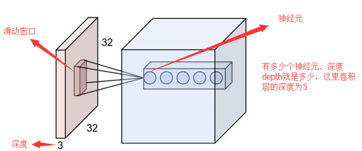

# 卷积神经网络(CNN)

## CNN简介

**卷积神经网络**（Convolutional Neural Networks / CNNs / ConvNets）是一种[前馈神经网络](https://zh.wikipedia.org/wiki/%E5%89%8D%E9%A6%88%E7%A5%9E%E7%BB%8F%E7%BD%91%E7%BB%9C)，它的人工神经元可以响应一部分覆盖范围内的周围单元，对于大型图像处理有出色表现。

**卷积神经网络**与普通神经网络非常相似，它们都由具有可学习的权重和偏置常量(biases)的神经元组成。每个神经元都接收一些输入，并做一些点积计算，然后进行非线性转换。

卷积神经网络与传统神经网络的不同之处在于：

1. 卷积神经网络默认输入是图像，可以把特定的性质编码入网络结构，使前馈函数更加有效率，并减少了大量参数。
2. **具有三维体积的神经元(3D volumes of neurons)** ，卷积神经网络利用输入是图片的特点，把神经元设计成三个维度 ： **width**, **height**, **depth**。


 <center>传统神经网络</center>


 <center>卷积神经网络</center>

## CNN的基本组成部分

### **数据输入层**

该层要做的处理主要是对原始图像数据进行预处理，其中包括：

- 去均值：把输入数据各个维度都中心化为0，其目的就是把样本的中心拉回到坐标系原点上。
- 归一化：幅度归一化到同样的范围，即减少各维度数据取值范围的差异而带来的干扰，比如，我们有两个维度的特征A和B，A范围是0到10，而B范围是0到10000，如果直接使用这两个特征是有问题的，好的做法就是归一化，即A和B的数据都变为0到1的范围。
- PCA/白化：用PCA降维；白化是对数据各个特征轴上的幅度归一化。

### 卷积层（Convolutional layer）

卷积神经网路中每层卷积层由若干卷积单元组成，每个卷积单元的参数都是通过反向传播算法优化得到的。卷积运算的目的是提取输入的不同特征，第一层卷积层可能只能提取一些低级的特征如边缘、线条和角等层级，更多层的网络能从低级特征中迭代提取更复杂的特征。

#### **局部感知（Local Connectivity）**

普通神经网络把输入层和隐含层进行“**全连接(Full Connected)**“的设计。从计算的角度来讲，相对较小的图像从整幅图像中计算特征是可行的。但是，如果是更大的图像（如 96x96 的图像），要通过这种全联通网络的这种方法来学习整幅图像上的特征，从计算角度而言，将变得非常耗时。你需要设计 10 的 4 次方（=10000）个输入单元，假设你要学习 100 个特征，那么就有 10 的 6 次方个参数需要去学习。与 28x28 的小块图像相比较， 96x96 的图像使用前向输送或者后向传导的计算方式，计算过程也会慢 10 的 2 次方（=100）倍。

卷积层解决这类问题的一种简单方法是对隐含单元和输入单元间的连接加以限制：**每个隐含单元仅仅只能连接输入单元的一部分**。例如，每个隐含单元仅仅连接输入图像的一小片相邻区域。（对于不同于图像输入的输入形式，也会有一些特别的连接到单隐含层的输入信号“连接区域”选择方式。如音频作为一种信号输入方式，一个隐含单元所需要连接的输入单元的子集，可能仅仅是一段音频输入所对应的某个时间段上的信号。)

每个隐含单元连接的输入区域大小叫神经元的**感受野(receptive field)**。

由于卷积层的神经元也是三维的，所以也具有深度。卷积层的参数包含一系列过滤器（filter），每个过滤器训练一个深度，有几个过滤器输出单元就具有多少深度。

具体如下图所示，样例输入单元大小是32×32×3, 输出单元的深度是5, 对于输出单元不同深度的同一位置，与输入图片连接的区域是相同的，但是参数（过滤器）不同。

在这个卷积层，有两个关键操作：
　　•	局部关联。每个神经元看做一个滤波器(filter)
　　•	窗口(receptive field)滑动， filter对局部数据计算 

一个输出单元的大小有以下三个量控制：**depth**, **stride** 和 **zero-padding**。

- **深度(depth)** : 顾名思义，它控制输出单元的深度，也就是filter的个数，连接同一块区域的神经元个数。又名：**depth column**
- **步幅(stride)**：它控制在同一深度的相邻两个隐含单元，与他们相连接的输入区域的距离。如果步幅很小（比如 stride = 1）的话，相邻隐含单元的输入区域的重叠部分会很多; 步幅很大则重叠区域变少。
- **补零(zero-padding)** ： 我们可以通过在输入单元周围补零来改变输入单元整体大小，从而控制输出单元的空间大小。



#### **参数共享(Parameter Sharing)**

问为什么要权重共享呢？一方面，重复单元能够对特征进行识别，而不考虑它在可视域中的位置。另一方面，权值共享使得我们能更有效的进行特征抽取，因为它极大的减少了需要学习的自由变量的个数。通过控制模型的规模，卷积网络对视觉问题可以具有很好的泛化能力。

在卷积层中每个神经元连接数据窗的权重是固定的，每个神经元只关注一个特性。神经元就是图像处理中的滤波器，比如边缘检测专用的Sobel滤波器，即卷积层的每个滤波器都会有自己所关注一个图像特征，比如垂直边缘，水平边缘，颜色，纹理等等，这些所有神经元加起来就好比就是整张图像的特征提取器集合。


#### **卷积（Convolution）计算**


### 激励层

把卷积层输出结果做非线性映射。

虽然每个输出单元只是连接输入的一部分，但是值的计算方法是没有变的，都是权重和输入的点积，然后加上偏置，这点与普通神经网络是一样的，如下图所示：


几个常用的激励函数

1. **sigmoid 函数**
2. **tanh 函数**
3. **ReLU函数**
4. **Leaky ReLU 函数**
5. **ELU 函数**
6. **Maxout 函数**

CNN采用的激励函数一般为ReLU(The Rectified Linear Unit/修正线性单元)，它的特点是收敛快，求梯度简单。

#### 激励层的实践经验

　　①不要用sigmoid！不要用sigmoid！不要用sigmoid！
　　② 首先试RELU，因为快，但要小心点
　　③ 如果2失效，请用Leaky ReLU或者Maxout
　　④ 某些情况下tanh倒是有不错的结果，但是很少

### **池化层（Pooling layer）**

池化层是CNN的重要组成部分，夹在连续的卷积层中间， 用于压缩数据和参数的量，减小过拟合，降低运算复杂程度。

#### 池化层的具体作用

1. 增大感受野，保留主要的特征

2. 增加平移不变性，不变性包括translation(平移)，rotation(旋转)，scale(尺度)

   我们希望目标的些许位置的移动，能得到相同的结果。因为pooling不断地抽象了区域的特征而不关心位置，所以pooling一定程度上增加了平移不变性。

3. 使网络更容易优化，pooling是每个feature map单独做降采样，与基于卷积的降采样相比，不需要参数，更容易优化。在一定程度上防止过拟合，更方便优化。

#### 常见的池化操作

1. 平均池化：计算图像区域的平均值作为该区域池化后的值。

2. 最大池化：选图像区域的最大值作为该区域池化后的值。

### **全连接层（ Fully-Connected layer）**

两层之间所有神经元都有权重连接，通常全连接层在卷积神经网络尾部。也就是跟传统的神经网络神经元的连接方式是一样的。

## CNN网络架构

### Layer Patterns

常见的卷积神经网络架构是这样的：

```
INPUT -> [[CONV -> RELU]*N -> POOL?]*M -> [FC -> RELU]*K -> FC1
```

堆叠几个卷积和整流层，再加一个池化层，重复这个模式知道图片已经被合并得比较小了，然后再用全连接层控制输出。

上述表达式中 `?` 意味着0次或1次，通常情况下：`N >= 0 && N <= 3`, `M >= 0`, `K >= 0 && K < 3`。

比如你可以组合出以下几种模式： 
* INPUT -> FC, 实现了一个线性分类器， 这里 N = M = K = 0 
* INPUT -> CONV -> RELU -> FC 
* INPUT -> [CONV -> RELU -> POOL]*2 -> FC -> RELU -> FC. Here we see that there is a single CONV layer between every POOL layer. 
* INPUT -> [CONV -> RELU -> CONV -> RELU -> POOL]\*3 -> [FC -> RELU]\*2 -> FC Here we see two CONV layers stacked before every POOL layer. This is generally a good idea for larger and deeper networks, because multiple stacked CONV layers can develop more complex features of the input volume before the destructive pooling operation.

------

### Layer Sizing Patterns

- **Input layer** : 应该是2的整数次幂。比如32，64， 128等。
- **Conv Layer** : 使用小的过滤器（filter），F=3 or F=5F=3 or F=5, 步幅 S=1S=1，如果不能恰好拟合输入层，还要边缘补零。如果使用 F=3, P=1F=3, P=1，那么输出大小将与输入一样。如果用更大的过滤器（比如7*7），一般只会在紧挨着原始输入图片的卷积层才会看到。
- **Pool Layer** : F=2, S=2

### **典型CNN**

1. LeNet，这是最早用于数字识别的CNN
2. AlexNet， 2012 ILSVRC比赛远超第2名的CNN，比LeNet更深，用多层小卷积层叠加替换单大卷积层。
3. ZF Net， 2013 ILSVRC比赛冠军
4. GoogLeNet， 2014 ILSVRC比赛冠军
5. VGGNet， 2014 ILSVRC比赛中的模型，图像识别略差于GoogLeNet，但是在很多图像转化学习问题(比如object detection)上效果奇好
6. ResNet
7. DenseNet

## CNN优缺点

优点
  - 共享卷积核，对高维数据处理无压力
  - 无需手动选取特征，训练好权重，即得特征分类效果好

缺点

- 需要调参，需要大样本量，训练最好要GPU
- 物理含义不明确（也就说，我们并不知道没个卷积层到底提取到的是什么特征，而且神经网络本身就是一种难以解释的“黑箱模型”）

## **小结**

卷积网络在本质上是一种输入到输出的映射，它能够学习大量的输入与输出之间的映射关系，而不需要任何输入和输出之间的精确的数学表达式，只要用已知的模式对卷积网络加以训练，网络就具有输入输出对之间的映射能力。

## 参考

1. https://cs231n.github.io/convolutional-networks/
2. [详解卷积神经网络(CNN)](https://blog.csdn.net/qq_25762497/article/details/51052861)
3. [卷积神经网络CNN总结](https://www.cnblogs.com/skyfsm/p/6790245.html)
4. [深度学习中常用的激励函数](https://blog.csdn.net/rogerchen1983/article/details/79380567)