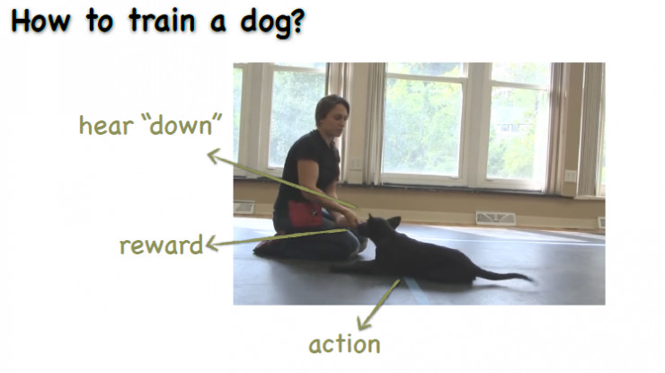

## 强化学习基础

2.1 真相--经典的隐马尔科夫模型（HMM）

2.1.1 HMM引例

2.1.2 模型理解与推导

2.1.3 隐马尔科夫应用举例

2.2 逢考必过—马尔科夫决策过程（MDP）

2.2.1 MDP生活化引例

2.2.2 MDP模型

2.2.3 MDP模型引例

2.2.4 模型理解

2.2.5 探索与利用

2.2.6 值函数和动作值函数

2.2.7 基于动态规划的强化问题求解

2.3 糟糕，考试不给题库—无模型强化学习

2.3.1 蒙特卡洛算法

2.3.2 时序差分算法

2.3.3 异步强化学习算法

2.4 学霸来了--强化学习之模仿学习

2.4.1 模仿学习（Imitation Learning）

2.4.2 逆强化学习

## 深度强化学习的理论基础

8.1 初识深度强化学习

8.1.1 深度强化学习概览

8.1.2 记忆回放（Memory-Replay）机制

8.1.3 蒙特卡罗搜索树

8.2 深度强化学习（DRL）中的值函数算法

8.2.1 DRL中值函数的作用

8.2.2 DRL中值函数理论推导

8.3 深度强化学习中的策略梯度（Policy Gradient）

8.3.1 策略梯度的作用和优势

8.3.2 策略梯度的理论推导

8.3.3 REINFORCE算法

8.3.4 策略梯度的优化算法

8.3.5 策略子－评判算法（Actor-Critic）

8.4 深度强化学习网络结构

## 深度强化学习算法框架

9.1 深度Q学习

9.2 双Q学习

9.3 异步深度强化学习

9.4 异步优越性策略子-评价算法

9.5 DDPG 算法：

9.6 值迭代网络

## 深度强化学习应用实例

强化学习做的是序列的预测和序列的学习，那为什么这个问题是强化学习问题呢？也有很多序列决策有可能并不是强化学习的问题，我们靠什么判断序列决策到底是不是强化学习呢？关键因素在于：决策放到环境里面执行以后，是否会改变这个环境。 

深度强化学习具有较广泛的使用场景，例如游戏决策、量化投资、动画仿真等 

## 强化学习的实验环境

1.5.1 Arcade Learning Environment 12

1.5.2 Box2D 12

1.5.3 MuJoCo 13

1.5.4 Gym 14

- 第一，强化学习到底是什么？
- 第二，强化学习有哪几类算法？这几类算法的思路是什么？
- 第三，强化学习能用在什么地方？应用时会遇到什么限制？

强化目的是希望机器能和动物一样，有较好的适应环境的能力。 

[南京大学俞扬博士万字演讲全文：强化学习前沿（上）](https://www.leiphone.com/news/201705/NlTc7oObBqh116Z5.html)