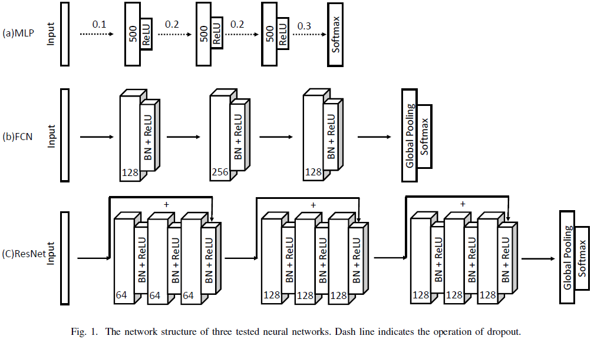
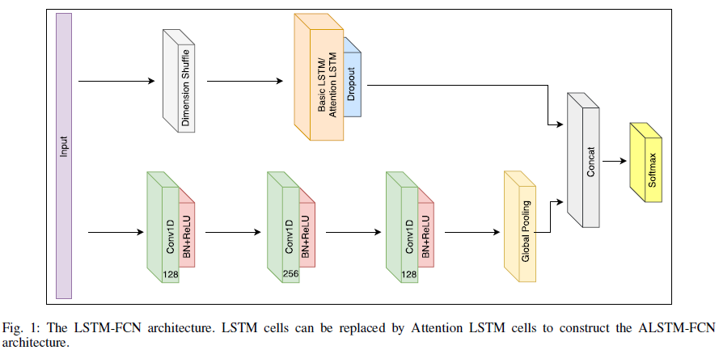
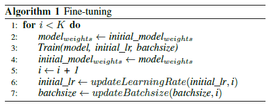

# 时间序列分类

## 为什么要进行时间序列分类？

需求场景：

- 
- 

#### Time series classification from scratch with deep neural networks: A strong baseline

提出了一种基于深度神经网络对时间序列进行分类的模型--FCN（Fully Convolutional Network） 。

- 效果优于同等模型规模的MLP、ResNet
- 模型中的全局平均池化层能够利用Class Activation Map(CAM)方法定位原始数据中对分类标签的贡献区域
- 直接在原始数据上训练模型，预处理工作量小

##### 分类方法

- distance-based methods

  基于在原始时间序列数据上预定义的相似性度量进行分类。

  - Euclidean distance
  - Dynamic time warping (DTW)

- Feature-based methods

  通过提取能够代表全局或局部时间序列模式的特征集，建模分类。模型依提取的特征而异。

  - Bag-of-Words (BoW)

  - The bag-of-features framework (TSBF)

    提取不同长度区间特征，用随机森林进行监督分类。

  - Bag-of-SFA-Symbols (BOSS)

    proposes a distance based on the histograms of symbolic Fourier approximation words。【？】

  - BOSSVS方法

    结合BOSS模型和向量空间模型；

    不同窗口大小的模型集成，然后用One-Nearest-Neighbor分类器进行分类。

  - Word Extraction for time Series classification (WEASEL)

    利用sliding window将时间序列转化为特征向量。

  - Elastic Ensemble (PROP)

    将11个基于elastic distance measures的分类器加权集成。

  - Shapelet ensemble (SE)

    shapelet transform，然后进行异质集成。

  - collective of transform-based ensembles (COTE)

    同时从时域和频域提取特征，将35个分类器集成。

- 基于深度神经网络

  **以上方法需要很繁重的数据预处理和特征工程工作。**

  - multi-channel CNN (MC-CNN)

    用于多变量时间序列分类，仅在两个多变量数据集上进行了模型评估，没有公开benchmark。

  - multi-scale CNN approach (MCNN)

    通过Down sampling, skip sampling and sliding windows方法进行数据预处理；

    在44 UCR个时间序列数据上取得了state-of-the-art效果，效果取决于数据预处理和超参数调优；

    预处理工作量大，超参数太多。

  - fully convolutional networks (FCN)【本文方法】

    效果优于同等模型规模的MLP、ResNet；

    模型中的全局平均池化层能够利用Class Activation Map(CAM)方法定位原始数据中对分类标签的贡献区域；

    直接在原始数据上训练模型，预处理工作量小。

##### FCN原理

- MLP网络结构

  - ReLU防止梯度饱和，使网络可以更深
  - dropout防止神经元之间协同适应(co-adaption)，使模型泛化性更好

- FCN网络结构

  - convolution operation is fulfilled by three 1-D kernels with the sizes {8; 5; 3} without striding
  - 卷积层未使用任何池化操作，防止过拟合
  - BN加速收敛速度，提高模型泛化能力
  - 倒数第二次使用**全局池化**而不是全连接层，大大减少模型参数数量

- ResNet网络结构

  - 堆叠3个残差块（residual block），每个残差块结构与FCN类似，结构如下：
    $$
    h_1 = Block_{k1}(x)  \\
    h_2 = Block_{k2}(h_1) \\
    h_3 = Block_{k3}(h_2) \\
    y = h_3 + x \\
    \hat{h}= ReLU(y)
    $$

  ##### 模型评估

  不同模型在44个UCR时间序列数据集上分类效果比较方法：

  对于每个模型，其性能度量指标：

  - rank1数据集的个数

  - 在每个数据集上rank的算术平均

  - 在每个数据集上rank的几何平均

  - 平均分类误差

    Mean Per-Class Error (MPCE)
    $$
    PCE_k = \frac{e_k}{c_k} \\
    MPCE_i = \frac{1}{K}\sum{PCE_k}
    $$

  - Wilcoxon Signed Rank Test【？】

  ##### 模型特点

  - 使用BN加速收敛速度，提高模型泛化能力
  - softmax层之前使用**全局池化**而不是全连接层
  - 11层的ResNet在NCR这种较小的数据集上预期会过拟合，采用上述方式避免了过拟合

  ##### github地址

  https://github.com/cauchyturing/UCR_Time_Series_Classification_Deep_Learning_Baseline

  ​

##### 待进一步调研

- class activation map (CAM)定位原始数据中对分类标签的贡献区域
- 神经网络中filters/weights可视化方法：Gramian Angular Summation Field (GASF)

#### LSTM Fully Convolutional Networks for Time Series Classification

**要点：**

- LSTM-FCN，基于LSTM改进了FCN，轻微的扩大模型规模和少量的数据预处理，模型效果好于其他模型
- 引入注意力机制，ALSTM-FCN，对LSTM的决策过程进行可视化
- 提出了一种模型调优方法

定位输入数据中对分类标签的共享区域：

- 注意力机制
- class activation map (CAM)方法

##### 模型结构

- dimension shuffle【？？】

  从不同的视角对待数据。

- 通过**迁移学习**的方式进行模型参数调优

  - initial phase

    在数据集上训练模型，获得参数值

  - fine-tuning phase

    在这个数据集上进行模型训练迭代，迭代时，参数初始化用上一次迭代后模型参数，学习率、batch size均更新为上一次的一半。不断迭代直到学习率为$10^{-4}$,batch size 为32，或者迭代次数达到设定值。

    

- github地址

  https://github.com/houshd/LSTM-FCN

- 遗留问题

  - 为什么ALSTM-FCN在某些数据集上效果劣于LSTM-FCN？
  - 模型在多变量时间序列数据集上的验证

- 小结
  - 上述模型是在各个数据集上分别训练一个模型，还是所有数据集训练一个模型？
  - 上述模型都是在较小数据集上的测试结果，对于大规模的数据，可能需要加大模型规模，如网络层数等，BN、全局池化等技巧可以试用。

#### Multivariate LSTM-FCNs for Time Series Classification

**要点：**

- 适用于多变量时间序列分类的LSTM-FCN、ALSTM-FCN模型
- 通过增加squeeze and excitation block来进一步提高模型效果
- 运行快，所需内存少，适用于部署在内存有限制的系统上

- 多变量时间序列分类应用
  - healthcare
  - activity recognition
  - object recognition
  - action recognition

- 多变量时间序列分类方法
  - Distance based methods
    - k-nearest neighbors
    - Dynamic Time Warping (DTW) + kNN
  - feature based algorithms
    - Hidden State Conditional Random Field (HCRF) 
    - Hidden Unit Logistic Model (HULM)

