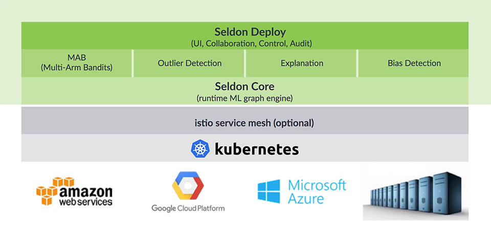

## 百度

### PaddlePaddle(PArallel Distributed Deep LEarning)，[开源]()

2016年9月开源。

主要特性：

- 更易用的API，更好的封装，更快速的业务集成；
- 分布式部署，并且是目前是唯一很好的支持Kubernetes的深度学习库
- 占用内存小，速度快，因为Paddle在百度内部也服务了众多大并发大数据场景，工业经验也很丰富;
- 本土化支持，也是唯一有官方中文文档的深度学习框架；
- 在自然语言处理上有很多现成的应用，比如情感分类，神经机器翻译，阅读理解、自动问答等，使用起来相对简单；
- PaddlePaddle支持多机多卡训练，并且本身支持多种集群方式。

相关组件：

- ### [Paddle](https://github.com/PaddlePaddle/Paddle)

  PArallel Distributed Deep LEarning

- ### [MacroCE](https://github.com/PaddlePaddle/MacroCE)

  Macro Continuous Evaluation Platform for Paddle.

- ### [VisualDL](https://github.com/PaddlePaddle/VisualDL)

  A platform to visualize the deep learning process.

- ### [models](https://github.com/PaddlePaddle/models)

  Model configurations

- ### [edl](https://github.com/PaddlePaddle/edl)

  Elastic Deep Learning using PaddlePaddle and Kubernetes

- ### [cloud](https://github.com/PaddlePaddle/cloud)

  PaddleCloud distributed training job scheduling

- ### [board](https://github.com/PaddlePaddle/board)

  Visualization tools for PaddlePaddle

### [百度机器学习 BML](https://cloud.baidu.com/product/bml.html)

是一个云端托管的分布式机器学习平台，提供特征工程、统计、训练、评估、预测和模型发布等功能，覆盖机器学习全流程

- 打通特征工程、模型训练、模型评估和预测服务全流程，拖拽式操作

- 并行化分布式的数据处理组件，可以快速完成复杂的数据预处理过程，支持的对数据的清理、替换、组合、采样、去重、拆分等操作。
- 只需简单配置即可完成模型训练和评估，可进行逻辑回归LR、深度神经网络DNN、聚类Kmeans、模型LDA、协同过滤CF等多种模型训练。
- 支持高并发的在线预测和大批量的离线预测

## 阿里

### 机器学习平台 PAI(Platform of Artificial Intelligence)

未开源

2015 年发布PAI1.0

2017 年 3 月发布PAI2.0, 阿里云首席科学家周靖人博士

PAI 2.0 的主要特性：

- **全面兼容深度学习框架**

  - PAI 2.0 编程接口完全兼容深度学习框架：TensorFlow、Caffe 以及 MXNet，用户只需要将自己本地编写的代码文件上传至云端就可以执行。
  - 对于底层计算资源，PAI 2.0 提供了强大的云端异构计算资源，包含 CPU、GPU、FPGA。在 GPU 方面，PAI 2.0 可以灵活实现多卡调度。

- **算法库的丰富与创新**

  - PAI 2.0 提供 100 余种算法组件，涵盖了分类、回归、聚类等常用场景，还针对主流的算法应用场景，提供了偏向业务的算法，包含文本分析、关系分析、推荐三种类别。

- **支持更大规模的数据训练**

  - 新增了参数服务器（Parameter Server）架构

  - 数据并行，模型分片

    把大的模型分为多个子集，每个参数服务器只存一个子集，全部的参数服务器聚合在一起拼凑成一个完整的模型。

  - 节点失败重试

- **人性化的操作界面**

  - 各种分门别类被封装好的算法组件。每一个实验步骤都提供可视化的监控页面，在深度学习黑箱透明化方面，PAI 也同时集成了各种可视化工具
  - 在搭架实验的过程中，只需要设置数据源、输出，就可以让系统实现人工智能训练，拖拽组件即可快速拼接成一个工作流

- **优化策略**

  - 计算优化
  - 显存优化
  - 通信优化
  - 性能预估模型
  - 软硬件协同优化

## 腾讯

### **Angel机器学习平台**

2017 年 6 月开源

- Angel采用参数服务器架构，支持十亿级别维度的模型训练。
- 采用了多种业界最新技术和腾讯自主研发技术，如SSP（Stale synchronous Parallel）、异步分布式SGD、多线程参数共享模式HogWild、网络带宽流量调度算法、计算和网络请求流水化、参数更新索引和训练数据预处理方案等。

### 机器学习基础平台[TDinsight](http://plus.tencent.com/bigdata/tdinsight)

未开源

- 一站式机器学习平台，通过可视化的拖拽布局，组合各种数据源、组件、算法、模型和评估模块。

- 支持各种开源机器学习框架

  在同一任务流中，可以执行多种框架，如先用Spark处理特征，再用XGBoost分类，最后用搭配Python的可视化。

- 提供灵活多变的运行模式。

  支持根据资源和数据量灵活切换并行和串行的执行方式；支持日、小时、分钟三种周期调度，引用Spark Streaming来做流式模型训练，提供作业监控和自动重启功能，实现7*24小时的模型训练效果；支持外部驱动和循环变参，与其他平台进行良好的互动，作为后台支撑进行模型训练和使用，在配置流程和指定参数范围后，可以产生多个参数组合并运行。

- 支持多个集群调度，并支持全局、任务流、节点三个级别。

  同一个任务流中的不同节点，都可以根据数据量的大小和特点，选择不同框架和算法，运行在不同的集群上，并通过共享的存储，来达到数据和模型的流转的目的，最大化的灵活利用大数据平台的计算和存储能力。

## 奇虎360

### 深度学习调度平台 XLearning

一款支持多种机器学习、深度学习框架调度系统。

**XLearning 系统包括三种组件：**

**● Client：**XLearning客户端，负责启动作业及获取作业执行状态；

**● ApplicationMaster（AM）：**负责输入数据分片、启动及管理Container、执行日志保存等；

**● Container：**作业的实际执行者，负责启动Worker或PS（Parameter Server）进程，监控并向AM汇报进程状态，上传作业的输出等。对于TensorFlow类型作业，还负责启动TensorBoard服务。

## 浪潮

### Caffe-MPI 

开源。

- 实现了多机多 GPU 卡的并行训练

### AIStation

- 提供从数据准备到分析训练结果的完整深度学习业务流程，支持 Caffe、TensorFlow、CNTK 等多种计算框架和 GoogleNet、VGG、ResNet 等多种模型。
- 支持对训练过程实时监控并可视化训练过程，支持打印每一步的损失函数值的日志、训练误差或测试误差等；
- 支持动态分配 GPU 资源实现资源合理共享，实现了“一键式”部署深度学习计算环境、快速启动训练任务；
- 实时监控集群的使用情况，合理安排训练任务，可及时发现运行中的问题，提高集群的可靠性。

### 

## Seldon.io

### [Seldon Core](https://github.com/SeldonIO/seldon-core)

开源。

该平台可以让数据科学团队在规模上运行和管理模型。

平台的特点包括:

- 使数据科学家能够部署使用任何机器学习工具包或编程语言构建的模型。Seldon Core计划最初支持基于python的工具/语言，包括Tensorflow、scikitlearn、Spark和H20。
- 在部署时，通过REST和gRPC将机器学习模型自动地集成到需要预测的业务应用程序和服务中。
- 处理部署的模型的完整生命周期管理，没有停机，包括更新运行时图、缩放、监视和安全。

## Reference

- [机器之心，阿里云推出机器学习平台PAI 2.0，降低人工智能门槛与开发成本](https://mp.weixin.qq.com/s/w3cpDoRjqkJsKjAdQkw7FQ)
- [PaddlePaddle官网](http://www.paddlepaddle.org/)
- [PaddlePaddle与TensorFlow的对比分析](http://ai.51cto.com/art/201801/565815.htm)
- [TDinsight官网](http://plus.tencent.com/bigdata/tdinsight)
- [奇虎360宣布开源深度学习调度平台 XLearning](https://www.itcodemonkey.com/article/1517.html)

