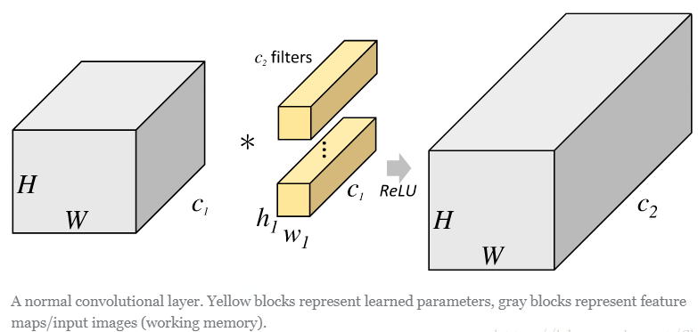
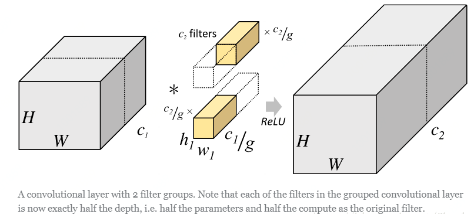
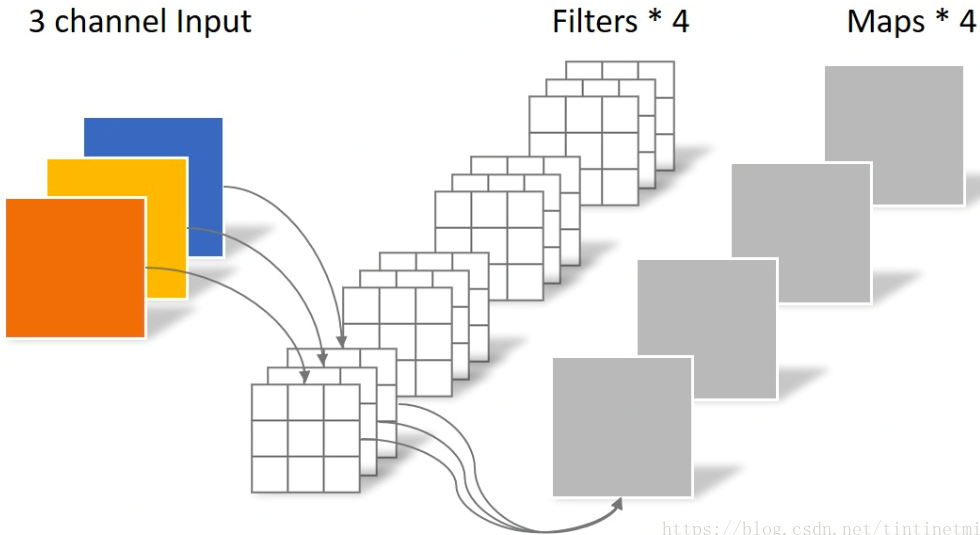
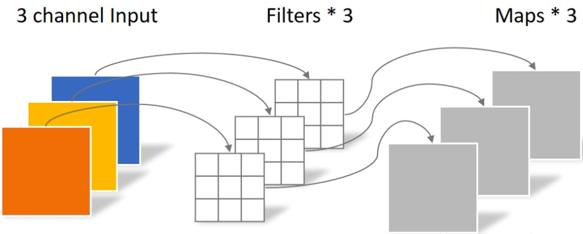
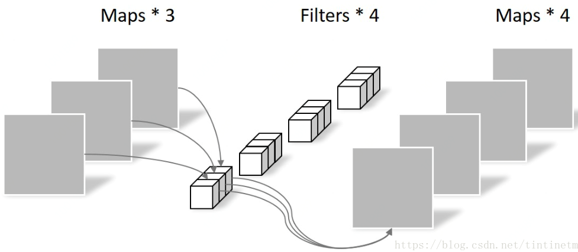

在前三篇文章中，分别介绍了经典网络[《CNN网络架构演进(一)》](https://mp.weixin.qq.com/s/N1v_VqfWFS8mKjPGo5gtaw)、Inception家族网络[《CNN网络架构演进(二)》](https://mp.weixin.qq.com/s/6-eTDDzZyWuzI0ves5qjZw)、ResNet家族网络[《CNN网络架构演进(三)》](https://mp.weixin.qq.com/s/M3CgfyjeOtOfecqwJvSrAg)的网络架构设计，其中不同的网络就采用了不同的卷积方式。

本节介绍卷积神经网络家族中，不同类型的卷积方式以及它们各自的优点。

## Group Convolution

Group convolution 分组卷积，最早在AlexNet中出现，由于当时的硬件资源有限，训练AlexNet时卷积操作不能全部放在同一个GPU处理，因此作者把feature maps分给多个GPU分别进行处理，最后把多个GPU的结果进行融合。

在说明分组卷积之前我们用一张图来体会一下一般的卷积操作。 
  
 从上图可以看出，一般的卷积会对输入数据的整体一起做卷积操作，即输入数据：H1×W1×C1；而卷积核大小为h1×w1，一共有C2个，然后卷积得到的输出数据就是H2×W2×C2。这里我们假设输出和输出的分辨率是不变的。主要看这个过程是一气呵成的，这对于存储器的容量提出了更高的要求。 
 但是分组卷积明显就没有那么多的参数。先用图片直观地感受一下分组卷积的过程。对于上面所说的同样的一个问题，分组卷积就如下图所示。 
  
可以看到，图中将输入数据分成了2组（组数为g），需要注意的是，这种分组只是在深度上进行划分，即某几个通道编为一组，这个具体的数量由（C1/g）决定。因为输出数据的改变，相应的，卷积核也需要做出同样的改变。即每组中卷积核的深度也就变成了（C1/g），而卷积核的大小是不需要改变的，此时每组的卷积核的个数就变成了（C2/g）个，而不是原来的C2了。然后用每组的卷积核同它们对应组内的输入数据卷积，得到了输出数据以后，再用concatenate的方式组合起来，最终的输出数据的通道仍旧是C2。也就是说，分组数g决定以后，那么我们将并行的运算g个相同的卷积过程，每个过程里（每组），输入数据为H1×W1×C1/g，卷积核大小为h1×w1×C1/g，一共有C2/g个，输出数据为H2×W2×C2/g。

从一个具体的例子来看，Group conv本身就极大地减少了参数。比如当输入通道为256，输出通道也为256，kernel size为3×3，不做Group conv参数为256×3×3×256。实施分组卷积时，若group为8，每个group的input channel和output channel均为32，参数为8×32×3×3×32，是原来的八分之一。而Group conv最后每一组输出的feature maps应该是以concatenate的方式组合。 

Alex认为group conv的方式能够增加 filter之间的对角相关性，而且能够减少训练参数，不容易过拟合，这类似于正则的效果。

## Dilated/Atrous Convolution

空洞卷积或者扩张卷积。它是解决pixel-wise输出模型的一种常用的卷积方式。

在图像分割领域，图像输入到CNN中，FCN先像传统的CNN那样对图像做卷积再pooling，降低图像尺寸的同时增大感受野，但是由于图像分割预测是pixel-wise的输出，所以要将pooling后较小的图像尺寸upsampling到原始的图像尺寸进行预测。一种普遍的认识是，pooling下采样操作导致的信息丢失是不可逆的。通常的分类识别模型，只需要预测每一类的概率，所以我们不需要考虑pooling会导致损失图像细节信息的问题，但是做像素级的预测时（譬如语义分割），就要考虑到这个问题了。

所以就要有一种卷积代替pooling的作用（成倍的增加感受野），而空洞卷积就是为了做这个的。dilated的好处是不做pooling损失信息的情况下，加大了感受野，让每个卷积输出都包含较大范围的信息。

在二维图像上直观地感受一下扩张卷积的过程：

上图是一个扩张率为2的3×3卷积核，感受野与5×5的卷积核相同，而且仅需要9个参数。你可以把它想象成一个5×5的卷积核，每隔一行或一列删除一行或一列。dilated conv不是在像素之间padding空白的像素，而是在已有的像素上，skip掉一些像素，或者输入不变，对conv的kernel参数中插一些0的weight，达到一次卷积看到的空间范围变大的目的。 

在相同的计算条件下，空洞卷积提供了更大的感受野。空洞卷积经常用在实时图像分割中。当网络层需要较大的感受野，但计算资源有限而无法提高卷积核数量或大小时，可以考虑空洞卷积。

在图像需要全局信息或者语音文本需要较长的sequence信息依赖的问题中，都能很好的应用dilated conv，比如图像分割、语音合成WaveNet、机器翻译ByteNet中。

## Transposed Convolutions/Deconvolution

转置卷积（transposed Convolutions）又名反卷积（deconvolution）或是分数步长卷积（fractially straced convolutions）。反卷积（Transposed Convolution, Fractionally Strided Convolution or Deconvolution）的概念第一次出现是Zeiler在2010年发表的论文Deconvolutional networks中。

**转置卷积和反卷积的区别**

那什么是反卷积？从字面上理解就是卷积的逆过程。值得注意的反卷积虽然存在，但是在深度学习中并不常用。而转置卷积虽然又名反卷积，却不是真正意义上的反卷积。因为根据反卷积的数学含义，通过反卷积可以将通过卷积的输出信号，完全还原输入信号。而事实是，转置卷积只能还原shape大小，而不能还原value。至少在数值方面上，转置卷积不能实现卷积操作的逆过程。所以说转置卷积与真正的反卷积有点相似，因为两者产生了相同的空间分辨率。但是又名反卷积（deconvolutions）的这种叫法是不合适的，因为它不符合反卷积的概念。

上图为卷积核为3×3、步幅为2和无边界扩充的二维转置卷积。

比如有输入数据：3×3，Reshape之后，为A ：1×9，B(可以理解为滤波器)：9×4(Toeplitz matrix) 那么A*B=C：1×4；Reshape C=2×2。所以，通过B 卷积，我们从输入数据由shape=3×3变成了shape=2×2。反过来。当我们把卷积的结果拿来做输入，此时A：2×2,reshape之后为1×4，B的转置为4×9，那么A*B=C=1×9，注意此时求得的C，我们就认为它是卷积之前的输入了，虽然存在偏差。然后reshape为3×3。所以，通过B的转置 - “反卷积”，我们从卷积结果shape=2×2得到了shape=3×3，重建了分辨率。 
也就是输入feature map A=[3,3]经过了卷积B=[2,2]  输出为 [2,2] ,其中padding=0,stride=1，反卷积（转置卷积）则是输入feature map A=[2,2],经过了反卷积滤波B=[2,2],输出为[3,3]。其中padding=0,stride=1不变。那么[2,2]的卷积核(滤波器)是怎么转化为[4,9]或者[9,4]的呢？通过Toeplitz matrix。 

## Depthwise Separable Convolution

Depthwise Separable Convolution是将一个完整的卷积运算分解为两步进行，即Depthwise Convolution与Pointwise Convolution。该结构和常规卷积操作类似，可用来提取特征，但相比于常规卷积操作，其参数量和运算成本较低。所以在一些轻量级网络中会碰到这种结构如MobileNet。

### Depthwise Convolution

**常规卷积操作**

对于一张5×5像素、三通道彩色输入图片（shape为5×5×3）。经过3×3卷积核的卷积层（假设输出通道数为4，则卷积核shape为3×3×3×4），最终输出4个Feature Map，如果有same padding则尺寸与输入层相同（5×5），如果没有则为尺寸变为3×3。 
 

不同于常规卷积操作，Depthwise Convolution的一个卷积核负责一个通道，一个通道只被一个卷积核卷积。上面所提到的常规卷积每个卷积核是同时操作输入图片的每个通道。 
 同样是对于一张5×5像素、三通道彩色输入图片（shape为5×5×3），Depthwise Convolution首先经过第一次卷积运算，不同于上面的常规卷积，DW完全是在二维平面内进行。卷积核的数量与上一层的通道数相同（通道和卷积核一一对应）。所以一个三通道的图像经过运算后生成了3个Feature map(如果有same padding则尺寸与输入层相同为5×5)，如下图所示。 

 Depthwise Convolution完成后的Feature map数量与输入层的通道数相同，无法扩展Feature map。而且这种运算对输入层的每个通道独立进行卷积运算，没有有效的利用不同通道在相同空间位置上的feature信息。因此需要Pointwise Convolution来将这些Feature map进行组合生成新的Feature map。

### Pointwise Convolution

Pointwise Convolution的运算与常规卷积运算非常相似，它的卷积核的尺寸为 1×1×M，M为上一层的通道数。所以这里的卷积运算会将上一步的map在深度方向上进行加权组合，生成新的Feature map。有几个卷积核就有几个输出Feature map。如下图所示。 

## Deformable Convolution

可形变卷积的思想很巧妙：它认为规则形状的卷积核（比如一般用的正方形3*3卷积）可能会限制特征的提取，如果赋予卷积核形变的特性，让网络根据label反传下来的误差自动的调整卷积核的形状，适应网络重点关注的感兴趣的区域，就可以提取更好的特征。

如下图：网络会根据原位置（a），学习一个offset偏移量，得到新的卷积核（b）（c）（d），那么一些特殊情况就会成为这个更泛化的模型的特例，例如图（c）表示从不同尺度物体的识别，图（d）表示旋转物体的识别。

## Squeeze-and-Excitation

通过学习的方式来自动获取到每个特征通道的重要程度，然后依照计算出来的重要程度去提升有用的特征并抑制对当前任务用处不大的特征。

首先做普通的卷积，得到了一个的output feature map，它的shape为[C，H，W]，根据paper的观点，这个feature map的特征很混乱。然后为了获得重要性的评价指标，直接对这个feature map做一个Global Average Pooling，然后就得到了长度为C的向量。

然后对这个向量加两个FC层，做非线性映射，这俩FC层的参数，也就是网络需要额外学习的参数。

最后输出的向量，可以看做特征的重要性程度，然后与feature map对应channel相乘就得到特征有序的feature map。

## 参考

[CNN中千奇百怪的卷积方式大汇总](https://zhuanlan.zhihu.com/p/29367273)

[对深度可分离卷积、分组卷积、扩张卷积、转置卷积（反卷积）的理解](https://blog.csdn.net/Chaolei3/article/details/79374563)

https://github.com/vdumoulin/conv_arithmetic

[Depthwise卷积与Pointwise卷积](https://blog.csdn.net/tintinetmilou/article/details/81607721)