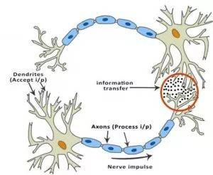
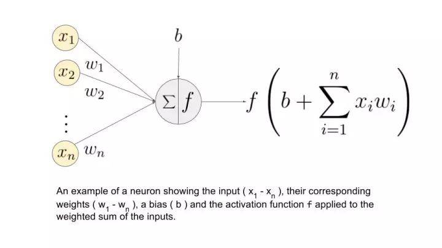
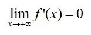
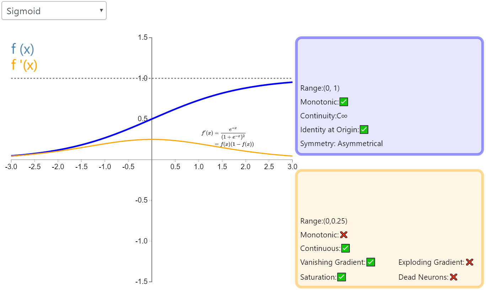
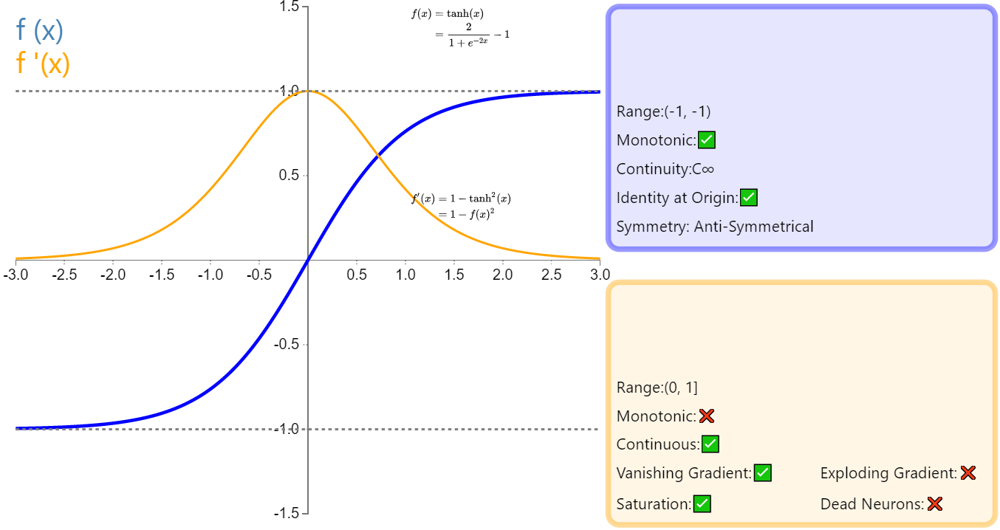
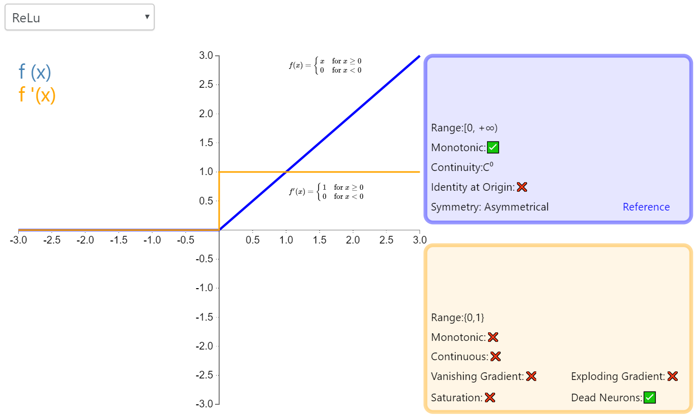
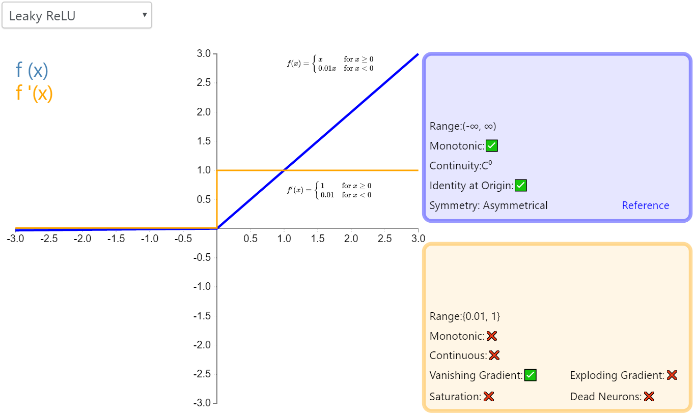
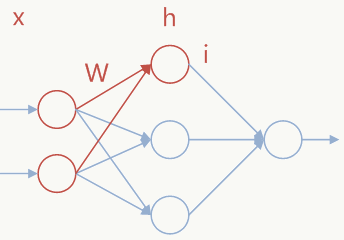
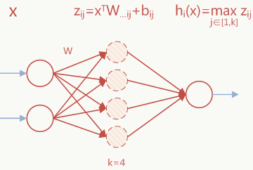
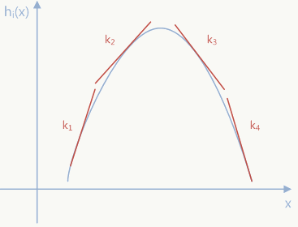

近年来，深度学习在计算机视觉领域取得了引人注目的成果，其中一个重要因素是激活函数的发展。本文将对激活函数的历史和近期进展进行梳理和总结。

#### 激活函数的定义

加拿大蒙特利尔大学的Bengio教授在ICML2016的一篇论文：Noisy Activation Functions中给出的了激活函数的定义：激活函数是实数到实数的映射，且几乎处处可导。激活函数一般具有以下性质：

- 非线性：弥补线性模型的不足；
- 几乎处处可导：反向传播时需要计算激活函数的偏导数，所以要求激活函数除个别点外，处处可导；
- 计算简单
- 单调性：当激活函数是单调的时候，单层网络能够保证是凸函数；
- 输出值范围有限：当激活函数的输出值有限的时候，基于梯度的优化方法会更加稳定；因为特定的表示受有限权值的影响更显著；当激活函数的输出是无限的时候，模型的训练会更加高效，不过在这种情况下，一般需要更小的learning rate。

#### 激活函数的生物学机制

典型神经元的物理结构包括细胞体（cell body）、向其他神经元发送信号的轴突（axon）和接收其他神经元发送的信号或信息的树突（dendrites）。

生物神经网络

上图中，红色圆圈代表两个神经元交流的区域。神经元通过树突接收来自其他神经元的信号。树突的权重叫作突触权值（synaptic weight），将和接收的信号相乘。来自树突的信号在细胞体内不断累积，如果信号强度超过特定阈值，则神经元向轴突传递信息。如未超过，则信号被该神经元「杀死」，无法进一步传播。

激活函数决定是否传递信号。在这种情况下，只需要带有一个参数（阈值）的简单阶梯函数。现在，当我们学习了一些新的东西（或未学习到什么）时，一些神经元的阈值和突触权值会发生改变。这使得神经元之间产生新的连接，大脑学会新的东西。

让我们再次理解这一概念，不过这次要使用人工神经元。

上图中（x_1, ..., x_n）是信号向量，它和权重（w_1, ..., w_n）相乘。然后再累加（即求和 + 偏置项 b）。最后，激活函数 f 应用于累加的总和。

注意：权重（w_1, ..., w_n）和偏置项 b 对输入信号进行线性变换。而激活函数对该信号进行非线性变换，这使得我们可以任意学习输入和输出之间的复杂变换。

#### 激活函数的作用

神经网络中激活函数的主要作用是提供网络的非线性建模能力，如不特别说明，激活函数一般而言是非线性函数。假设一个示例神经网络中仅包含线性卷积和全连接运算，那么该网络仅能够表达线性映射，即便增加网络的深度也依旧还是线性映射，难以有效建模实际环境中非线性分布的数据。加入（非线性）激活函数之后，深度神经网络才具备了分层的非线性映射学习能力。因此，激活函数是深度神经网络中不可或缺的部分。

- 神经网络中的激活函数能够引入非线性因素，提高模型的表达能力；
  网络中仅有线性模型的话，表达能力不够。比如一个多层的线性网络，其表达能力和单层的线性网络是相同的。网络中卷积层、池化层和全连接层都是线性的。所以，需要在网络中加入非线性的激活函数层。

- 一些激活函数能够起到特征组合的作用；

  例如，对于Sigmoid函数$\sigma(x) = \frac {1}{1+e^(-x)}$，根据泰勒公式展开:

  $$e^x = 1+ \frac {1}{1!}x + \frac {1}{2!}x^2 + \frac {1}{3!}x^3+O(x^3)$$

  对于输入特征为$x_1,x_2$，加权组合后如下：

  $x = w_1x_1+w_2x_2$

  将x带入到ex泰勒展开的平方项，

  $$x^2=(w_1x_1+w_2x_2)^2 = ((w_1x_1)^2+(w_2x_2)^2 + 2w_1x_1*w_2x_2)$$

  可以看出，平方项起到了特征两两组合的作用，更高阶的$x^3,x^4$等，则是更复杂的特征组合。

#### 激活函数的饱和性(Saturated)

**软饱和激活函数**

在定义域内处处可导，且两侧导数逐渐趋近于0，即：

Bengio 教授等将具有这类性质的激活函数定义为软饱和激活函数。与极限的定义类似，饱和也分为左饱和与右饱和：

左饱和：

右饱和：

**硬饱和激活函数**

f'(x)=0，当 |x| > c，其中 c 为常数。

同理，硬饱和也分为左饱和和右饱和。常见的 ReLU 就是一类左侧硬饱和激活函数。

#### 激活函数的历史发展与近期进展

##### Sigmoid

从数学上看，非线性的Sigmoid函数对中央区域的信号增益较大，对两侧区域的信号增益较小，在信号的特征空间映射上，有很好的效果。从神经科学上来看，中央神经区酷似神经元的兴奋态，两侧区酷似神经元的抑制状态，因而在神经网络学习方面，可以将重点特征推向中央区，将非重点特征推向两侧区。

Sigmoid的有以下优点：

- 输出值域在(0,1)之间，可以被表示为概率，或用于输入的归一化；
- 输出范围有限，数据在传递的过程中不容易发散；
- 求导比较方便；

Sigmoid的缺点如下：

- Sigmoid函数是饱和的，可能导致梯度消失(两个原因:(1)Sigmoid导数值较小；(2)Sigmoid是饱和的)，导致训练出现问题；

  具体来说，由于在后向传递过程中，sigmoid向下传导的梯度包含了一个f'(x) 因子（sigmoid关于输入的导数），因此一旦输入落入饱和区，f'(x) 就会变得接近于0，导致了向底层传递的梯度也变得非常小。此时，网络参数很难得到有效训练。这种现象被称为梯度消失。一般来说， sigmoid 网络在 5 层之内就会产生梯度消失现象[2]。梯度消失问题至今仍然存在，但被新的优化方法有效缓解了，例如DBN中的分层预训练，Batch Normalization的逐层归一化，Xavier和MSRA权重初始化等代表性技术。

- 输出不以0为中心，可能导致收敛缓慢(待思考原因)；

- 指数计算，计算复杂度高；

##### Tanh

Tanh 激活函数又叫作双曲正切激活函数（hyperbolic tangent activation function）。Tanh函数是Sigmoid函数的一种变体，tanh(x)=2sigmoid(2x)-1，也具有软饱和性。与Sigmoid不同的是，Tanh是0均值的。

文献 中提到tanh 网络的收敛速度要比sigmoid快。因为 tanh 的输出均值比 sigmoid 更接近 0，SGD会更接近 natural gradient（一种二次优化技术），从而降低所需的迭代次数。

优缺点总结如下：

- 相比Sigmoid函数，收敛速度更快；
- 相比Sigmoid函数，其输出是以0为中心的；
- 没有解决由于饱和性产生的梯度消失问题；

##### ReLU

修正线性单元（Rectified linear unit，ReLU）是神经网络中最常用的激活函数。它保留了 step 函数的生物学启发（只有输入超出阈值时神经元才激活）。可见，ReLU 在x<0 时硬饱和。由于 x>0时导数为 1，所以，ReLU 能够在x>0时保持梯度不衰减，从而缓解梯度消失问题。

**ReLU的优点如下:**

- 相比Sigmoid和Tanh，ReLU在SGD中收敛速度要相对快一些；

- Sigmoid和Tanh涉及到指数运算，计算复杂度高，ReLU只需要一个阈值就可以得到激活值，加快正向传播的计算速度；

- 有效的缓解了梯度消失的问题；

- 提供了神经网络的稀疏表达能力；

  ReLU提供神经网络的稀疏表达能力，在Bengio教授的Deep Sparse Rectifier Neural Network一文中被认为是ReLU带来网络性能提升的原因之一。但后来的研究发现稀疏性并非性能提升的必要条件，文献 RReLU 也指明了这一点。PReLU、ELU等激活函数不具备这种稀疏性，但都能够提升网络性能。

**ReLU的缺点如下：**

- ReLU的输出不是以0为中心的；

- “神经元死亡”现象

  随着训练的推进，部分输入会落入硬饱和区，导致对应权重无法更新。

- 输出具有偏移现象，即输出均值恒大于零。

  偏移现象和 神经元死亡会共同影响网络的收敛性。实验表明，如果不采用Batch Normalization，即使用 MSRA 初始化30层以上的ReLU网络，最终也难以收敛。相对的，PReLU和ELU网络都能顺利收敛，这两种改进的激活函数将在后面介绍。

**ReLU的变体**

为了解决上面的问题，出现了一些变体，这些变体的主要思路是将x>0的部分保持不变，x≤0的部分不直接设置为0，设置为αx，如下三种变体:

- L-ReLU(Leaky ReLU):α固定为比较小的值，比如：0.01，0.05；
- P-ReLU(Parametric ReLU):α作为参数，自适应地从数据中学习得到；
- R-ReLU(Randomized ReLU):先随机生成一个α，然后在训练过程中再进行修正；

##### Leaky ReLU

经典（以及广泛使用的）ReLU 激活函数的变体，带泄露修正线性单元（Leaky ReLU）的输出对负值输入有很小的坡度。由于导数总是不为零，这能减少静默神经元的出现，允许基于梯度的学习（虽然会很慢）。

##### PReLU

参数化修正线性单元（Parameteric Rectified Linear Unit，PReLU）属于 ReLU 修正类激活函数的一员。它和 RReLU 以及 Leaky ReLU 有一些共同点，即为负值输入添加了一个线性项。而最关键的区别是，这个线性项的斜率实际上是在模型训练中学习到的。

引入了一个随机的超参数α，它可以被学习，因为你可以对它进行反向传播。这使神经元能够选择负区域最好的梯度，有了这种能力，它们可以变成 ReLU 或 Leaky ReLU。总之，最好使用 ReLU，但是你可以使用 Leaky ReLU 或 Parametric ReLU 实验一下，看看它们是否更适合你的问题。

##### RReLU

随机带泄露的修正线性单元（Randomized Leaky Rectified Linear Unit，RReLU）也属于 ReLU 修正类激活函数的一员。和 Leaky ReLU 以及 PReLU 很相似，为负值输入添加了一个线性项。而最关键的区别是，这个线性项的斜率在每一个节点上都是随机分配的（通常服从均匀分布）。这种随机性类似于一种噪声，能够在一定程度上起到正则效果。

##### Maxout

Maxout激活函数由Goodfellow等人在《[Maxout Networks](http://www.jmlr.org/proceedings/papers/v28/goodfellow13.pdf)》一文中提出。

对于神经网络任意一层可以添加Maxout结构，公式如下： 
$$
\begin{array}{l} h_i(x)=max_{j\in [1,k]}z_{ij}\\ z_{ij}=x^TW_{ij}+b_{ij} \end{array}
$$
上面的W和b是要学习的参数，这些参数可以通过反向传播计算，k是事先指定的参数，x是输入节点，假定有以下3层网络结构：

 

Maxout激活可以认为是在输入节点和输出节点中间加了个隐含节点，以上图节点为例，**上图红色部分**在Maxout结构中被扩展为以下结构：

 

实际上图所示的单个Maxout 单元本质是一个分段线性函数，而任意凸函数都可以通过分段线性函数来拟合，这个可以很直观的理解，以抛物线为例：每个节点都是一个线性函数，上图~节点输出对应下图~线段： 

 

从全局上看，ReLU可以看做Maxout的一种特例，Maxout通过网络自动学习激活函数(从这个角度看Maxout也可以看做某种Network-In-Network结构)。

Maxout的缺点：多了一倍参数、需要人为指定值、先验假设被学习的激活函数是凸的。

##### ELU

指数线性单元（Exponential Linear Unit，ELU）融合了sigmoid和ReLU，具有左侧软饱性。右侧线性部分使得ELU能够缓解梯度消失，而左侧软饱能够让ELU对输入变化或噪声更鲁棒。ELU的输出均值接近于零，所以收敛速度更快。

实验表明，ELU的收敛性质的确优于ReLU和PReLU。在cifar10上，ELU 网络的loss 降低速度更快；在 ImageNet上，不加 Batch Normalization 30 层以上的 ReLU 网络会无法收敛，PReLU网络在MSRA的Fan-in （caffe）初始化下会发散，而 ELU 网络在Fan-in/Fan-out下都能收敛 。

ELU也是为了解决ReLU存在的问题而提出的，它具有ReLU的基本所有优点，以及：

- 不会有神经元死亡的问题；
- 输出的均值接近于0，zero-centered;
- 计算量稍大，理论上虽然好于ReLU，但在实际使用中，目前并没有好的证据证明ELU总是优于ReLU;

#### 激活函数使用建议

- 如果想让结果在(0,1)之间，使用Sigmoid(如LSTM的各种Gates);
- 如果想神经网络训练的很深，不要使用S型的激活函数；
- 如果使用ReLU，要注意初始化和Learning Rates的设置；
- 如果使用ReLU，出现很多神经元死亡的问题，且无法解决，可以尝试使用L-ReLU、P-ReLU等ReLU的变体；
- 最好不要使用Sigmoid，可以尝试使用Tanh;

#### 参考

1. [深度学习中的激活函数导引](https://zhuanlan.zhihu.com/p/22142013)
2. [26种神经网络激活函数可视化](https://www.jiqizhixin.com/articles/2017-10-10-3)
3. [Visualising Activation Functions in Neural Networks](https://dashee87.github.io/deep%20learning/visualising-activation-functions-in-neural-networks/)
4. [一文概览深度学习中的激活函数](https://www.jiqizhixin.com/articles/2017-11-02-26)