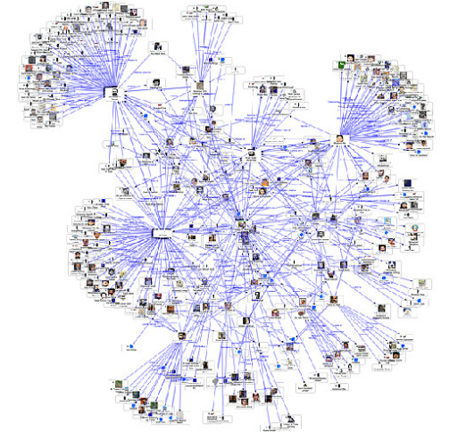
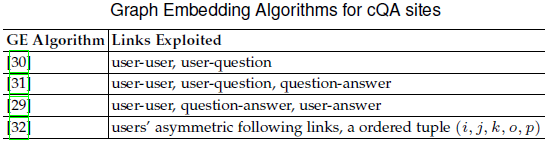
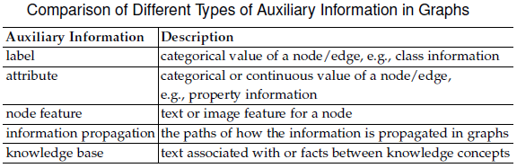
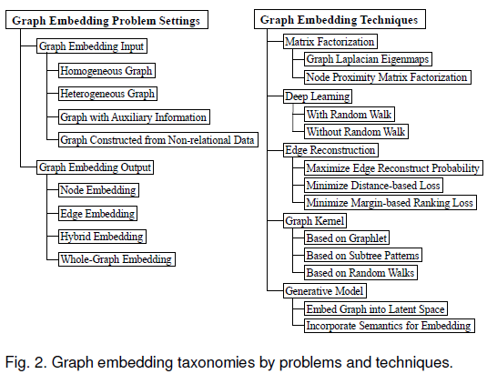

# 网络表示学习研究进展

## 网络场景

- 社交网络
- 企业关系

## 社交网络

### 社交网络的传播特征 

- 六度分隔

  世界上任意两个人之间建立联系，最多只需要6个人

- 三度影响

  我们所做或所说的任何事情，都会在社会网络上泛起涟漪，影响我们的朋友（一度）、我们朋友的朋友（二度）、甚至我们朋友的朋友的朋友（三度）。如果超出三度分隔，我们的影响就逐渐消失。反过来，我们也深受三度以内朋友的“链式反应”影响。

### 社交网络的基本要素

- 用户（节点）

  - 属性：用户基本信息、消费水平、用户个性
  - 属性的时序变化

- 关系（边）

  - 空间关系：地址分析（邻居关系、家庭关系等）
  - 购物关系：购物篮分析
  - 用户评价：对商品的认同度
  - 外部数据：同事、同学等关系
  - 逻辑关系：计算对于某个主题的评估与参与度
  - 动态关系：关系的时序变化

- 关系强度（边权重）

  - 关系强度的时序变化

  - 是否互相关注、交往频率、隐私暴露程度

    强关系 => 可以引发行为

    弱关系 => 传递信息

## 需要解决的关键点

- 如何识别群体、社区？
  - 根据具体的业务、应用场景定义用户群
- 如何定义关系的强度？
  - 借鉴搜索引擎的算法
    - Page-rank算法
    - W-entropy算法
  - 基于主题级别的影响力评价模型（TAP）
    - 不同用户关注的领域不同
- 如何衡量节点之间的相互影响？
  - 风险传播

## 网络表示学习模型

- 考虑的因素

  - 节点间的连接（有向无向，是否加权）

  - 连接 + 节点属性、标签

    - 噪声

    - 链接稀疏性

    - 没有链接不代表不存在链接，可能只是现有数据没有捕捉到

    - 核心节点对其邻近节点之前关系的影响

      有时需要避免，有时需要考虑

- 动态变化的关系

  - 节点、连接可能增加或减少，连接权重可能增大或减小
  - 节点属性也可能随时间变化

- 同构、异构网络

  如，反欺诈：人、设备、账号

## 网络的构建

### 如何丰富数据

- 自有数据
- 合作、交换数据
- 爬取数据

### 结构、非结构化数据的自动化处理流程

- 信息的提取
- 时序变化数据的保存

deep walk

LINE

node2vec

SDNE

metapath2vec

HIN2Vec

### Deepwalk: Online learning of social representations

#### **摘要**

提出了在一个网络中，学习节点隐表达的方法——DeepWalk，这个方法在一个连续向量空间中对节点的社会关系进行编码，是语言模型和无监督学习从单词序列到图上的一个扩展。

该方法将截断游走的序列当成句子进行学习。

该方法具有可扩展，可并行化的特点，可以用来做网络分类和异常点检测。

#### 贡献

论文贡献有三点： 

1. 将深度学习应用到图分析中，构建鲁棒性的表示，其结果可应用于统计模型中 
2. 将表示结果应用于一些社会网络的多标签分类任务中，与对比算法比较，大部分的F1值提高5-10%，有些情况下，在给定少于60%训练集的情况下，比其他对比方法要好 
3. 论文通过构建互联网规模（例如YouTube）的并行化实现的表示，论证了方法的可扩展性，同时描述了构建流式版本的方法实现

#### 随机游走序列

随机游走序列生成方法：对于序列中第k个节点，从k节点的相邻节点中随机选择一个节点作为第k+1个节点，直至达到指定的序列长度。然后将该序列作为DeepWalk的输入。原因有：

- 随机游走能够包含网络的局部结构
- 使用随机游走可以很方便地并行化
- **当网络结构具有微小的变化时，可以针对变化的部分生成新的随机游走，更新学习模型，提高了学习效率**
- 如果一个网络的节点服从幂律分布，那么节点在随机游走序列中的出现次数也应该服从幂律分布，论文通过实证发现自然语言处理中单词的出现频率也服从幂律分布。可以很自然地将自然语言处理的相关方法直接用于构建社区结构模型中。

### Attributed Social Network Embedding

**要点：**

- 社交网络的用户资料、文献引用网络的文本信息揭示了同质效应，对于社交网络的形成有重要影响。
- 提出的Social Network Embedding framework (SNE),利用了网络节点属性信息，能够保留网络的结构邻近（网络结构）和属性邻近（同质效应）信息。
- SNE与node2vec相比，在链接预测任务上性能提升8.2%，在节点分类任务上性能提升12.7%。

网络类型：

- 社交网站网络
- 文献引用网络
- 电话呼叫-接听网络

## Aributed Network Embedding for Learning in a Dynamic Environment

**要点：**

- 网络是动态变化的
  - 节点、连接可能增加或减少，连接权重可能增大或减小
  - 节点属性也可能随时间变化

## metapath2vec: Scalable representation learning for heterogeneous networks

**要点：**

1. 提出了两个scalable表示学习模型：

   - metapath2vec

     formalizes meta-path based random walks to construct the heterogeneous neighborhood of a node and then leverages a heterogeneous skip-gram model to perform node embeddings.

   - metapath2vec++

     同时模拟异构网络的结构和语义关系【？何为语义关系】

2. 不仅在网络节点分类、聚类、相似搜索等各种异构网络挖掘任务上的性能优于现有模型，而且揭示了不同网络对象之间的结构和语义关系。

社交和信息网络表示了人类互动的动态和类型。

定义

异构网络：网络中存在多种类型的节点和链接。

## A Comprehensive Survey of Graph Embedding: Problems, Techniques and Applications

**要点：**

1. 图嵌入以及相关概念的正式定义
2. 图嵌入方法的分类以及这些方法是如何解决当前存在的问题的
3. 图嵌入总结，指出在计算效率、问题背景（problem settings）、技术、应用场景等方面的未来研究方向

### 基本介绍

图

- 社交媒体网络中的社交图、传播图
- 文献引用图
- 用户兴趣爱好图

图的应用

- 节点分类
- 节点聚类
- 节点检索、推荐
- 链接预测

直接的图计算

- 计算复杂度高，占用空间大

- 分布式图数据处理框架

  GraphX、GraphLab

- 解决方式：图嵌入

### 图嵌入的问题背景

#### 输入

- homogeneous graph，同构图

  - 边是否权值
  - 边是否有向
  - 边是否有正负号

  **挑战**：如何捕获图中不同连接模式的多样性？

- heterogeneous graph，异构图，即网络中的节点和边不止一种

  - 社区问答网络，Community-based Question Answering (cQA) sites

    cQA算法根据考虑的链接类型的不同而异，主要有：

    

    (i, j, k, o, p)：对于问题i，第k的用户的第j的回答比第p个用户的第o个回答多获得的赞同票数

  -  多媒体网络

    比如有的 paper 就考虑过一张图具备图像和文本两种节点，以及图像文本、图像图像和文本文本这三种边。

    - 将用户和图像嵌入相同的向量空间，从而使得它们能在图像推荐时进行比较
    - 点击图：图像-文本查询中，图像-查询边指示着对查询出的图像的点击，点击次数指示边的权重。

  - 知识图谱。图中节点表示的是实体，边表示的关系。每一个三元，HRT 都表示头节点 H 和尾节点 T 有关系 R。由于关系 R 可以有很多种，因此 KG 也属于一种异构图。

  **挑战**：

  - 全局一致性问题：将异构图中不同类型的对象嵌入的相同的向量空间，如何处理不同类型对象的全局一致性？
  - 数据倾斜问题：如何处理不同类型对象之前的不平衡？

- graph with auxiliary information

  图中辅助信息的类型:标签、属性、节点特征、信息传播、知识库。

  

  指除了边和点之外，节点和边都会带有辅助信息，比如边和点都有 label，边和点都有 attribute，或者 note 有 feature。 

  它们的区别在于 label 是类别型的，attribute 可以是离散的，也可以是连续的，而 feature 就可能是文本或图像等更复杂的一些特征。 

  - label

    相距较远具有相同、不同标签的节点如何进行嵌入？

    - 对嵌入目标函数和分类器函数同时进行优化
    - 在计算不同标签类型节点相似度时增加一个惩罚项
    - 在计算不同图核(graph kernels)时考虑节点标签和边标签

  - attribute

    可以是离散的，也可以是连续的

  - feature

    可能是文本或图像等更复杂的一些特征.

  **挑战**：

  如何包含丰富的非结构化信息，使得学习到的嵌入向量既能够表示图的拓扑结构，又能根据辅助信息具有区分度？

- graph constructed from non-relational data

  - 基于the Euclidean distance

  - 基于KNN

  - 基于nodes’ co-occurrence

    例如，在图像相关的应用(图像分割、图像分类)中，将像素点当做节点，将像素间的空间关系当做边，从而构建图

  **挑战：**

  如何计算非关系型数据中两两实例之前的关系，从而构建出图？

#### 输出

不同的场景，要求不同粒度的嵌入输出，node，node pairs, subgraph,or even a whole graph。如何找到一个适当的嵌入输出类型以满足具体任务的需求？

不同的输出粒度对“好”嵌入有不同的标准，也面临不同的问题。

- node embedding

  不同图嵌入方法的区别在于如何定义节点之间的亲密度。

  一阶邻近、二阶邻近、高阶邻近。

  **挑战**：如何定义输入图中不同类型节点之间的邻近度？如何在嵌入向量中编码这种邻近度？

- edge embedding

  即为每个边输出 embedding。

  - 应用场景1：知识图谱嵌入中，同时学习节点和边的嵌入向量。对于三元组< h, r, t >，给定其中两个组分，预测第三个组分。

  - 应用场景2： link prediction。

  **挑战**：如何定义边级别的相似度？对于有向图，如何将节点之间的非对称属性编码到嵌入向量中？

  ​

- 子图嵌入，hybrid embedding

  节点嵌入与社区嵌入相辅相成。

  - subgraph embedding，Substructure embedding
    - 语义邻近搜索：
    - 图分类：graph kernels定义
  - community embedding
    - 在节点嵌入时，考虑社区意识邻近（consider a community-aware proximity for node embedding）
    - 将每个社区嵌入定义为一个多变量高斯分布

  **挑战**：如何定义子图?如何将不同类型的子图同时嵌入到一个公共的向量空间？

- whole-graph embedding

  一般用于对蛋白质、分子这类小图进行 embedding，对比两个图的相似性。

  - 层次图嵌入框架

    金字塔形图，每层为不同尺度的子图，各层分别嵌入，然后合并到一个向量中

  - whole cascade graph

    训练一个MLP，to predict the increment of the size of the cascade graph in the future

  **挑战**：如何捕获整个图的属性？如何权衡图嵌入的表达性和效率？

#### 技术

不同图嵌入算法的区别在于：如何定义需要保留的图属性。不同算法对node(/edge/substructure/whole-graph)相似度的度量视角不同。

#### 应用

- 节点相关的
- 边相关的
- (子)图相关的

