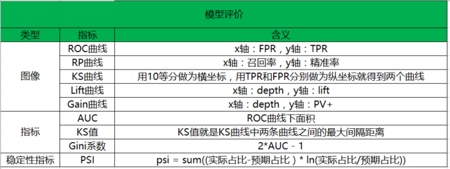
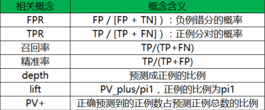

# 风控模型评价指标

[TOC]

## ROC曲线

ROC（Receiver Operating Characteristic，受试者操作特性）曲线和AUC常被用来评价一个二值分类器（binary classifier）的优劣，对两者的简单介绍见[这里](http://bubblexc.com/y2011/148/)。这篇博文简单介绍ROC和AUC的特点，以及更为深入地，讨论如何作出ROC曲线图以及计算AUC。

需要提前说明的是，我们这里只讨论二值分类器。对于分类器，或者说分类算法，评价指标主要有precision，recall，F-score[1](http://alexkong.net/2013/06/introduction-to-auc-and-roc/#fn:1)，以及我们今天要讨论的ROC和AUC。下图是一个ROC曲线的示例[2](http://alexkong.net/2013/06/introduction-to-auc-and-roc/#fn:2)。

正如我们在这个ROC曲线的示例图中看到的那样，ROC曲线的横坐标为false positive rate（FPR），纵坐标为true positive rate（TPR）。下图中详细说明了FPR和TPR是如何定义的。

接下来我们考虑ROC曲线图中的四个点和一条线。第一个点，(0,1)，即FPR=0, TPR=1，这意味着FN（false negative）=0，并且FP（false positive）=0。Wow，这是一个完美的分类器，它将所有的样本都正确分类。第二个点，(1,0)，即FPR=1，TPR=0，类似地分析可以发现这是一个最糟糕的分类器，因为它成功避开了所有的正确答案。第三个点，(0,0)，即FPR=TPR=0，即FP（false positive）=TP（true positive）=0，可以发现该分类器预测所有的样本都为负样本（negative）。类似的，第四个点（1,1），分类器实际上预测所有的样本都为正样本。经过以上的分析，我们可以断言，ROC曲线越接近左上角，该分类器的性能越好。

下面考虑ROC曲线图中的虚线y=x上的点。这条对角线上的点其实表示的是一个采用随机猜测策略的分类器的结果，例如(0.5,0.5)，表示该分类器随机对于一半的样本猜测其为正样本，另外一半的样本为负样本。

### 如何画ROC曲线

对于一个特定的分类器和测试数据集，显然只能得到一个分类结果，即一组FPR和TPR结果，而要得到一个曲线，我们实际上需要一系列FPR和TPR的值，这又是如何得到的呢？我们先来看一下[Wikipedia](http://en.wikipedia.org/wiki/Receiver_operating_characteristic)上对ROC曲线的定义：

> In signal detection theory, a receiver operating characteristic (ROC), or simply ROC curve, is a graphical plot which illustrates the performance of a binary classifier system as its discrimination threshold is varied.

问题在于“as its discrimination threashold is varied”。如何理解这里的“discrimination threashold”呢？我们忽略了分类器的一个重要功能“概率输出”，即表示分类器认为某个样本具有多大的概率属于正样本（或负样本）。通过更深入地了解各个分类器的内部机理，我们总能想办法得到一种概率输出。通常来说，是将一个实数范围通过某个变换映射到(0,1)区间[3](http://alexkong.net/2013/06/introduction-to-auc-and-roc/#fn:3)。

假如我们已经得到了所有样本的概率输出（属于正样本的概率），现在的问题是如何改变“discrimination threashold”？我们根据每个测试样本属于正样本的概率值从大到小排序。下图是一个示例，图中共有20个测试样本，“Class”一栏表示每个测试样本真正的标签（p表示正样本，n表示负样本），“Score”表示每个测试样本属于正样本的概率[4](http://alexkong.net/2013/06/introduction-to-auc-and-roc/#fn:4)。

接下来，我们从高到低，依次将“Score”值作为阈值threshold，当测试样本属于正样本的概率大于或等于这个threshold时，我们认为它为正样本，否则为负样本。举例来说，对于图中的第4个样本，其“Score”值为0.6，那么样本1，2，3，4都被认为是正样本，因为它们的“Score”值都大于等于0.6，而其他样本则都认为是负样本。每次选取一个不同的threshold，我们就可以得到一组FPR和TPR，即ROC曲线上的一点。这样一来，我们一共得到了20组FPR和TPR的值，将它们画在ROC曲线的结果如下图：

当我们将threshold设置为1和0时，分别可以得到ROC曲线上的(0,0)和(1,1)两个点。将这些(FPR,TPR)对连接起来，就得到了ROC曲线。当threshold取值越多，ROC曲线越平滑。

其实，我们并不一定要得到每个测试样本是正样本的概率值，只要得到这个分类器对该测试样本的“评分值”即可（评分值并不一定在(0,1)区间）。评分越高，表示分类器越肯定地认为这个测试样本是正样本，而且同时使用各个评分值作为threshold。我认为将评分值转化为概率更易于理解一些。

### AUC值的计算

AUC（Area Under Curve）被定义为ROC曲线下的面积，显然这个面积的数值不会大于1。又由于ROC曲线一般都处于y=x这条直线的上方，所以AUC的取值范围在0.5和1之间。使用AUC值作为评价标准是因为很多时候ROC曲线并不能清晰的说明哪个分类器的效果更好，而作为一个数值，对应AUC更大的分类器效果更好。

在了解了ROC曲线的构造过程后，编写代码实现并不是一件困难的事情。相比自己编写代码，有时候阅读其他人的代码收获更多，当然过程也更痛苦些。在此推荐[scikit-learn](http://scikit-learn.org/stable/)中关于[计算AUC的代码](https://github.com/scikit-learn/scikit-learn/blob/master/sklearn/metrics/metrics.py#L479)。

### AUC意味着什么

那么AUC值的含义是什么呢？根据(Fawcett, 2006)，AUC的值的含义是：

> The AUC value is equivalent to the probability that a randomly chosen positive example is ranked higher than a randomly chosen negative example.

这句话有些绕，我尝试解释一下：首先AUC值是一个概率值，当你随机挑选一个正样本以及一个负样本，当前的分类算法根据计算得到的Score值将这个正样本排在负样本前面的概率就是AUC值。当然，AUC值越大，当前的分类算法越有可能将正样本排在负样本前面，即能够更好的分类。

### 为什么使用ROC曲线

既然已经这么多评价标准，为什么还要使用ROC和AUC呢？因为ROC曲线有个很好的特性：当测试集中的正负样本的分布变化的时候，ROC曲线能够保持不变。在实际的数据集中经常会出现类不平衡（class imbalance）现象，即负样本比正样本多很多（或者相反），而且测试数据中的正负样本的分布也可能随着时间变化。下图是ROC曲线和Precision-Recall曲线[5](http://alexkong.net/2013/06/introduction-to-auc-and-roc/#fn:5)的对比：

在上图中，(a)和(c)为ROC曲线，(b)和(d)为Precision-Recall曲线。(a)和(b)展示的是分类其在原始测试集（正负样本分布平衡）的结果，(c)和(d)是将测试集中负样本的数量增加到原来的10倍后，分类器的结果。可以明显的看出，ROC曲线基本保持原貌，而Precision-Recall曲线则变化较大。

## **AR(Accuracy Ratio)**

衡量分数预测能力的指标 ,需要一个**完整的表现期**。看看这个模型能不能把坏样本很好的区分处理。其取值位于-1~1之间。**具有滞后性**。 
如果我们今天用AR来监控模型的好坏，那么只能是监控模型在一年（这里假定表现期为一年）之前的数据上表现的好坏。

**先把样本按分数由低到高排序**，Ｘ轴是总样本的累积比例，Ｙ轴是坏样本占总的坏样本的累积比例。AR就是等于模型在随机模型之上的面积除以理想模型在随机模型之上的面积。计算中可以用梯形近似逼近曲线下面积来计算，AR越高说明模型区分效果越好。

【？？】理想模型是什么?

下图公式中Xk,Yk代表分数的第Ｋ个分位点对应的累积总样本及相应的坏样本的比例。设总的坏样本的比例为Bo，令（Ｘk,Yｋ)=(0,0)

 

## **KS(Kolmogorov-Smirnov)**

衡量分数区分能力的指标。 
 
把样本按分数由低到高排序，Ｘ轴是总样本累积比例，Ｙ是累积好，坏样本分别占总的好，坏样本的比例。两条曲线在Ｙ轴方向上的相差最大值即KS。KS越大说明模型的区分能力越好。

Bad k和Good k分别表示为分数累积到第ｋ个分位点的坏样本个数和好样本个数，KS计算公式： 

**通常要求模型KS值在0.4以上。**

## **PSI( Population Stablility Index)**

衡量分数稳定性的指标

**按分数对人群进行分组**，令Ｒi是现在样本中第ｉ组占总样本的百分比，Bi是一段时间后第ｉ个分组占总样本的百分比。PSI取值越小说明分数的分布随时间变化越小。

 

## **Kendall’s Tau**

正确有效的评分卡模型中，**低分数的实际逾期率应该严格大于高分段的实际逾期率**。我们将分数从低到高划分为１０组，每组的实际逾期率记做r1,r2,r3,…,r10。对所有的(ri,rj)的组合，如果有ri< rj且i< j，或者ri> rj且i> j，则记做一个discordant pair，否则记做concordant pair。其计算公式如下：

Kendall’s Tau越接近１或者等于１，说明逾期率在分数上的单调下降性越明显，反之说明分数变化与逾期率的变化的一致性得不到保证。

## **Migration Matrix**

迁移矩阵是衡量分数矩阵的指标，**对相同的人群**，观察在相邻两次监控日期（一周）分数的迁移变化。迁移矩阵中元素Mjk代表上次监控日期分数在第ｊ组中的人群在当前迁移到第ｋ组的概率。实际计算中可把分数平均分成10组，计算这10组之间的迁移矩阵。

## **lift曲线**

在营销推广活动（例如DM信）中，我们的首要目标并不是尽可能多地找出那些潜在客户，而是提高客户的响应率。客户响应率是影响投入产出比的重要因素。此时，我们关注的不再是TPR（覆盖率），而是另一个指标：命中率。

回顾前面介绍的分类矩阵，正例的命中率是指预测为正例的样本中的真实正例的比例，即d/(b+d)，一般记作PV。

在不使用模型的情况下，我们用先验概率估计正例的比例，即(c+d)/(a+b+c+d)，可以记为k。

定义提升值lift=PV/k。

lift揭示了logistic模型的效果。例如，若经验告诉我们10000个消费者中有1000个是我们的潜在客户，则我们向这10000个消费者发放传单的效率是10%（即客户的响应率是10%），k=(c+d)/(a+b+c+d)=10%。通过对这10000个消费者进行研究，建立logistic回归模型进行分类，我们得到有可能比较积极的1000个消费者，b+d=1000。如果此时这1000个消费者中有300个是我们的潜在客户，d=300，则命中率PV为30%。

此时，我们的提升值lift=30%/10%=3，客户的响应率提升至原先的三倍，提高了投入产出比。

为了画lift图，需要定义一个新的概念depth深度，这是预测为正例的比例，(b+d)/(a+b+c+d)。
$$
depth = \frac{b+d}{a+b+c+d}
$$

与ROC曲线中的TPR和FPR相同，lift和depth也都受到阈值的影响。

当阈值为0时，所有的样本都被预测为正例，因此depth=1，而PV=d/(b+d)=(0+d)/(0+b+0+d)=k，于是lift=1，模型未起提升作用。随着阈值逐渐增大，被预测为正例的样本数逐渐减少，depth减小，而较少的预测正例样本中的真实正例比例逐渐增大。当阈值增大至1时，没有样本被预测为正例，此时depth=0，而lift=0/0。

由此可见，lift与depth存在相反方向变化的关系。在此基础上作出lift图：

 与ROC曲线不同，lift曲线凸向（0，1）点。我们希望在尽量大的depth下得到尽量大的lift（当然要大于1），也就是说这条曲线的右半部分应该尽量陡峭。

 

至此，我们对ROC曲线和lift曲线进行了描述。这两个指标都能够评价logistic回归模型的效果，只是分别适用于不同的问题：

如果是类似信用评分的问题，希望能够尽可能完全地识别出那些有违约风险的客户（不使一人漏网），我们需要考虑尽量增大TPR（覆盖率），同时减小FPR（减少误杀），因此选择ROC曲线及相应的AUC作为指标；

如果是做类似数据库精确营销的项目，希望能够通过对全体消费者的分类而得到具有较高响应率的客户群，从而提高投入产出比，我们需要考虑尽量提高lift（提升度），同时depth不能太小（如果只给一个消费者发放传单，虽然响应率较大，却无法得到足够多的响应），因此选择lift曲线作为指标。

## Reference

- ROC和AUC介绍以及如何计算AUC:http://alexkong.net/2013/06/introduction-to-auc-and-roc/