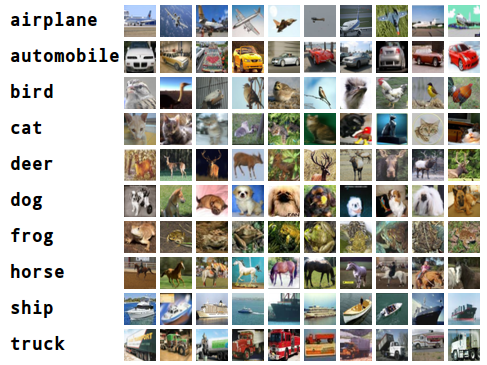

## Keras之04-用Cifar10数据集训练一个CNN
----

### Cifar数据集介绍
Cifar是加拿大政府牵头投资的一个先进科学项目研究所。Cifar-10是由Hinton的两个大弟子Alex Krizhevsky、Ilya Sutskever收集的一个用于普适物体识别的数据集。

Cifar-10由60000张32*32的RGB彩色图片构成，共10个分类。50000张训练，10000张测试（交叉验证）。这个数据集最大的特点在于将识别迁移到了普适物体，而且应用于多分类（姊妹数据集Cifar-100达到100类，ILSVRC比赛则是1000类）。

#### 普适物体识别的挑战
+ 数据中含有大量特征、噪声
+ 识别物体比例不一
+ 分类庞大（SVM难以应对）
