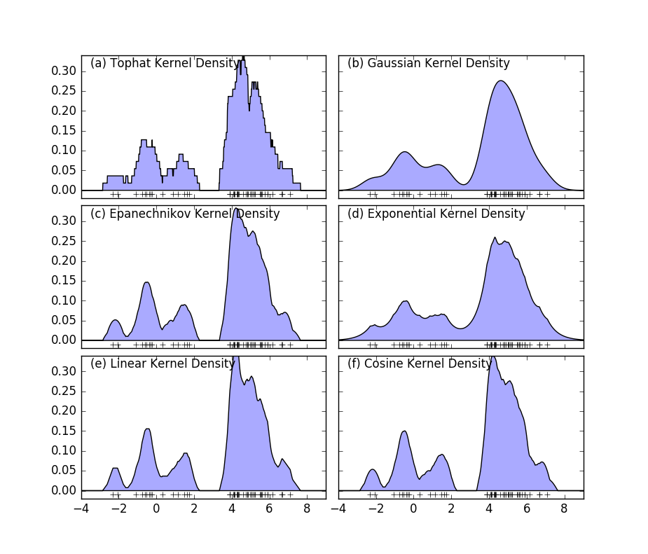
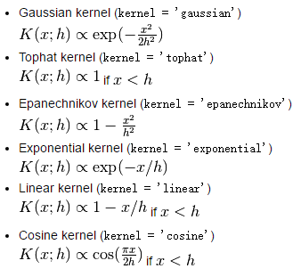
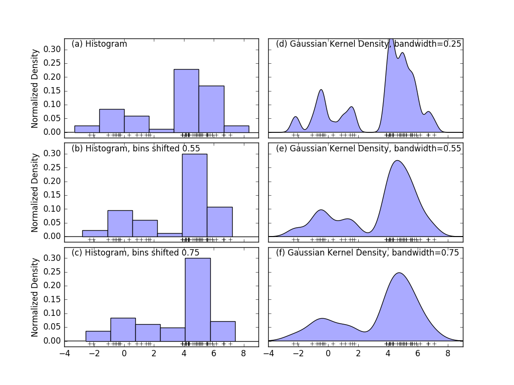

## ML之01-核密度估计Kernel Density Estimation(KDE)
----

由给定样本集合求解随机变量的分布密度函数问题是概率统计学的基本问题之一。解决这一问题的方法包括参数估计和非参数估计。

### 参数估计
+ 参数回归分析  
需要假定数据分布符合某种特定的性态，如线性、可化线性或指数性态等，然后在目标函数族中寻找特定的解，即确定回归模型中的未知参数。
+ 参数判别分析  
需要假定作为判别依据的、随机取值的数据样本在各个可能的类别中都服从特定的分布。

经验和理论说明，参数模型的这种基本假定与实际的物理模型之间常常存在较大的差距，这些方法并非总能取得令人满意的结果。

### 非参数估计
由于上述缺陷，Rosenblatt和Parzen提出了非参数估计方法，即核密度估计方法。核密度估计Kernel Density Estimation(KDE)是在概率论中用来估计未知的密度函数，属于非参数检验方法之一。

由于核密度估计方法不利用有关数据分布的先验知识，对数据分布不附加任何假定，是一种从数据样本本身出发研究数据分布特征的方法，因而，在统计学理论和应用领域均受到高度的重视。

核密度估计，就是采用平滑的峰值函数(“核”)来拟合观察到的数据点，从而对真实的概率分布曲线进行模拟。

### sklearn中实现的核函数
核密度估计有多种内核，如下图：

sklearn核函数形式

虽然采用不同的核函数都可以获得一致性的结论（整体趋势和密度分布规律性基本一致），但核密度函数也不是完美的。除了核算法的选择外，带宽（bandwidth）也会影响密度估计，过大或过小的带宽值都会影响估计结果。如下图(d,e,f)所示:

### SVM的核函数如何选取

1. 如果Feature的数量很大，跟样本数量差不多，这时候选用LR或者是Linear Kernel的SVM
2. 如果Feature的数量比较小，样本数量一般，不算大也不算小，选用SVM+Gaussian Kernel
3. 如果Feature的数量比较小，而样本数量很多，需要手工添加一些feature变成第一种情况

### 核密度估计的应用
+ 股票、金融等风险预测
在单变量核密度估计的基础上，可以建立风险价值的预测模型。通过对核密度估计变异系数的加权处理，可以建立不同的风险价值的预测模型。
+ 测量建筑密度
+ 获取犯罪情况报告
+ 发现对城镇或野生动物栖息地造成影响的道路或公共设施管线
+ 热力图

总而言之，核密度就是用来估计密度的，如果你有一系列空间点数据，那么核密度估计往往是比较好的可视化方法。
